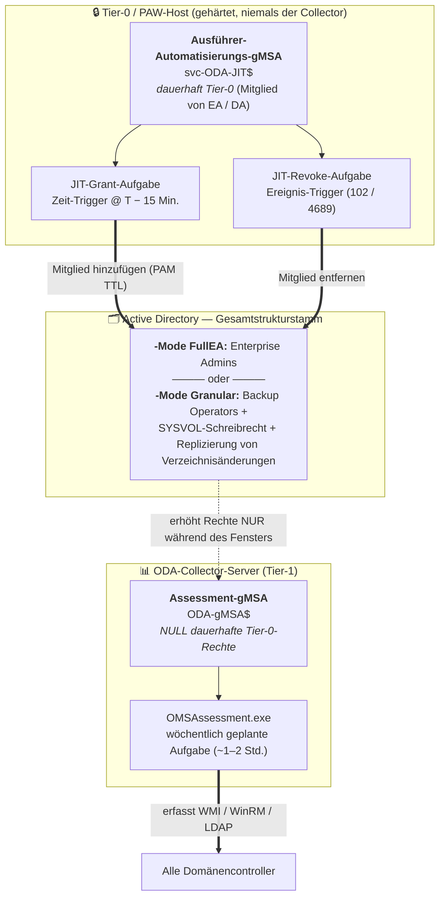
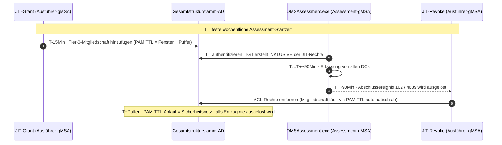
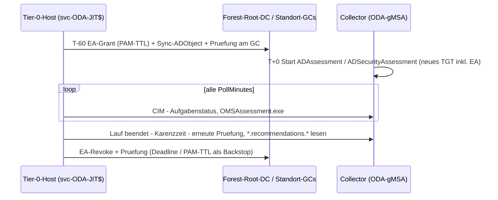

# ODA Delegation Toolkit

**🌐 Sprache:** [English](README.md) · Deutsch

[](https://learn.microsoft.com/powershell/)
[](./LICENSE)
[](https://www.microsoft.com/windows)

Verwalten Sie die WMI-Namespace-Sicherheit (DACL) und die Berechtigungen des Service Control Managers (SCM) über die Befehlszeile. Fügen Sie Zugriffssteuerungseinträge (ACEs) für lokale oder Domänenkonten hinzu oder entfernen Sie sie — lokal oder remote.

Diese Skripte sind essenziell für die **Least-Privilege-Delegation des ODA Active Directory Assessments** und ermöglichen es einem Dienstkonto ohne Domänen-Admin-/Enterprise-Admin-Rechte, WMI und SCM auf Domänencontrollern abzufragen.

## Skripte

| Skript | Zweck | Geltungsbereich |
| ------ | ----- | --------------- |
| `Set-WMINamespaceACL.ps1` | ACEs in der DACL eines beliebigen WMI-Namespaces hinzufügen oder entfernen | Pro DC |
| `Set-SCM_ACL.ps1` | ACEs in der DACL des Service Control Managers hinzufügen oder entfernen | Pro DC |
| `Set-NetlogonPermissions.ps1` | NTFS-Leseberechtigungen (ACEs) auf `netlogon.dns` und `netlogon.log` hinzufügen oder entfernen | Pro DC |
| `Set-ADConvergenceRights.ps1` | "Replizierung von Verzeichnisänderungen" auf Domänen-Namenskontexten gewähren oder entziehen | Pro Domäne |
| `Set-SYSVOLWriteAccess.ps1` | NTFS-Änderungsrecht (Modify) auf dem SYSVOL-Domänenstammordner gewähren oder entziehen | Pro Domäne |
| `Process-DCs.ps1` | Orchestrierungsskript — durchläuft alle DCs und wendet WMI-, SCM- und Netlogon-Berechtigungen an | Alle DCs |
| `Invoke-ODAJitDelegation.ps1` | **JIT-Alternative** — gewährt/entzieht nur die Tier-0-/schreibfähigen Rechte (Backup Operators, SYSVOL-Schreibrecht, Replizierung von Verzeichnisänderungen) rund um das wöchentliche Assessment-Fenster | Gesamtstruktur (JIT) |
| `Start-ODAJitGrant.ps1` / `Start-ODAJitRevokeWatcher.ps1` / `Register-ODAJitTasks.ps1` | **Automatisiertes FullEA-JIT** — EA-Vergabe per Zeitplan vor dem Fenster, Watcher entzieht nach Ende des ODA-Laufs + Karenzzeit, harte Deadline (Konfiguration je Forest: `ODA-JIT.example.psd1`) | Gesamtstruktur (JIT) |

## Warum mehrere Skripte?

Die ODA-AD-Assessment-Collectoren fragen auf jedem Domänencontroller mehrere Sicherheitsebenen ab. Ein Dienstkonto ohne Domänen-Admin-Rechte benötigt explizite Berechtigungen auf **jeder** Ebene:

1. **WMI-Namespace-ACLs** — `Root\CIMV2`, `Root\default`, `Root\MicrosoftActiveDirectory`, `Root\directory`, `Root\MicrosoftDFS`, `Root\MicrosoftDNS`
2. **Service Control Manager DACL** — `SC_MANAGER_ENUMERATE_SERVICE` für `Win32_Service`-Abfragen
3. **NTFS-Datei-ACLs** — Lesezugriff auf `netlogon.dns` und `netlogon.log` (Backup Operators gewährt zwar C$-Freigabezugriff, aber Standard-.NET-I/O aktiviert `SeBackupPrivilege` nicht)
4. **Erweiterte AD-Rechte** — "Replizierung von Verzeichnisänderungen" auf jedem Domänen-NC für den Konvergenztest
5. **SYSVOL-NTFS-Berechtigungen** — Änderungszugriff (Modify) auf den SYSVOL-Domänenstamm für die DFS-R-Konvergenzmessung

Jedes Skript adressiert eine Ebene unabhängig und ist idempotent — ein `add`, wenn der ACE bereits existiert, wird mit einer Warnung übersprungen.

## Set-WMINamespaceACL.ps1

### Funktionen

- **Hinzufügen** von Allow- oder Deny-ACEs mit granularen WMI-Berechtigungen
- **Löschen** aller ACEs für ein bestimmtes Konto
- Funktioniert auf **lokalen** und **entfernten** Computern
- Kompatibel mit **PowerShell 5.1** und **7.x**
- Nutzt `.NET RawSecurityDescriptor` und `ManagementObject`, um bekannte CIM/WMI-Serialisierungsprobleme zu vermeiden

### Verfügbare Berechtigungen

Verwenden Sie diese Zeichenfolgen (Groß-/Kleinschreibung wird ignoriert) mit dem Parameter `-permissionsString`, durch Kommas getrennt.

| Berechtigungszeichenfolge | WMI-Konstante | Hex | Beschreibung |
| ------------------------- | ------------- | --- | ------------ |
| `Enable` | WBEM_ENABLE | `0x00001` | Gewährt Lesezugriff auf WMI-Objekte (Instanzen, Klassen, Enumerationen) |
| `MethodExecute` | WBEM_METHOD_EXECUTE | `0x00002` | Erlaubt die Ausführung von WMI-Provider-Methoden |
| `FullWrite` | WBEM_FULL_WRITE_REP | `0x00004` | Erlaubt Schreiben in statische WMI-Repository-Klassen und -Instanzen |
| `PartialWrite` | WBEM_PARTIAL_WRITE_REP | `0x00008` | Erlaubt Schreiben in dynamische WMI-Provider-Objekte |
| `ProviderWrite` | WBEM_WRITE_PROVIDER | `0x00010` | Erlaubt Schreiben von Klassen und Instanzen in WMI-Provider |
| `RemoteAccess` | WBEM_REMOTE_ACCESS | `0x00020` | Erlaubt Remotezugriff auf den Namespace (DCOM/WinRM) |
| `ReadSecurity` | READ_CONTROL | `0x20000` | Erlaubt das Lesen des Namespace-Sicherheitsdeskriptors |
| `WriteSecurity` | WRITE_DAC | `0x40000` | Erlaubt das Ändern des Namespace-Sicherheitsdeskriptors (DACL) |

> **Tipp:** Für typische Überwachungs- oder Remote-Abfrageszenarien verwenden Sie `"Enable,MethodExecute,RemoteAccess"`.
> Für vollständigen administrativen Zugriff kombinieren Sie alle Berechtigungen.

### WMI-Parameter

| Parameter | Erforderlich | Standard | Beschreibung |
| --------- | ------------ | -------- | ------------ |
| `-namespace` | Ja | — | WMI-Namespace-Pfad (z. B. `Root\CIMV2`) |
| `-operation` | Ja | — | `add` oder `delete` |
| `-account` | Ja | — | Konto im Format `DOMAIN\User`, `.\User` oder `user@domain` |
| `-permissionsString` | Nein | `$null` | Kommagetrennte Berechtigungen (für `add` erforderlich) |
| `-allowInherit` | Nein | `$true` | ACE auf untergeordnete Namespaces via ContainerInherit anwenden |
| `-deny` | Nein | `$false` | Einen Deny-ACE statt eines Allow-ACE erstellen |
| `-computerName` | Nein | `.` | Zielcomputer (`.` = lokal) |
| `-logPath` | Nein | `$null` | Pfad zu einer Protokolldatei für zeitgestempelte Änderungseinträge |

### WMI-Beispiele

#### ACL hinzufügen — grundlegenden Remotezugriff für eine lokale Gruppe gewähren

```powershell
.\Set-WMINamespaceACL.ps1 -namespace "Root\CIMV2" `
    -operation add `
    -account ".\local-grp" `
    -permissionsString "Enable,MethodExecute,RemoteAccess" `
    -allowInherit $true
```

#### ACL hinzufügen — Vollzugriff für ein Domänen-Dienstkonto (ohne Vererbung)

```powershell
.\Set-WMINamespaceACL.ps1 -namespace "Root\CIMV2" `
    -operation add `
    -account "DOMAIN\ServiceUser" `
    -permissionsString "Enable,MethodExecute,FullWrite,PartialWrite,ProviderWrite,RemoteAccess,ReadSecurity,WriteSecurity" `
    -allowInherit $false
```

#### ACL hinzufügen — Remotezugriff für eine Domänengruppe verweigern

```powershell
.\Set-WMINamespaceACL.ps1 -namespace "Root\CIMV2" `
    -operation add `
    -account "DOMAIN\RemoteDenyGroup" `
    -permissionsString "RemoteAccess" `
    -deny $true
```

#### ACL hinzufügen — Zugriff auf einem Remotecomputer gewähren

```powershell
.\Set-WMINamespaceACL.ps1 -namespace "Root\CIMV2" `
    -operation add `
    -account "DOMAIN\MonitoringSvc" `
    -permissionsString "Enable,MethodExecute,RemoteAccess" `
    -computerName "SERVER01"
```

#### ACL löschen — alle ACEs für einen lokalen Benutzer entfernen

```powershell
.\Set-WMINamespaceACL.ps1 -namespace "Root\CIMV2" `
    -operation delete `
    -account ".\gast"
```

#### ACL löschen — alle ACEs für einen Domänenbenutzer auf einem Remotecomputer entfernen

```powershell
.\Set-WMINamespaceACL.ps1 -namespace "Root\CIMV2" `
    -operation delete `
    -account "DOMAIN\ServiceUser" `
    -computerName "SERVER01"
```

## Set-SCM_ACL.ps1

Verwaltet den Sicherheitsdeskriptor des **Service Control Managers (SCM)**, um die Berechtigungen `SC_MANAGER_CONNECT` und `SC_MANAGER_ENUMERATE_SERVICE` zu gewähren oder zu entziehen. Dies ist erforderlich, wenn `Win32_Service`-WMI-Abfragen aufgrund gehärteter SCM-ACLs fehlschlagen — selbst wenn der Zugriff auf den Namespace `Root\CIMV2` korrekt konfiguriert ist.

### SCM-Parameter

| Parameter | Erforderlich | Standard | Beschreibung |
| --------- | ------------ | -------- | ------------ |
| `-operation` | Ja | — | `add` oder `delete` |
| `-account` | Ja | — | Konto im Format `DOMAIN\User`, `.\User` oder `user@domain` |
| `-deny` | Nein | `$false` | Einen Deny-ACE statt eines Allow-ACE erstellen |
| `-computerName` | Nein | `.` | Zielcomputer (`.` = lokal) |
| `-logPath` | Nein | `$null` | Pfad zu einer Protokolldatei für zeitgestempelte Änderungseinträge |

### Gewährte SCM-Berechtigungen (Least Privilege)

| Recht | Hex | SDDL | Zweck |
| ----- | --- | ---- | ----- |
| `SC_MANAGER_CONNECT` | `0x0001` | `CC` | Verbindung mit dem SCM herstellen |
| `SC_MANAGER_ENUMERATE_SERVICE` | `0x0004` | `LC` | Dienste aufzählen |

Nach jeder Operation zeigt `Set-SCM_ACL.ps1` die resultierende SCM-DACL mit den tatsächlichen SCM-Berechtigungsnamen an (z. B. `SC_MANAGER_CONNECT`, `SC_MANAGER_ENUMERATE_SERVICE`) statt generischer Dateisystem-Bezeichnungen.

### SCM-Beispiele

```powershell
.\Set-SCM_ACL.ps1 -operation add -account "DOMAIN\MonitoringGroup" -computerName "SERVER01"
```

#### Löschen — alle SCM-ACEs für ein Konto entfernen

```powershell
.\Set-SCM_ACL.ps1 -operation delete -account "DOMAIN\MonitoringGroup" -computerName "SERVER01"
```

## Set-NetlogonPermissions.ps1

Verwaltet die NTFS-Berechtigungen auf Dateiebene für `netlogon.dns` und `netlogon.log`. Dies ist erforderlich, wenn das ODA-Dienstkonto Mitglied der Backup Operators ist (was C$-Freigabezugriff gewährt), der Sirona-Collector jedoch Standard-.NET-Datei-I/O (`System.IO.File.OpenText()`) verwendet, das `SeBackupPrivilege` **nicht** aktiviert.

### Netlogon-Parameter

| Parameter | Erforderlich | Standard | Beschreibung |
| --------- | ------------ | -------- | ------------ |
| `-operation` | Ja | — | `add` oder `delete` |
| `-account` | Ja | — | Konto im Format `DOMAIN\User` oder `.\User` |
| `-logPath` | Nein | `$null` | Pfad zu einer Protokolldatei für zeitgestempelte Änderungseinträge |

### Zieldateien

| Datei | Pfad | Zweck |
| ----- | ---- | ----- |
| `netlogon.dns` | `%SystemRoot%\system32\config\netlogon.dns` | DNS-Registrierungseinträge |
| `netlogon.log` | `%SystemRoot%\debug\netlogon.log` | Netlogon-Debug-Protokoll |

### Netlogon-Beispiele

```powershell
# NTFS-Leserecht gewähren (lokal auf dem DC ausführen)
.\Set-NetlogonPermissions.ps1 -operation add -account "DOMAIN\ODA-DC-Readers"

# NTFS-ACEs entfernen
.\Set-NetlogonPermissions.ps1 -operation delete -account "DOMAIN\ODA-DC-Readers"
```

## Set-ADConvergenceRights.ps1

Gewährt oder entzieht das erweiterte Recht **"Replizierung von Verzeichnisänderungen"** ("Replicating Directory Changes") auf Domänen-Namenskontexten. Dies ist für die ODA-AD-Konvergenz-Collectoren (`IPBB_ADREPLICATIONSTATUS_GetADConvergence_Init/_Collect`) erforderlich, die ein Testattribut schreiben und die Replikationslatenz überwachen.

Dies ist ein **schreibgeschütztes** Replikationsrecht — es gewährt **keine** Passwortreplikation ("Replizierung aller Verzeichnisänderungen" / "Replicating Directory Changes All").

> **Geltungsbereich:** Dies ist eine Operation auf Domänenebene. Führen Sie sie einmalig von einer Admin-Workstation aus, nicht pro DC.

### Konvergenz-Parameter

| Parameter | Erforderlich | Standard | Beschreibung |
| --------- | ------------ | -------- | ------------ |
| `-operation` | Ja | — | `add` oder `delete` |
| `-account` | Ja | — | Konto im Format `DOMAIN\Name` |
| `-domainNCs` | Nein | Platzhalterliste | Array von Domänen-NC-Distinguished-Names |
| `-logPath` | Nein | `$null` | Pfad zu einer Protokolldatei für zeitgestempelte Änderungseinträge |

### Konvergenz-Beispiele

```powershell
# Replizierung von Verzeichnisänderungen auf allen Domänen-NCs gewähren
.\Set-ADConvergenceRights.ps1 -operation add -account "CONTOSO\ODA-Assessment-Readers"

# Alle delegierten Rechte auf allen Domänen-NCs entziehen
.\Set-ADConvergenceRights.ps1 -operation delete -account "CONTOSO\ODA-Assessment-Readers"
```

## Set-SYSVOLWriteAccess.ps1

Gewährt oder entzieht die NTFS-Berechtigung **Ändern (Modify)** auf dem SYSVOL-Domänenstammordner. Dies ist für die ODA-SYSVOL-Konvergenz-Collectoren (`IPBB_SYSVOLREPLICATION_Convergence_Init/_Collect`) erforderlich, die eine temporäre Datei in `\\<DC>\SYSVOL\<domain>\` erstellen und die DFS-R-Replikationslatenz messen.

> **Geltungsbereich:** Dies ist eine Operation auf Domänenebene. Führen Sie sie einmal pro Domäne auf einem DC (vorzugsweise dem PDCe) aus — DFS-R repliziert die ACL-Änderung auf die anderen DCs.

### SYSVOL-Parameter

| Parameter | Erforderlich | Standard | Beschreibung |
| --------- | ------------ | -------- | ------------ |
| `-operation` | Ja | — | `add` oder `delete` |
| `-account` | Ja | — | Konto im Format `DOMAIN\Name` |
| `-domainToDC` | Nein | Platzhalter-Hashtable | Hashtable, die Domänen-DNS → einen DC-FQDN abbildet |
| `-logPath` | Nein | `$null` | Pfad zu einer Protokolldatei für zeitgestempelte Änderungseinträge |

### SYSVOL-Beispiele

```powershell
# NTFS-Änderungsrecht auf SYSVOL für alle Domänen gewähren
.\Set-SYSVOLWriteAccess.ps1 -operation add -account "CONTOSO\ODA-Assessment-Readers"

# NTFS-Berechtigungen auf SYSVOL für alle Domänen entziehen
.\Set-SYSVOLWriteAccess.ps1 -operation delete -account "CONTOSO\ODA-Assessment-Readers"
```

## Process-DCs.ps1

Orchestrierungsskript, das eine Liste von Domänencontrollern durchläuft und **pro DC** Berechtigungen für ein Dienstkonto remote anwendet:

- **WMI-Namespace-ACLs** auf `Root\CIMV2`, `Root\default`, `Root\MicrosoftActiveDirectory`, `Root\directory`, `Root\MicrosoftDFS`, `Root\MicrosoftDNS`
- **SCM-DACL** für `Win32_Service`-Zugriff (`SC_MANAGER_CONNECT` + `SC_MANAGER_ENUMERATE_SERVICE`)
- **NTFS-ACLs** auf `netlogon.dns` und `netlogon.log`

Wenn der Ziel-DC der lokale Computer ist, wird das Skript lokal ausgeführt, um WinRM-Loopback-Fehler zu vermeiden.

Bearbeiten Sie die Variablen `$account` und `$dcs` am Anfang des Skripts, um sie an Ihre Umgebung anzupassen.

> **Hinweis:** `Set-ADConvergenceRights.ps1` und `Set-SYSVOLWriteAccess.ps1` sind **nicht** in `Process-DCs.ps1` enthalten — es handelt sich um Operationen auf Domänenebene, die nur einmal pro Domäne und nicht pro DC ausgeführt werden müssen.

### Protokollierung

`Process-DCs.ps1` erstellt eine zeitgestempelte Protokolldatei (`ACL-Changes_<operation>_yyyyMMdd_HHmmss.log`) im Skriptverzeichnis auf dem **Admin-Server**, auf dem es ausgeführt wird. Das Protokoll erfasst:

- Alle Remote-Ausgaben (WMI-Erfolgsmeldungen, SCM-DACL-Auflistungen mit Berechtigungsnamen, Netlogon-Datei-ACLs)
- `[OK]`- oder `[ERR]`-Status pro Domänencontroller und pro Einstellung
- Zeitstempel für jeden Eintrag
- Zusammenfassende Zählungen am Ende

## Invoke-ODAJitDelegation.ps1 (Just-in-Time-Alternative)

Eine **dokumentierte Alternative** zur dauerhaften Delegation. Anstatt jede Berechtigung rund um die Uhr zugewiesen zu lassen, werden die sensiblen, Tier-0-/schreibfähigen Rechte **unmittelbar vor** jedem wöchentlichen Assessment-Lauf gewährt und **unmittelbar danach** entzogen (oder automatisch ablaufen gelassen). Dies setzt *Least Privilege über die Zeit* zusätzlich zu *Least Privilege des Geltungsbereichs* um.

Das ODA-AD-Assessment läuft als **wöchentlich geplante Aufgabe**, die `OMSAssessment.exe` startet (gemäß dem ODA-Setup-Leitfaden), und ist daher nur ~1–2 Stunden pro Woche aktiv. JIT entfernt die dauerhafte Exposition während der übrigen ~166 Stunden.

### Was per JIT gesteuert wird (und was nicht)

| Recht | JIT? | Warum |
| ----- | ---- | ----- |
| Backup-Operators-Mitgliedschaft | **Ja** | Tier-0-Gruppe; Element mit höchstem Risiko |
| SYSVOL-Schreibrecht (NTFS Modify) | **Ja** | Schreibfähige Ressourcen-ACL |
| Replizierung von Verzeichnisänderungen | **Ja** | Schreibfähiges erweitertes Recht |
| WMI/SCM-ACLs, DCOM/WinRM, Event Log Readers, DNS/DFSR-Lesen | **Nein — dauerhaft belassen** | Schreibgeschützt; wöchentliches Umschalten erhöht die Fragilität ohne Sicherheitsgewinn |

Das Skript verwendet `Set-ADConvergenceRights.ps1` und `Set-SYSVOLWriteAccess.ps1` wieder und verwaltet die Backup-Operators-Mitgliedschaft direkt (mit einer PAM-Time-To-Live bei `add`).

### ⚠ Kerberos-Token-Timing (die entscheidende Design-Tatsache)

**Gruppenmitgliedschaften** (Backup Operators) werden beim Authentifizieren von `OMSAssessment.exe` in das Kerberos-Ticket des gMSA eingebettet und für bis zu **10 Stunden** zwischengespeichert. Das Gewähren der Mitgliedschaft *nachdem* der Prozess gestartet ist, hat **keine Auswirkung auf die laufende Erfassung**. Daher:

- Führen Sie **`-operation add` über einen ZEIT-Trigger ~15 Min. vor** dem festen wöchentlichen Fenster aus (lesen Sie das Fenster aus der geplanten Assessment-Aufgabe — siehe unten). **Nicht** über ein „OMSAssessment.exe gestartet"-Ereignis — zu diesem Zeitpunkt ist das Token bereits erstellt.
- Führen Sie **`-operation delete` über einen EREIGNIS-Trigger** aus, wenn das Assessment endet (Aufgabenplanung-Betriebsereignis `102` oder Sicherheit `4689` für den `OMSAssessment.exe`-Exit) und/oder als zeitbasiertes Sicherheitsnetz.
- Bei `add` wird die Mitgliedschaft mit `-MemberTimeToLive` (PAM) gewährt, sodass sie **automatisch abläuft**, selbst wenn der Entzug nie ausgeführt wird. Erfordert Gesamtstruktur-Funktionsebene 2016+ und das optionale PAM-Feature; setzen Sie `-usePamTtl $false` auf älteren Gesamtstrukturen und verlassen Sie sich auf den Entzug.

**Ressourcen-ACLs** (SYSVOL, Replizierung von Verzeichnisänderungen) zielen auf die permanente Gruppe und werden sofort an der Ressource wirksam/entfernt — keine Token-Aktualisierung erforderlich.

### Ausführer-Privileg (seien wir ehrlich)

Das Hinzufügen/Entfernen von Backup Operators (eine durch AdminSDHolder geschützte Gruppe), `dsacls` auf dem Domänen-NC und `icacls` auf SYSVOL erfordern allesamt **Domänen-/Enterprise-Admin-äquivalente** Rechte. Die Identität, die dieses Skript ausführt, ist daher effektiv **Tier-0**. Der Sicherheitsgewinn besteht darin, dass das *Assessment-gMSA* keine dauerhaften Tier-0-Rechte mehr besitzt — führen Sie dieses Skript als dediziertes, abgeschottetes Automatisierungs-gMSA nur auf einem Tier-0-/PAW-Host aus.

### JIT-Automatisierungsarchitektur (Identitätstrennung)

Das zentrale Designprinzip sind **zwei getrennte gMSAs**: Der Collector hält niemals dauerhafte Tier-0-Rechte, während eine dedizierte Automatisierungsidentität das privilegierte Umschalten von einem gehärteten Host aus durchführt.



**Wöchentliches Timing (Kerberos-gesteuert):**



> **Warum der Grant zeitbasiert sein muss, nicht ereignisbasiert:** Backup Operators / Enterprise Admins ist eine *Gruppenmitgliedschaft*, die in das Kerberos-Ticket des gMSA eingebettet wird, **wenn `OMSAssessment.exe` sich authentifiziert**. Sie *nach* dem Prozessstart zu gewähren, hat keine Auswirkung auf die laufende Erfassung — daher wird der Grant bei `T − 15 Min.` ausgelöst, bevor das Token erstellt wird.

### Parameter

| Parameter | Erforderlich | Standard | Beschreibung |
| --------- | ------------ | -------- | ------------ |
| `-operation` | Ja | — | `add` (gewähren, vor dem Fenster) oder `delete` (entziehen, bei Abschluss) |
| `-Mode` | Nein | `Granular` | `Granular` = JIT-Teilmenge; `FullEA` = einzelnes Enterprise-Admins-Umschalten (Variante C) |
| `-account` | Nein | Platzhalter | Globale Gruppe, die das gMSA enthält, `DOMAIN\Name` (für die ACLs) |
| `-groupDN` | Nein | Platzhalter | DN dieser Gruppe (für domänenübergreifendes Backup-Operators-/EA-Schreiben) |
| `-backupOperatorsDomains` | Nein | Platzhalterliste | Domänen-FQDNs, deren Backup-Operators-Gruppe umgeschaltet wird |
| `-ttlHours` | Nein | `3` | PAM-Time-To-Live für die Mitgliedschaft bei `add` (Fenster + Puffer) |
| `-usePamTtl` | Nein | `$true` | `-MemberTimeToLive` verwenden (FFL 2016+); `$false` = auf Entzug verlassen |
| `-domainNCs` | Nein | Platzhalterliste | Domänen-NCs für Replizierung von Verzeichnisänderungen |
| `-domainToDC` | Nein | Platzhalter-Hashtable | Domäne → ein DC-FQDN für SYSVOL-Schreibrecht |
| `-forestRootServer` | Nein | Platzhalter | Gesamtstrukturstamm-DC für das Enterprise-Admins-Schreiben (`-Mode FullEA`) |
| `-logPath` | Nein | Auto | Protokolldatei (`JIT-Delegation_<op>_<timestamp>.log`) |

### Beispiele

```powershell
# Gewähren — ~15 Min. vor dem wöchentlichen Assessment-Fenster planen
.\Invoke-ODAJitDelegation.ps1 -operation add

# Entziehen — bei Assessment-Abschluss auslösen (Ereignis 102 / 4689), auch als Sicherheitsnetz ausführen
.\Invoke-ODAJitDelegation.ps1 -operation delete
```

### Verdrahtung der Trigger

Lesen Sie das feste wöchentliche Fenster aus der Assessment-Aufgabe (verwenden Sie **keinen** fest kodierten Aufgabennamen — dieser wird pro Assessment während des ODA-Setups erstellt):

```powershell
$oda = Get-ScheduledTask | Where-Object { $_.Actions.Execute -match 'OMSAssessment\.exe' }
([datetime]($oda.Triggers | Select-Object -First 1).StartBoundary)   # = wöchentliche Zeit T
```

- **Grant-Aufgabe**: wöchentlicher Zeit-Trigger bei `T − 15 Min.`, Aktion `Invoke-ODAJitDelegation.ps1 -operation add`.
- **Revoke-Aufgabe**: Ereignis-Trigger auf `Microsoft-Windows-TaskScheduler/Operational` Ereignis `102` (oder Sicherheit `4689` für `OMSAssessment.exe`), Aktion `Invoke-ODAJitDelegation.ps1 -operation delete`.
- Führen Sie die privilegierte Aktion auf einem gehärteten Tier-0-/Management-Host aus; verwenden Sie **Windows Event Forwarding**, wenn die Trigger-Quelle der Collector-Server ist.

> Eine vollständige Anleitung (Ereignis-XML, Aufgaben-XML, selbstsynchronisierender Zeitplan, Vergleichstabellen) finden Sie in Abschnitt 10 „Just-in-Time-(JIT)-Delegationsmodell" des [ODA-Delegationsleitfadens](docs/ODA-Delegation-Guide.de.md).

### Variante C — Vollständige Rechteerhöhung (Enterprise Admin) mit `-Mode FullEA`

Microsofts **dokumentierte** Voraussetzung für das Konto des AD On-Demand Assessments ist **Enterprise Administrator** plus administrativer Zugriff auf jeden DC und DNS-Server ([Getting Started with AD ODA](https://learn.microsoft.com/services-hub/unified/health/getting-started-ad)). `-Mode FullEA` **begrenzt diese dokumentierte Anforderung zeitlich**: Statt der granularen Teilmenge schaltet er eine einzelne **Enterprise-Admins**-Mitgliedschaft im Gesamtstrukturstamm mit einer PAM-TTL um.

```powershell
# EA ~15 Min. vor dem Fenster gewähren; bei Abschluss entziehen / TTL ablaufen lassen
.\Invoke-ODAJitDelegation.ps1 -operation add    -Mode FullEA
.\Invoke-ODAJitDelegation.ps1 -operation delete -Mode FullEA
```

**Vorteile**: ein Umschalten, keine Arbeit pro DC / ACL, trivial 100 % Datenparität mit der DA/EA-Baseline.

**Nachteile / Entscheidungspunkt**: Enterprise Admins im Gesamtstrukturstamm kaskadiert in `Administrators` jeder Domäne, sodass während des Fensters das **Assessment-gMSA — und damit der Collector-Server, der dessen Passwort abrufen kann — effektiv Tier-0 ist**. Wird dieser Collector kompromittiert (oder das wöchentliche Fenster missbraucht), handelt es sich um eine vollständige Gesamtstruktur-Kompromittierung. Es gilt dasselbe Kerberos-Timing (vor der Authentifizierung der Aufgabe gewähren), und der Ausführer benötigt weiterhin EA, um das Mitglied hinzuzufügen.

| | `-Mode Granular` (Standard) | `-Mode FullEA` |
| --- | --- | --- |
| Umgeschaltete Rechte | Backup Operators + SYSVOL + Repl. Verz.-Änderungen | Enterprise Admins (Gesamtstrukturstamm) |
| Datenparität | Hoch (entspricht der granularen Delegation) | 100 % (entspricht der DA/EA-Baseline) |
| Vertrauensstufe des Collectors während des Fensters | Tier-1 mit begrenzten Tier-0-Teilrechten | **Voll Tier-0** |
| Verwenden, wenn | Gehärtete Umgebung verbietet dem Collector Tier-0-Besitz | Collector wird als Tier-0-/PAW-Asset behandelt |
| Komplexität | Mittel (verwendet die Paketskripte wieder) | Am niedrigsten (eine Mitgliedschaft) |

> **Empfehlung**: Bevorzugen Sie `-Mode Granular` in gehärteten/regulierten Umgebungen. Verwenden Sie `-Mode FullEA` nur, wenn der Kunde akzeptiert, die Datenerfassungsmaschine als Tier-0-Asset zu behandeln (abgeschottet, eingeschränkter gMSA-Passwortabruf, EA-Änderungsalarmierung).

#### Welches Konto automatisiert das `-Mode FullEA`-Umschalten?

**Es muss kein statischer menschlicher Domänen-Admin sein — aber es muss eine *dauerhafte* Tier-0-Identität sein.** Sie können „Enterprise-Admins-Mitgliedschaft verwalten" nicht an eine niedrigere Stufe delegieren: `Enterprise Admins` ist eine **durch AdminSDHolder geschützte** Gruppe, sodass jeder delegierte *Mitglied-Schreib*-ACE, den Sie hinzufügen, **von SDProp innerhalb von ~60 Minuten zurückgesetzt** wird. Das `member`-Attribut von EA schreiben zu können, ist gleichbedeutend mit EA zu sein (Sie könnten sich selbst hinzufügen), sodass der Ausführer per Definition Tier-0 ist. Dies ist dieselbe Einschränkung, die bereits für `-Mode Granular` gilt (Backup Operators ist ebenfalls durch AdminSDHolder geschützt).

Verwenden Sie ein dediziertes, nicht-interaktives **Tier-0-Automatisierungs-gMSA** anstelle eines menschlichen Kontos:

| Anforderung | Einstellung |
| ----------- | ----------- |
| Identität | Dediziertes gMSA, z. B. `svc-ODA-JIT$` — **ausschließlich** für diese Automatisierung verwendet |
| Dauerhafte Rechte | Mitglied einer Tier-0-Gruppe im Gesamtstrukturstamm (Administrators / Domain Admins / Enterprise Admins), damit sein Schreibvorgang SDProp übersteht |
| Passwortabruf | `PrincipalsAllowedToRetrieveManagedPassword` = nur das eine PAW-/Tier-0-Orchestrierungs-Host-Computerkonto |
| Anmelderechte (GPO) | `Lokale Anmeldung verweigern` + `Anmelden über RDP verweigern` (meldet sich nie interaktiv an); nur `Anmelden als Batchauftrag` auf diesem PAW erlauben. Netzwerkanmeldung **nicht** pauschal verweigern — siehe Hinweis unten |
| Ausführung auf | Einem gehärteten Tier-0-PAW-/Management-Host — niemals dem Collector |
| Auditing | Alarmierung bei 4756/4757 (EA-Mitgliedschaftsänderung – Enterprise Admins ist eine universelle Gruppe) und bei Fehlschlag der Grant-/Revoke-Aufgabe |

> **Zwei verschiedene gMSAs — verwechseln Sie ihre Netzwerkanforderungen nicht.** *„Zugriff auf diesen Computer über das Netzwerk verweigern"* darf **nicht** pauschal auf eines der beiden Konten angewendet werden, da beide auf Netzwerkanmeldung angewiesen sind:
>
> - **Assessment-gMSA** (das ODA-Erfassungskonto): authentifiziert sich *vom Collector zu jedem DC und DNS-Server* (Remote-WMI / RPC / LDAP / SMB). Es **benötigt** *Zugriff auf diesen Computer über das Netzwerk* auf all diesen Zielen — Netzwerkanmeldung zu verweigern, unterbricht die Erfassung vollständig. Härten Sie es stattdessen über Verweigern von interaktiver/RDP-Anmeldung, begrenzten Passwortabruf (nur Collector-Host), die PAM-TTL-Erhöhung und EA-Änderungsalarmierung.
> - **Ausführer-gMSA** (`svc-ODA-JIT$`): führt einen *ausgehenden LDAP-Schreibvorgang zu einem Gesamtstrukturstamm-DC* aus, um die Mitgliedschaft umzuschalten, benötigt also ebenfalls Netzwerkanmeldung **auf diesem DC**. Es läuft als geplante Aufgabe auf dem PAW (Batch-Anmeldung).
>
> Wenden Sie *Zugriff auf diesen Computer über das Netzwerk verweigern* auf diese Tier-0-Konten nur auf **Tier-1-/Tier-2-Maschinen** an (um laterale Wiederverwendung zu blockieren), niemals auf den DCs / DNS-Servern, die jedes Konto legitim erreichen muss.

**Minimierung von Tier-0-Konten.** Mit diesem Design fügen Sie genau **eine** neue *dauerhafte* Tier-0-Identität hinzu (das Automatisierungs-gMSA). Das Assessment-gMSA hält **null** dauerhafte Tier-0-Rechte — es wird nur für das ~1–2-stündige wöchentliche Fenster erhöht. Die Konto*anzahl* ist für `Granular` und `FullEA` gleich; der Unterschied ist die **Breite** der transienten Rechteerhöhung (eine begrenzte Teilmenge vs. volle Enterprise Admins). Der eigentliche Hebel für Least Privilege ist also die **Variantenwahl**, nicht der Ausführer: Behalten Sie das einzelne Automatisierungs-gMSA und bevorzugen Sie `-Mode Granular`, um den wöchentlichen Wirkungsradius des Assessment-gMSA zu verkleinern. Was auch immer die EA-Mitgliedschaft automatisiert, ist unvermeidlich ein dauerhaftes Tier-0-Prinzipal — das Beste, was Sie tun können, ist, es zu einem abgeschotteten gMSA auf einem PAW zu machen.

## ODA-JIT-Automatisierung (FullEA): Grant, Revoke-Watcher, geplante Aufgaben

Einsatzbereite Automatisierung von `-Mode FullEA` für die Assessments **ODA AD und AD Security** (ein Assessment-gMSA, eine Gesamtstruktur). Das Konzept mit der Analyse der Ende-Signale steht in [docs/ODA-JIT-EnterpriseAdmin-Konzept.docx](docs/ODA-JIT-EnterpriseAdmin-Konzept.docx).

| Datei | Zweck |
| ----- | ----- |
| `ODA-JIT.example.psd1` | Konfigurationsvorlage — **eine Datei je Gesamtstruktur** (Root-DC, Gruppen-DN, Standort-GCs, Collector, Arbeitsverzeichnis, Fenster, Karenzzeit, Deadline, TTL) |
| `Register-ODAJitTasks.ps1` | Legt `\ODA-JIT\ODA-JIT-Grant-<Forest>` und `ODA-JIT-Revoke-<Forest>` auf dem Tier-0-Host unter dem Ausführer-gMSA an (Tageswechsel, Ereignisquelle, Abgleich mit dem Zeitplan der ODA-Aufgaben auf dem Collector) |
| `Start-ODAJitGrant.ps1` | `T − 60 min`: EA-Vergabe mit PAM-TTL, `Sync-ADObject` auf die GCs im Standort des Collectors, Prüfung über GC-Port 3268; `-StartOdaTasks` für manuelle Läufe |
| `Start-ODAJitRevokeWatcher.ps1` | `T + 15 min`: fragt den Collector ab, wartet auf das Ende des Laufs + Karenzzeit, entzieht und prüft; No-Start-Timeout, harte Deadline, `-RevokeNow`, `-WhatIf`-Trockenlauf |
| `ODAJit.Common.psm1`, `Tests\ODAJit.Common.Tests.ps1` | Gemeinsame Logik und Pester-Tests |

**Ende-Signale** (müssen für jede konfigurierte ODA-Aufgabe erfüllt sein):

- **T1** — die Aufgabe lief im Fenster (`LastRunTime ≥ Fensterstart`) und ist nicht `Running`/`Queued`
- **T3** — kein `OMSAssessment.exe`-Prozess auf dem Collector
- **T4** — eine Datei `*.recommendations.*` (`new.*` bzw. nach dem Upload `processed.*`) wurde im Fenster in jedem Ordner `<WorkingDirectory>\<XX>Assessment` geschrieben → der Lauf gilt als *erfolgreich*

`LastTaskResult = 0` beweist **nicht**, dass alle Collectors erfolgreich waren. Der Upload (`new.*` → `processed.*`) braucht kein EA, darauf wartet der Watcher nicht.



```powershell
# Einmalig je Gesamtstruktur auf dem Tier-0-Host (als Administrator)
Copy-Item .\ODA-JIT.example.psd1 C:\ODA-JIT\ODA-JIT.contoso.psd1    # anpassen
.\Register-ODAJitTasks.ps1 -ConfigPath C:\ODA-JIT\ODA-JIT.contoso.psd1

# Trockenlauf des Watchers (nur Erkennung, kein Revoke)
.\Start-ODAJitRevokeWatcher.ps1 -ConfigPath C:\ODA-JIT\ODA-JIT.contoso.psd1 -WhatIf

# Manueller Lauf außerhalb des Wochenfensters
.\Start-ODAJitGrant.ps1 -ConfigPath C:\ODA-JIT\ODA-JIT.contoso.psd1 -StartOdaTasks
.\Start-ODAJitRevokeWatcher.ps1 -ConfigPath C:\ODA-JIT\ODA-JIT.contoso.psd1 -WindowStart (Get-Date)

# Notfall: sofort entziehen
.\Start-ODAJitRevokeWatcher.ps1 -ConfigPath C:\ODA-JIT\ODA-JIT.contoso.psd1 -RevokeNow

# Unit-Tests (Pester 5)
Invoke-Pester .\Tests
```

| Application-Ereignis (Quelle `ODA-JIT`) | Bedeutung |
| --------------------------------------- | --------- |
| 1000 / 1001 | Grant OK / Grant fehlgeschlagen oder nicht auf den Standort-GCs sichtbar |
| 1010 | Entzogen nach erfolgreichem Lauf |
| 1011 | Entzogen — Lauf unvollständig, ohne Ergebnis oder manuell |
| 1012 | Entzogen an der Deadline |
| 1013 | Revoke **fehlgeschlagen** (PAM-TTL bleibt als Backstop) |

**Warum 60 min Vorlauf statt 15?** Enterprise Admins ist eine universelle Gruppe im Forest-Root; der KDC der gMSA-Domäne löst sie über einen Global Catalog auf. Der Grant wird per `Sync-ADObject` übertragen und auf den GCs im Standort des Collectors geprüft — der Vorlauf ist nur Puffer für die standortübergreifende Replikation.

**Mehrere Gesamtstrukturen**: eine Konfiguration, ein Ausführer-gMSA und ein Tier-0-Host **je Gesamtstruktur** (nie ein zentraler, Forest-übergreifender Ausführer). Auf Azure-Seite kann ein einzelner **Engage Center Connector** mehrere Log-Analytics-Workspace-Verbindungen halten ([Manage Log Analytics workspaces](https://learn.microsoft.com/services-hub/microsoft-engage-center/health/manage-log-analytics)); Collector (Arc) und LAW jeder Gesamtstruktur gehören in eine eigene Ressourcengruppe — das Engage Center bietet nur Maschinen aus Subscription/Ressourcengruppe des aktiven LAW an ([Manage Assessments](https://learn.microsoft.com/services-hub/microsoft-engage-center/health/manage-assessments)). Der LAW muss öffentlichen Netzwerkzugriff aktiviert lassen.

## Voraussetzungen

- Windows-Betriebssystem
- PowerShell 5.1 oder 7.x
- **Administrator**-Rechte (erforderlich zum Ändern der WMI-Namespace-Sicherheit und der SCM-DACL)
- Für `Invoke-ODAJitDelegation.ps1`: das **ActiveDirectory**-Modul (RSAT), eine **Tier-0**-Ausführeridentität und (empfohlen) **PAM** aktiviert (Gesamtstruktur-Funktionsebene 2016+)
- Für die ODA-JIT-Automatisierung zusätzlich: das **ScheduledTasks**-Modul, CIM-(WinRM-)Zugriff und Lesezugriff auf die `C$`-Freigabe des Collectors vom Tier-0-Host; Pester 5 für die Tests

## Lizenz

Dieses Projekt ist unter der [MIT-Lizenz](./LICENSE) lizenziert.
