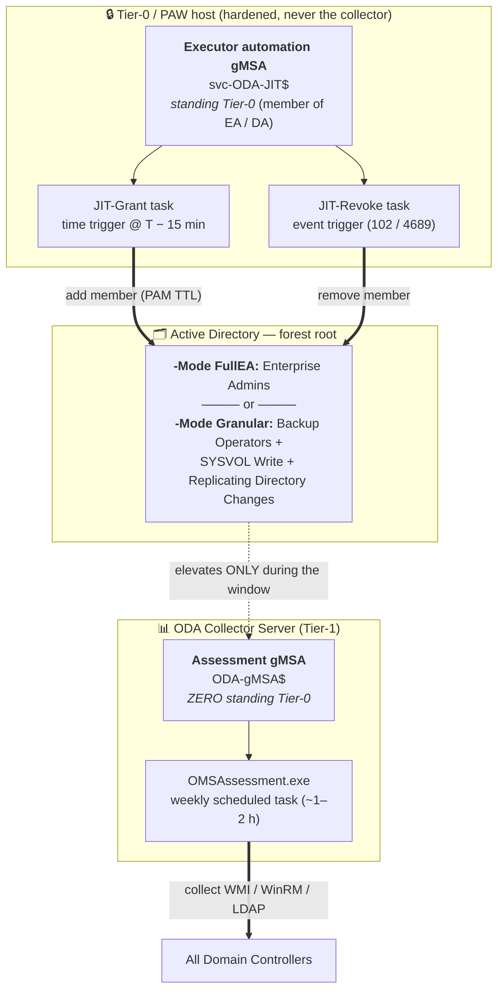
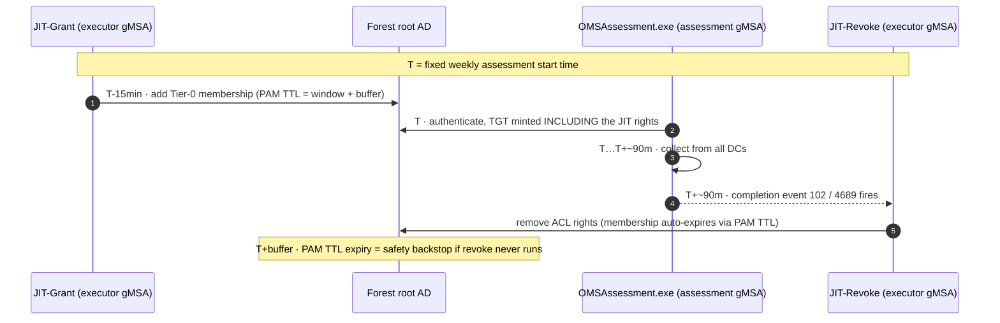
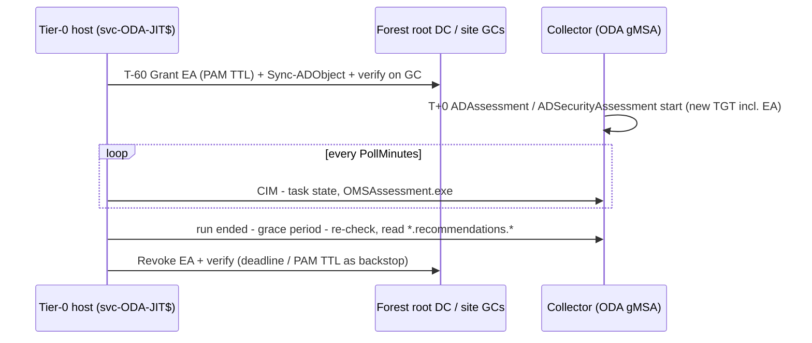

# ODA Delegation Toolkit

**🌐 Language:** English · [Deutsch](README.de.md)

[](https://learn.microsoft.com/powershell/)
[](./LICENSE)
[](https://www.microsoft.com/windows)

Manage WMI namespace security (DACL) and Service Control Manager (SCM) permissions from the command line. Add or remove access control entries for local or domain accounts — locally or remotely.

These scripts are essential for **ODA Active Directory Assessment least-privilege delegation**, enabling a non-Domain Admin / non-Enterprise Admin service account to query WMI and SCM on domain controllers.

## Scripts

| Script | Purpose | Scope |
| ------ | ------- | ----- |
| `Set-WMINamespaceACL.ps1` | Add or remove ACEs on any WMI namespace DACL | Per DC |
| `Set-SCM_ACL.ps1` | Add or remove ACEs on the Service Control Manager DACL | Per DC |
| `Set-NetlogonPermissions.ps1` | Add or remove NTFS Read ACEs on `netlogon.dns` and `netlogon.log` | Per DC |
| `Set-ADConvergenceRights.ps1` | Grant or revoke "Replicating Directory Changes" on domain naming contexts | Per domain |
| `Set-SYSVOLWriteAccess.ps1` | Grant or revoke NTFS Modify on the SYSVOL domain root folder | Per domain |
| `Process-DCs.ps1` | Orchestration script — loops through all DCs and applies WMI, SCM, and Netlogon permissions | All DCs |
| `Invoke-ODAJitDelegation.ps1` | **JIT alternative** — grants/revokes only the Tier-0 / write-capable rights (Backup Operators, SYSVOL Write, Replicating Directory Changes) around the weekly assessment window | Forest (JIT) |
| `Start-ODAJitGrant.ps1` / `Start-ODAJitRevokeWatcher.ps1` / `Register-ODAJitTasks.ps1` | **Automated FullEA JIT** — scheduled EA grant before the window, watcher that revokes after the ODA run ended + grace period, hard deadline (config per forest: `ODAJit.example.psd1`) | Forest (JIT) |

## Why Multiple Scripts?

ODA AD Assessment collectors query multiple security layers on each domain controller. A non-Domain Admin service account needs explicit permissions at **every** layer:

1. **WMI namespace ACLs** — `Root\CIMV2`, `Root\default`, `Root\MicrosoftActiveDirectory`, `Root\directory`, `Root\MicrosoftDFS`, `Root\MicrosoftDNS`
2. **Service Control Manager DACL** — `SC_MANAGER_ENUMERATE_SERVICE` for `Win32_Service` queries
3. **NTFS file ACLs** — Read access on `netlogon.dns` and `netlogon.log` (Backup Operators grants C$ share access, but standard .NET I/O does not activate `SeBackupPrivilege`)
4. **AD extended rights** — "Replicating Directory Changes" on each domain NC for convergence testing
5. **SYSVOL NTFS permissions** — Modify access on the SYSVOL domain root for DFS-R convergence measurement

Each script addresses one layer independently and is idempotent — running `add` when the ACE already exists will skip with a warning.

## Set-WMINamespaceACL.ps1

### Features

- **Add** allow or deny ACEs with granular WMI permissions
- **Delete** all ACEs for a given account
- Works on **local** and **remote** computers
- Compatible with **PowerShell 5.1** and **7.x**
- Uses `.NET RawSecurityDescriptor` and `ManagementObject` to avoid known CIM/WMI serialization issues

### Available Permissions

Use these strings (case-insensitive) with the `-permissionsString` parameter, separated by commas.

| Permission String | WMI Constant | Hex | Description |
| ----------------- | ------------ | --- | ----------- |
| `Enable` | WBEM_ENABLE | `0x00001` | Grants read access to WMI objects (instances, classes, enumerations) |
| `MethodExecute` | WBEM_METHOD_EXECUTE | `0x00002` | Allows execution of WMI provider methods |
| `FullWrite` | WBEM_FULL_WRITE_REP | `0x00004` | Allows writing to static WMI repository classes and instances |
| `PartialWrite` | WBEM_PARTIAL_WRITE_REP | `0x00008` | Allows writing to dynamic WMI provider objects |
| `ProviderWrite` | WBEM_WRITE_PROVIDER | `0x00010` | Allows writing of classes and instances to WMI providers |
| `RemoteAccess` | WBEM_REMOTE_ACCESS | `0x00020` | Allows remote access to the namespace (DCOM/WinRM) |
| `ReadSecurity` | READ_CONTROL | `0x20000` | Allows reading the namespace security descriptor |
| `WriteSecurity` | WRITE_DAC | `0x40000` | Allows modifying the namespace security descriptor (DACL) |

> **Tip:** For typical monitoring or remote query scenarios, use `"Enable,MethodExecute,RemoteAccess"`.
> For full administrative access, combine all permissions.

### WMI Parameters

| Parameter | Required | Default | Description |
| --------- | -------- | ------- | ----------- |
| `-namespace` | Yes | — | WMI namespace path (e.g. `Root\CIMV2`) |
| `-operation` | Yes | — | `add` or `delete` |
| `-account` | Yes | — | Account in `DOMAIN\User`, `.\User`, or `user@domain` format |
| `-permissionsString` | No | `$null` | Comma-separated permissions (required for `add`) |
| `-allowInherit` | No | `$true` | Apply ACE to child namespaces via ContainerInherit |
| `-deny` | No | `$false` | Create a deny ACE instead of allow |
| `-computerName` | No | `.` | Target computer (`.` = local) |
| `-logPath` | No | `$null` | Path to a log file for timestamped change entries |

### WMI Examples

#### Add ACL — grant basic remote access to a local group

```powershell
.\Set-WMINamespaceACL.ps1 -namespace "Root\CIMV2" `
    -operation add `
    -account ".\local-grp" `
    -permissionsString "Enable,MethodExecute,RemoteAccess" `
    -allowInherit $true
```

#### Add ACL — grant full access to a domain service account (no inheritance)

```powershell
.\Set-WMINamespaceACL.ps1 -namespace "Root\CIMV2" `
    -operation add `
    -account "DOMAIN\ServiceUser" `
    -permissionsString "Enable,MethodExecute,FullWrite,PartialWrite,ProviderWrite,RemoteAccess,ReadSecurity,WriteSecurity" `
    -allowInherit $false
```

#### Add ACL — deny remote access for a domain group

```powershell
.\Set-WMINamespaceACL.ps1 -namespace "Root\CIMV2" `
    -operation add `
    -account "DOMAIN\RemoteDenyGroup" `
    -permissionsString "RemoteAccess" `
    -deny $true
```

#### Add ACL — grant access on a remote computer

```powershell
.\Set-WMINamespaceACL.ps1 -namespace "Root\CIMV2" `
    -operation add `
    -account "DOMAIN\MonitoringSvc" `
    -permissionsString "Enable,MethodExecute,RemoteAccess" `
    -computerName "SERVER01"
```

#### Delete ACL — remove all ACEs for a local user

```powershell
.\Set-WMINamespaceACL.ps1 -namespace "Root\CIMV2" `
    -operation delete `
    -account ".\gast"
```

#### Delete ACL — remove all ACEs for a domain user on a remote computer

```powershell
.\Set-WMINamespaceACL.ps1 -namespace "Root\CIMV2" `
    -operation delete `
    -account "DOMAIN\ServiceUser" `
    -computerName "SERVER01"
```

## Set-SCM_ACL.ps1

Manages the **Service Control Manager (SCM)** security descriptor to grant or revoke `SC_MANAGER_CONNECT` and `SC_MANAGER_ENUMERATE_SERVICE` permissions. This is required when `Win32_Service` WMI queries fail due to hardened SCM ACLs — even though `Root\CIMV2` namespace access is correctly configured.

### SCM Parameters

| Parameter | Required | Default | Description |
| --------- | -------- | ------- | ----------- |
| `-operation` | Yes | — | `add` or `delete` |
| `-account` | Yes | — | Account in `DOMAIN\User`, `.\User`, or `user@domain` format |
| `-deny` | No | `$false` | Create a deny ACE instead of allow |
| `-computerName` | No | `.` | Target computer (`.` = local) |
| `-logPath` | No | `$null` | Path to a log file for timestamped change entries |

### SCM permissions granted (least privilege)

| Right | Hex | SDDL | Purpose |
| ----- | --- | ---- | ------- |
| `SC_MANAGER_CONNECT` | `0x0001` | `CC` | Connect to the SCM |
| `SC_MANAGER_ENUMERATE_SERVICE` | `0x0004` | `LC` | Enumerate services |

After each operation, `Set-SCM_ACL.ps1` displays the resulting SCM DACL with actual SCM permission names (e.g. `SC_MANAGER_CONNECT`, `SC_MANAGER_ENUMERATE_SERVICE`) instead of generic file system labels.

### SCM Examples

```powershell
.\Set-SCM_ACL.ps1 -operation add -account "DOMAIN\MonitoringGroup" -computerName "SERVER01"
```

#### Delete — remove all SCM ACEs for an account

```powershell
.\Set-SCM_ACL.ps1 -operation delete -account "DOMAIN\MonitoringGroup" -computerName "SERVER01"
```

## Set-NetlogonPermissions.ps1

Manages NTFS file-level permissions on `netlogon.dns` and `netlogon.log`. This is needed when the ODA service account is a member of Backup Operators (granting C$ share access) but the Sirona collector uses standard .NET file I/O (`System.IO.File.OpenText()`) that does **not** activate `SeBackupPrivilege`.

### Netlogon Parameters

| Parameter | Required | Default | Description |
| --------- | -------- | ------- | ----------- |
| `-operation` | Yes | — | `add` or `delete` |
| `-account` | Yes | — | Account in `DOMAIN\User` or `.\User` format |
| `-logPath` | No | `$null` | Path to a log file for timestamped change entries |

### Target Files

| File | Path | Purpose |
| ---- | ---- | ------- |
| `netlogon.dns` | `%SystemRoot%\system32\config\netlogon.dns` | DNS registration records |
| `netlogon.log` | `%SystemRoot%\debug\netlogon.log` | Netlogon debug log |

### Netlogon Examples

```powershell
# Grant NTFS Read (run locally on the DC)
.\Set-NetlogonPermissions.ps1 -operation add -account "DOMAIN\ODA-DC-Readers"

# Remove NTFS ACEs
.\Set-NetlogonPermissions.ps1 -operation delete -account "DOMAIN\ODA-DC-Readers"
```

## Set-ADConvergenceRights.ps1

Grants or revokes the **"Replicating Directory Changes"** extended right on domain naming contexts. This is required for the ODA AD Convergence collectors (`IPBB_ADREPLICATIONSTATUS_GetADConvergence_Init/_Collect`) that write a test attribute and monitor replication latency.

This is a **read-only** replication right — it does **not** grant password replication ("Replicating Directory Changes All").

> **Scope:** This is a domain-level operation. Run once from an admin workstation, not per DC.

### Convergence Parameters

| Parameter | Required | Default | Description |
| --------- | -------- | ------- | ----------- |
| `-operation` | Yes | — | `add` or `delete` |
| `-account` | Yes | — | Account in `DOMAIN\Name` format |
| `-domainNCs` | No | Placeholder list | Array of domain NC distinguished names |
| `-logPath` | No | `$null` | Path to a log file for timestamped change entries |

### Convergence Examples

```powershell
# Grant Replicating Directory Changes on all domain NCs
.\Set-ADConvergenceRights.ps1 -operation add -account "CONTOSO\ODA-Assessment-Readers"

# Revoke all delegated rights on all domain NCs
.\Set-ADConvergenceRights.ps1 -operation delete -account "CONTOSO\ODA-Assessment-Readers"
```

## Set-SYSVOLWriteAccess.ps1

Grants or revokes NTFS **Modify** permission on the SYSVOL domain root folder. This is required for the ODA SYSVOL Convergence collectors (`IPBB_SYSVOLREPLICATION_Convergence_Init/_Collect`) that create a temporary file in `\\<DC>\SYSVOL\<domain>\` and measure DFS-R replication latency.

> **Scope:** This is a domain-level operation. Run once per domain on one DC (preferably PDCe) — DFS-R replicates the ACL change to other DCs.

### SYSVOL Parameters

| Parameter | Required | Default | Description |
| --------- | -------- | ------- | ----------- |
| `-operation` | Yes | — | `add` or `delete` |
| `-account` | Yes | — | Account in `DOMAIN\Name` format |
| `-domainToDC` | No | Placeholder hashtable | Hashtable mapping domain DNS → one DC FQDN |
| `-logPath` | No | `$null` | Path to a log file for timestamped change entries |

### SYSVOL Examples

```powershell
# Grant NTFS Modify on SYSVOL for all domains
.\Set-SYSVOLWriteAccess.ps1 -operation add -account "CONTOSO\ODA-Assessment-Readers"

# Revoke NTFS permissions on SYSVOL for all domains
.\Set-SYSVOLWriteAccess.ps1 -operation delete -account "CONTOSO\ODA-Assessment-Readers"
```

## Process-DCs.ps1

Orchestration script that loops through a list of domain controllers and remotely applies **per-DC** permissions for a service account:

- **WMI namespace ACLs** on `Root\CIMV2`, `Root\default`, `Root\MicrosoftActiveDirectory`, `Root\directory`, `Root\MicrosoftDFS`, `Root\MicrosoftDNS`
- **SCM DACL** for `Win32_Service` access (`SC_MANAGER_CONNECT` + `SC_MANAGER_ENUMERATE_SERVICE`)
- **NTFS ACLs** on `netlogon.dns` and `netlogon.log`

When the target DC is the local machine, the script runs locally to avoid WinRM loopback failures.

Edit the `$account` and `$dcs` variables at the top of the script to match your environment.

> **Note:** `Set-ADConvergenceRights.ps1` and `Set-SYSVOLWriteAccess.ps1` are **not** included in `Process-DCs.ps1` — they are domain-level operations that only need to run once per domain, not per DC.

### Logging

`Process-DCs.ps1` creates a timestamped log file (`ACL-Changes_<operation>_yyyyMMdd_HHmmss.log`) in the script directory on the **admin server** where it runs. The log captures:

- All remote output (WMI success messages, SCM DACL listings with permission names, Netlogon file ACLs)
- `[OK]` or `[ERR]` status per domain controller and per setting
- Timestamps for every entry
- Summary counts at the end

## Invoke-ODAJitDelegation.ps1 (Just-In-Time alternative)

A **documented alternative** to the standing delegation. Instead of leaving every permission
assigned 24/7, the sensitive, Tier-0 / write-capable rights are granted **immediately before**
each weekly assessment run and revoked (or auto-expired) **immediately after**. This implements
*least privilege over time* in addition to *least privilege of scope*.

The ODA AD Assessment runs as a **weekly scheduled task** that launches `OMSAssessment.exe`
(per the ODA setup guide), so it is only active ~1–2 hours per week. JIT removes the standing
exposure during the other ~166 hours.

### What it JITs (and what it does not)

| Right | JIT? | Why |
| ----- | ---- | --- |
| Backup Operators membership | **Yes** | Tier-0 group; highest-risk item |
| SYSVOL Write (NTFS Modify) | **Yes** | Write-capable resource ACL |
| Replicating Directory Changes | **Yes** | Write-capable extended right |
| WMI/SCM ACLs, DCOM/WinRM, Event Log Readers, DNS/DFSR read | **No — keep standing** | Read-only; toggling every week adds fragility for no security benefit |

The script reuses `Set-ADConvergenceRights.ps1` and `Set-SYSVOLWriteAccess.ps1` and manages the
Backup Operators membership directly (with a PAM Time-To-Live on `add`).

### ⚠ Kerberos token timing (the key design fact)

**Group memberships** (Backup Operators) are baked into the gMSA's Kerberos ticket when
`OMSAssessment.exe` authenticates and are cached for up to **10 hours**. Granting the
membership *after* the process has started has **no effect on the running collection**.
Therefore:

- Run **`-operation add` on a TIME trigger ~15 min before** the fixed weekly window (read the
  window from the assessment scheduled task — see below). **Not** on an "OMSAssessment.exe
  started" event — by then the token is already minted.
- Run **`-operation delete` on an EVENT trigger** when the assessment finishes
  (Task Scheduler Operational event `102`, or Security `4689` for `OMSAssessment.exe` exit),
  and/or as a time-based safety net.
- On `add`, the membership is granted with `-MemberTimeToLive` (PAM) so it **auto-expires**
  even if the revoke never runs. Requires Forest Functional Level 2016+ and the PAM optional
  feature; set `-usePamTtl $false` on older forests and rely on the revoke.

**Resource ACLs** (SYSVOL, Replicating Directory Changes) target the permanent group and take
effect/removal immediately at the resource — no token refresh needed.

### Executor privilege (be honest)

Adding/removing Backup Operators (an AdminSDHolder-protected group), `dsacls` on the domain NC,
and `icacls` on SYSVOL all require **Domain/Enterprise Admin-equivalent** rights. The identity
that runs this script is therefore effectively **Tier-0**. The security win is that the
*assessment gMSA* no longer holds standing Tier-0 rights — run this script as a dedicated,
locked-down automation gMSA on a Tier-0 / PAW host only.

### JIT automation architecture (identity separation)

The key design principle is **two separate gMSAs**: the collector never holds standing Tier-0
rights, while a dedicated automation identity does the privileged toggling from a hardened host.



**Weekly timing (Kerberos-driven):**



> **Why the grant must be time-based, not event-based:** Backup Operators / Enterprise Admins is
> a *group membership* baked into the gMSA's Kerberos ticket **when `OMSAssessment.exe`
> authenticates**. Granting it *after* the process starts has no effect on the running
> collection — so the grant fires at `T − 15 min`, before the token is minted.

### Parameters

| Parameter | Required | Default | Description |
| --------- | -------- | ------- | ----------- |
| `-operation` | Yes | — | `add` (grant, pre-window) or `delete` (revoke, on completion) |
| `-Mode` | No | `Granular` | `Granular` = JIT subset; `FullEA` = single Enterprise Admins toggle (Variant C) |
| `-account` | No | Placeholder | Global group holding the gMSA, `DOMAIN\Name` (for the ACLs) |
| `-groupDN` | No | Placeholder | DN of that group (for cross-domain Backup Operators / EA write) |
| `-backupOperatorsDomains` | No | Placeholder list | Domain FQDNs whose Backup Operators group is toggled |
| `-ttlHours` | No | `3` | PAM Time-To-Live for the membership on `add` (window + buffer) |
| `-usePamTtl` | No | `$true` | Use `-MemberTimeToLive` (FFL 2016+); `$false` = rely on revoke |
| `-domainNCs` | No | Placeholder list | Domain NCs for Replicating Directory Changes |
| `-domainToDC` | No | Placeholder hashtable | Domain → one DC FQDN for SYSVOL write |
| `-forestRootServer` | No | Placeholder | Forest root DC for the Enterprise Admins write (`-Mode FullEA`) |
| `-logPath` | No | Auto | Log file (`JIT-Delegation_<op>_<timestamp>.log`) |

### Examples

```powershell
# Grant — schedule ~15 min before the weekly assessment window
.\Invoke-ODAJitDelegation.ps1 -operation add

# Revoke — trigger on assessment completion (event 102 / 4689), also run as a safety net
.\Invoke-ODAJitDelegation.ps1 -operation delete
```

### Wiring the triggers

Read the fixed weekly window from the assessment task (do **not** hardcode a task name — it is
created per assessment during ODA setup):

```powershell
$oda = Get-ScheduledTask | Where-Object { $_.Actions.Execute -match 'OMSAssessment\.exe' }
([datetime]($oda.Triggers | Select-Object -First 1).StartBoundary)   # = weekly time T
```

- **Grant task**: weekly time trigger at `T − 15 min`, action `Invoke-ODAJitDelegation.ps1 -operation add`.
- **Revoke task**: event trigger on `Microsoft-Windows-TaskScheduler/Operational` event `102`
  (or Security `4689` for `OMSAssessment.exe`), action `Invoke-ODAJitDelegation.ps1 -operation delete`.
- Run the privileged action on a hardened Tier-0 / management host; use **Windows Event
  Forwarding** if the trigger source is the collector server.

> A full walkthrough (event XML, task XML, self-syncing schedule, comparison tables) is in
> Section 10 "Just-In-Time (JIT) Delegation Model" of the
> [ODA delegation guide](docs/ODA-Delegation-Guide.md).

### Variant C — Full elevation (Enterprise Admin) with `-Mode FullEA`

Microsoft's **documented** prerequisite for the AD On-Demand Assessment account is
**Enterprise Administrator** plus administrative access to every DC and DNS server
([Getting Started with AD ODA](https://learn.microsoft.com/services-hub/unified/health/getting-started-ad)).
`-Mode FullEA` **time-boxes that documented requirement**: instead of the granular subset it
toggles a single **Enterprise Admins** membership in the forest root with a PAM TTL.

```powershell
# Grant EA ~15 min before the window; revoke on completion / let the TTL expire
.\Invoke-ODAJitDelegation.ps1 -operation add    -Mode FullEA
.\Invoke-ODAJitDelegation.ps1 -operation delete -Mode FullEA
```

**Pros**: one toggle, no per-DC / ACL work, trivially 100% data parity with the DA/EA baseline.

**Cons / decision point**: Enterprise Admins in the forest root cascades into `Administrators`
of every domain, so during the window the **assessment gMSA — and therefore the collector
server that can retrieve its password — is effectively Tier-0**. If that collector is
compromised (or the weekly window is abused), it is a full-forest compromise. The same Kerberos
timing applies (grant *before* the task authenticates), and the executor still needs EA to add
the member.

| | `-Mode Granular` (default) | `-Mode FullEA` |
| --- | --- | --- |
| Rights toggled | Backup Operators + SYSVOL + Repl. Dir. Changes | Enterprise Admins (forest root) |
| Data parity | High (matches the granular delegation) | 100% (matches the DA/EA baseline) |
| Collector trust tier during window | Tier-1 with scoped Tier-0 sub-rights | **Full Tier-0** |
| Use when | Hardened env forbids the collector holding Tier-0 | Collector is treated as a Tier-0 / PAW asset |
| Complexity | Medium (reuses the package scripts) | Lowest (one membership) |

> **Recommendation**: prefer `-Mode Granular` in hardened / regulated environments. Use
> `-Mode FullEA` only when the customer accepts treating the data collection machine as a
> Tier-0 asset (locked down, restricted gMSA password retrieval, EA-change alerting).

#### Which account automates the `-Mode FullEA` toggle?

**It does not have to be a static human Domain Admin — but it must be a *standing* Tier-0
identity.** You cannot delegate "manage Enterprise Admins membership" down to a lower tier:
`Enterprise Admins` is an **AdminSDHolder-protected** group, so any delegated *write member*
ACE you add is **reverted by SDProp within ~60 minutes**. Being able to write the `member`
attribute of EA is equivalent to being EA (you could add yourself), so the executor is Tier-0
by definition. This is the same constraint that already applies to `-Mode Granular` (Backup
Operators is likewise AdminSDHolder-protected).

Use a dedicated, non-interactive **Tier-0 automation gMSA** instead of a human account:

| Requirement | Setting |
| ----------- | ------- |
| Identity | Dedicated gMSA, e.g. `svc-ODA-JIT$` — used **only** for this automation |
| Standing rights | Member of a forest-root Tier-0 group (Administrators / Domain Admins / Enterprise Admins) so its write survives SDProp |
| Password retrieval | `PrincipalsAllowedToRetrieveManagedPassword` = the one PAW / Tier-0 orchestration host computer account only |
| Logon rights (GPO) | `Deny log on locally` + `Deny log on through RDP` (it never logs on interactively); allow only `Log on as a batch job` on that PAW. **Do not** blanket-deny network logon — see the note below |
| Runs on | A hardened Tier-0 PAW / management host — never the collector |
| Auditing | Alert on 4756/4757 (EA membership change — Enterprise Admins is a universal group) and on grant/revoke task failure |

> **Two different gMSAs — don't confuse their network needs.** *"Deny access to this computer
> from the network"* must **not** be applied blanket to either account, because both rely on
> network logon:
>
> - **Assessment gMSA** (the ODA collection account): authenticates *from the collector to every
>   DC and DNS server* (remote WMI / RPC / LDAP / SMB). It **requires** *Access this computer
>   from the network* on all those targets — denying network logon breaks collection entirely.
>   Harden it instead via deny interactive/RDP, scoped password retrieval (collector host only),
>   the PAM-TTL elevation, and EA-change alerting.
> - **Executor gMSA** (`svc-ODA-JIT$`): makes an *outbound LDAP write to a forest-root DC* to
>   toggle the membership, so it also needs network logon **on that DC**. It runs as a scheduled
>   task on the PAW (batch logon).
>
> Apply *Deny access to this computer from the network* to these Tier-0 accounts only on
> **Tier-1 / Tier-2 machines** (to block lateral reuse), never on the DCs / DNS servers each
> account must legitimately reach.

**Minimising Tier-0 accounts.** With this design you add exactly **one** new *standing* Tier-0
identity (the automation gMSA). The assessment gMSA holds **zero** standing Tier-0 rights — it
is elevated only for the ~1–2 h weekly window. The account *count* is the same for `Granular`
and `FullEA`; the difference is the **breadth** of the transient elevation (a scoped subset vs.
full Enterprise Admins). So the real lever for least privilege is the **variant choice**, not
the executor: keep the single automation gMSA and prefer `-Mode Granular` to shrink the
assessment gMSA's weekly blast radius. Whatever automates EA membership is unavoidably a
standing Tier-0 principal — the best you can do is make it one locked-down gMSA on a PAW.

## ODA-JIT automation (FullEA): grant, revoke watcher, scheduled tasks

Ready-to-run automation of `-Mode FullEA` for the **ODA AD and AD Security** assessments (one
assessment gMSA, one forest). The concept (German) with the end-of-collection analysis is in
[docs/ODA-JIT-EnterpriseAdmin-Konzept.docx](docs/ODA-JIT-EnterpriseAdmin-Konzept.docx).

> **Deploying it?** Which of the repository files FullEA needs, where they go on the Tier-0 host
> and how to set it up per forest (executor gMSA, rights, ports, configuration, trial run) is
> described step by step in [docs/ODA-JIT-Deployment.md](docs/ODA-JIT-Deployment.md)
> ([Deutsch](docs/ODA-JIT-Deployment.de.md), Word: [ODA-JIT-Deployment.de.docx](docs/ODA-JIT-Deployment.de.docx)).
> FullEA needs exactly six files: `Register-ODAJitTasks.ps1`, `Start-ODAJitGrant.ps1`,
> `Start-ODAJitRevokeWatcher.ps1`, `Invoke-ODAJitDelegation.ps1`, `ODAJit.Common.psm1`,
> `ODAJit.example.psd1`.

| File | Purpose |
| ---- | ------- |
| `ODAJit.example.psd1` | Config template — **one file per forest** (root DC, group DN, site GCs, collector, working directory, window, grace, deadline, TTL) |
| `Register-ODAJitTasks.ps1` | Registers `\ODA-JIT\ODA-JIT-Grant-<Forest>` and `ODA-JIT-Revoke-<Forest>` on the Tier-0 host as the executor gMSA (day roll-over, event source, checks the ODA task schedule on the collector) |
| `Start-ODAJitGrant.ps1` | `T − 60 min`: EA grant with PAM TTL, `Sync-ADObject` to the collector-site GCs, verification via GC port 3268; `-StartOdaTasks` for manual runs |
| `Start-ODAJitRevokeWatcher.ps1` | `T + 15 min`: polls the collector, waits for the run to end + grace period, revokes and verifies; no-start timeout, hard deadline, `-RevokeNow`, `-WhatIf` dry run |
| `ODAJit.Common.psm1`, `Tests\ODAJit.Common.Tests.ps1` | Shared logic and Pester tests |

**End-of-collection signals** (all must hold for every configured ODA task):

- **T1** — the task ran in the window (`LastRunTime ≥ window start`) and is not `Running`/`Queued`
- **T3** — no `OMSAssessment.exe` process on the collector
- **T4** — a `*.recommendations.*` file (`new.*`, or `processed.*` after upload) was written in
  the window in each `<WorkingDirectory>\<XX>Assessment` folder → the run counts as *successful*

`LastTaskResult = 0` does **not** prove that all collectors succeeded. Upload (`new.*` →
`processed.*`) needs no EA, so the watcher does not wait for it.



```powershell
# Once per forest on the Tier-0 host (elevated)
Copy-Item .\ODAJit.example.psd1 C:\ODA-JIT\ODAJit.contoso.psd1    # edit
.\Register-ODAJitTasks.ps1 -ConfigPath C:\ODA-JIT\ODAJit.contoso.psd1

# Dry run of the watcher (detection only, no revoke)
.\Start-ODAJitRevokeWatcher.ps1 -ConfigPath C:\ODA-JIT\ODAJit.contoso.psd1 -WhatIf

# Manual run outside the weekly window
.\Start-ODAJitGrant.ps1 -ConfigPath C:\ODA-JIT\ODAJit.contoso.psd1 -StartOdaTasks
.\Start-ODAJitRevokeWatcher.ps1 -ConfigPath C:\ODA-JIT\ODAJit.contoso.psd1 -WindowStart (Get-Date)

# Emergency revoke
.\Start-ODAJitRevokeWatcher.ps1 -ConfigPath C:\ODA-JIT\ODAJit.contoso.psd1 -RevokeNow

# Unit tests (Pester 5)
Invoke-Pester .\Tests
```

| Application event (source `ODA-JIT`) | Meaning |
| ------------------------------------ | ------- |
| 1000 / 1001 | Grant OK / grant failed or not visible on the site GCs |
| 1010 | Revoked after a successful run |
| 1011 | Revoked — run incomplete, without results, or manual |
| 1012 | Revoked at the deadline |
| 1013 | Revoke **failed** (PAM TTL remains the backstop) |

**Why 60 min lead time instead of 15?** Enterprise Admins is a universal group in the forest
root; the KDC of the gMSA's domain expands it through a Global Catalog. The grant is pushed with
`Sync-ADObject` and verified on the collector-site GCs — the lead time is only a buffer for
inter-site replication.

**Multiple forests**: one config, one executor gMSA and one Tier-0 host **per forest** (never a
central cross-forest executor). On the Azure side a single **Engage Center Connector** can hold
multiple Log Analytics workspace connections
([Manage Log Analytics workspaces](https://learn.microsoft.com/services-hub/microsoft-engage-center/health/manage-log-analytics));
put each forest's collector (Arc) and LAW into its own resource group — the Engage Center only
offers machines from the active LAW's subscription/resource group
([Manage Assessments](https://learn.microsoft.com/services-hub/microsoft-engage-center/health/manage-assessments)).
The LAW must keep public network access enabled.

## Prerequisites

- Windows OS
- PowerShell 5.1 or 7.x
- **Administrator** privileges (required to modify WMI namespace security and SCM DACL)
- For `Invoke-ODAJitDelegation.ps1`: the **ActiveDirectory** module (RSAT), a **Tier-0**
  executor identity, and (recommended) **PAM** enabled (Forest Functional Level 2016+)
- For the ODA-JIT automation additionally: the **ScheduledTasks** module, CIM (WinRM) access and
  read access to the collector's `C$` share from the Tier-0 host; Pester 5 for the tests

## License

This project is licensed under the [MIT License](./LICENSE).
