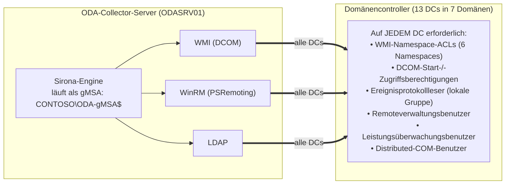
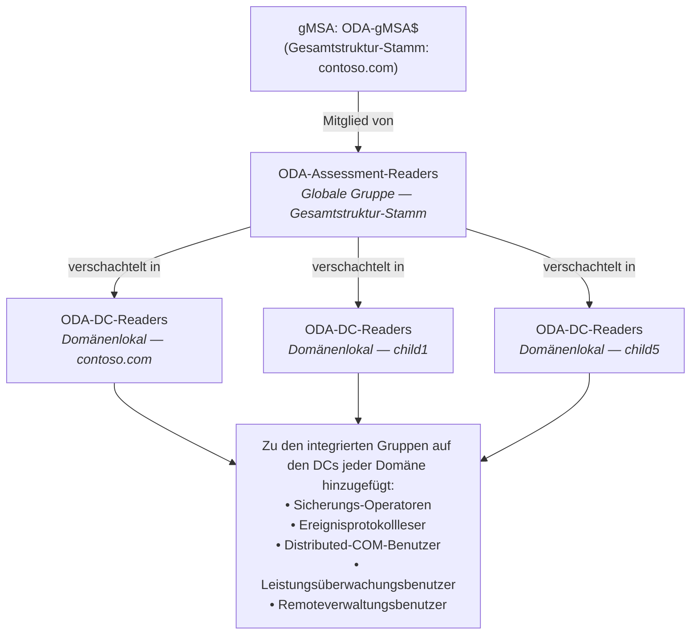
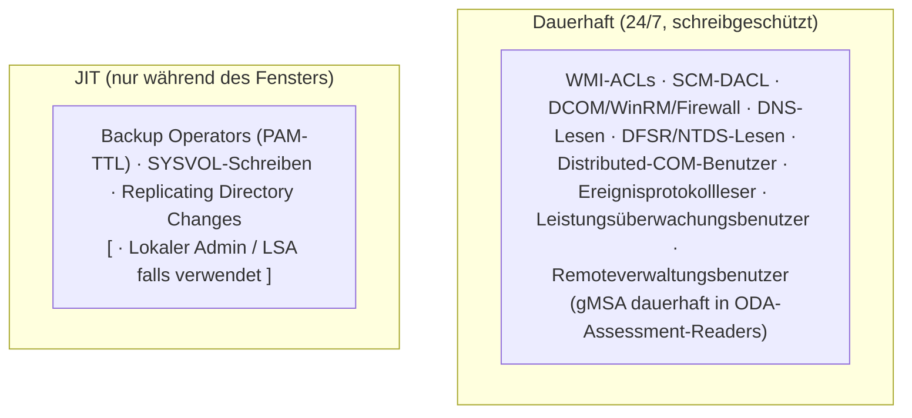

# ODA-AD-Assessment — Leitfaden zur Least-Privilege-Delegation

**🌐 Sprache:** [English](ODA-Delegation-Guide.md) · Deutsch

## 1. Zusammenfassung (Executive Summary)

Dieses Dokument beschreibt, wie die minimal erforderlichen Berechtigungen für das Microsoft **On-Demand Assessment (ODA)** AD-Assessment an ein **Group Managed Service Account (gMSA)** delegiert werden — wodurch Domänen-Admin- oder Enterprise-Admin-Anmeldeinformationen überflüssig werden.

Die ODA-Sirona-Engine sammelt Daten von allen Domänencontrollern (DCs) einer Gesamtstruktur über drei primäre Mechanismen:

| Sammelmechanismus | Erfasste Daten | Erforderliche Berechtigung |
|---|---|---|
| **WMI (DCOM)** | Win32\_\*-Klassen, Registry über StdRegProv, Ereignisprotokolle, DFSR, Vertrauensstellungsstatus | WMI-Namespace-ACLs + DCOM-Start/-Zugriff |
| **WinRM (PSRemoting)** | PowerShell-basierte Collectors (SpeculationControl, UserRights, DFS Shares, QFE) | Remoteverwaltungsbenutzer + WinRM-Richtlinie |
| **LDAP** | AD-Objekte, Vertrauensstellungen, GPOs, Replikationsmetadaten | Authentifizierte Benutzer (Standard-Leserecht) |

### Auswirkung fehlender Berechtigungen

Ein Vergleich des Basis-Assessments (2026-04-27, volle DA-Rechte) mit dem Assessment mit reduzierten Rechten (2026-04-28) ergab:

| Kategorie | Betroffene Tabellenblätter | Verlorene Zeilen | Ursache |
|---|---|---|---|
| WMI-Win32\_\*-Abfragen | 22 Prüfungen | ~3.200 | WMI `Access denied` auf `root\cimv2` |
| Remote-Registry (über WMI) | 29 Prüfungen | ~1.400 | WMI `Access denied` (StdRegProv) |
| Ereignisprotokolle | 7 Prüfungen | ~130 | WMI + Ereignisprotokollleser fehlen |
| DFSR / SYSVOL | 15 Prüfungen | ~200 | WMI `root\cimv2` + DFSR-Namespace |
| Validierung von Vertrauensstellungen | 2 Prüfungen | ~23 | WMI `root\MicrosoftActiveDirectory` |
| AD-Replikation | 2 Prüfungen | ~13 | Replikations-Leserechte |
| WinRM-Collectors | 4 Prüfungen (4 DCs) | ~680 | HTTP 403 — PSRemoting verweigert |
| **Gesamt** | **74 Collectors fehlgeschlagen** | **~5.400 Zeilen** | |

## 2. Architekturübersicht



## 3. Voraussetzungen

### 3.1 gMSA-Konto

Das gMSA muss nur **einmal in einer einzigen Domäne** der Gesamtstruktur erstellt werden — typischerweise in der **Gesamtstruktur-Stammdomäne** (z. B. `contoso.com`). Es muss **nicht** in jeder untergeordneten Domäne existieren. Der domänenübergreifende Zugriff wird über Gruppenverschachtelung erreicht (siehe Abschnitt 3.2).

Anforderungen an das gMSA:

- Das Computerkonto des ODA-Collector-Servers muss in `PrincipalsAllowedToRetrieveManagedPassword` aufgeführt sein
- Der KDS-Stammschlüssel muss in der Gesamtstruktur vorhanden sein (einmalige Einrichtung)
- Das gMSA ist Mitglied der Platzhalter-Global-Gruppe (siehe Abschnitt 3.2)

```powershell
# Example: Create gMSA in the forest root domain
New-ADServiceAccount -Name 'ODA-gMSA' `
    -DNSHostName 'oda-gmsa.contoso.com' `
    -PrincipalsAllowedToRetrieveManagedPassword 'ODASRV01$' `
    -Enabled $true
```

### 3.2 Gruppenverschachtelungsstrategie für domänenübergreifende Delegation

Da das gMSA nur in einer Domäne existiert, aber auf DCs in allen untergeordneten Domänen Berechtigungen benötigt, verwenden Sie das **AGDLP**-Verschachtelungsmuster (Account → Global → Domain Local → Permission):



> Die `...` zwischen `child1` und `child5` stehen für die übrigen untergeordneten Domänen — jede untergeordnete Domäne erhält ihre eigene **domänenlokale** Gruppe `ODA-DC-Readers` nach demselben Muster.

#### Schrittweise Einrichtung:

1. **Gesamtstruktur-Stammdomäne** (`contoso.com`): Erstellen Sie eine **globale** Sicherheitsgruppe `ODA-Assessment-Readers` und fügen Sie das gMSA als Mitglied hinzu.

2. **Jede untergeordnete Domäne**: Erstellen Sie eine **domänenlokale** Sicherheitsgruppe `ODA-DC-Readers` und verschachteln Sie die globale Gruppe des Gesamtstruktur-Stamms darin.

3. Verwenden Sie die **domänenlokale** Gruppe (`ODA-DC-Readers`) in jeder Domäne für alle lokalen Berechtigungszuweisungen (GPO-Gruppenmitgliedschaften, WMI-ACLs, DCOM-Sicherheit).

```powershell
# 1. Forest root — create Global group, add gMSA
New-ADGroup -Name 'ODA-Assessment-Readers' -GroupScope Global `
    -GroupCategory Security -Path 'OU=Groups,DC=contoso,DC=com'
Add-ADGroupMember -Identity 'ODA-Assessment-Readers' -Members 'ODA-gMSA$'

# 2. Each child domain — create Domain Local group, nest the Global group
$childDomains = @('child1.contoso.com','child2.contoso.com',
                  'child3.contoso.com','child4.contoso.com',
                  'child5.contoso.com','child6.contoso.com')

foreach ($domain in $childDomains) {
    New-ADGroup -Name 'ODA-DC-Readers' -GroupScope DomainLocal `
        -GroupCategory Security -Server $domain
    Add-ADGroupMember -Identity 'ODA-DC-Readers' `
        -Members 'CN=ODA-Assessment-Readers,OU=Groups,DC=contoso,DC=com' `
        -Server $domain
}
```

> **Warum das funktioniert**: Globale Gruppen aus dem Gesamtstruktur-Stamm können in domänenlokale Gruppen in jeder Domäne innerhalb derselben Gesamtstruktur verschachtelt werden. Die domänenlokale Gruppe wird dann für alle lokalen Ressourcenberechtigungen verwendet (Mitgliedschaften in integrierten Gruppen, WMI-ACLs, DCOM). Das ist das Standard-AGDLP-Modell.

**Vorteil**: Wenn sich das gMSA ändert, muss nur die Mitgliedschaft in der globalen Gruppe im Gesamtstruktur-Stamm aktualisiert werden — nicht jede GPO, WMI-ACL und lokale Gruppe in allen Domänen.

## 4. Delegationsschritte

### 4.1 AD-Gruppenmitgliedschaften (pro Domäne in der Gesamtstruktur)

Da das gMSA ein authentifizierter Benutzer ist, verfügt es bereits über die standardmäßigen AD-Leserechte. Die **domänenlokale Gruppe** (`ODA-DC-Readers`) jeder Domäne (die die globale Gruppe des Gesamtstruktur-Stamms mit dem gMSA enthält — siehe Abschnitt 3.2) muss diesen **integrierten Gruppen auf den DCs jeder Domäne** hinzugefügt werden:

| Gruppe | Zweck | Behebt |
|---|---|---|
| **Sicherungs-Operatoren (Backup Operators)** | Gewährt Zugriff auf Admin-Freigaben (`C$`) für dateibasierte Collectors | Netlogon.dns-, Netlogon.log-Collectors (siehe Abschnitt 4.11) |
| **Distributed-COM-Benutzer** | Erlaubt DCOM-Aufrufe an WMI | WMI-Voraussetzungsprüfung |
| **Ereignisprotokollleser (Event Log Readers)** | Lesen der Ereignisprotokolle Anwendung, System, Verzeichnisdienst, DNS | 7 Ereignisprotokoll-Collectors |
| **Leistungsüberwachungsbenutzer (Performance Monitor Users)** | Lesen von Leistungsindikatoren | Leistungsdaten-Collectors |
| **Remoteverwaltungsbenutzer (Remote Management Users)** | WinRM-/PSRemoting-Zugriff | 4 WinRM-basierte Collectors (UserRights, SpeculationControl, DFS Shares, QFE) |

> **⚠ Sicherheitshinweis — Sicherungs-Operatoren (Backup Operators)**
>
> **Sicherungs-Operatoren** ist die höchstprivilegierte integrierte Gruppe in diesem Delegationspaket. Mitglieder können **alle Dateien** des Systems lesen (über `SeBackupPrivilege`), auf **alle Admin-Freigaben** (`C$`, `ADMIN$`) zugreifen und — auf Domänencontrollern — sich **lokal anmelden** und **das System herunterfahren**. Das macht sie in den meisten Härtungsframeworks (Microsoft ESAE, ERNW-AD-Tier-Modell) zu einer sensiblen **Tier-0**-Gruppe.
>
> **Wenn der Kunde die Mitgliedschaft in den Sicherungs-Operatoren ablehnt**, ergibt sich folgende Auswirkung:
>
> | Collector | Excel-Tabellenblatt | Verlorene Daten | Schweregrad |
> |---|---|---|---|
> | `AD_NameResolution_DCNetlogon.dns` | Netlogon_DNS | DNS-Registrierungseinträge pro DC | Gering — informativ, DNS-Probleme über andere Prüfungen sichtbar |
> | `FILE_Netlogon.log` | Netlogon_Log | Netlogon-Debugprotokolleinträge (sicherer Kanal, DC-Locator) | Gering — informativ, nützlich zur Fehlersuche, aber keine kritischen Zustandsdaten |
>
> **Empfehlung — JIT-(Just-in-Time-)Gruppenmitgliedschaft (Best Practice)**:
>
> Statt eine **dauerhafte** Mitgliedschaft in den Sicherungs-Operatoren zu gewähren, verwenden Sie eine **zeitlich begrenzte Gruppenmitgliedschaft**, sodass das gMSA nur während des ODA-Assessment-Fensters Mitglied ist. Das folgt dem **Prinzip der geringsten Rechte über die Zeit** und ist der empfohlene Ansatz für den Zugriff auf Tier-0-Gruppen.
>
> **Option 1 — Privileged Access Management (PAM) mit TTL** (AD-Gesamtstruktur-Funktionsebene 2016+):
>
> Das PAM-Feature (eingeführt mit der Windows-Server-2016-FFL) unterstützt **zeitgebundene Gruppenmitgliedschaft** nativ über den Parameter `-MemberTimeToLive`. Die Mitgliedschaft läuft automatisch ab — kein Aufräumen erforderlich.
>
> ```powershell
> # Enable PAM feature (one-time, requires Forest Functional Level 2016+)
> Enable-ADOptionalFeature 'Privileged Access Management Feature' `
>     -Scope ForestOrConfigurationSet -Target 'contoso.com'
>
> # Add gMSA to Backup Operators with a 4-hour TTL (adjust to assessment duration)
> # Run this in EACH domain against the Domain Local group on the DCs
> $ttl = New-TimeSpan -Hours 4
> Add-ADGroupMember -Identity 'Backup Operators' `
>     -Members 'CN=ODA-DC-Readers,OU=Groups,DC=contoso,DC=com' `
>     -MemberTimeToLive $ttl
>
> # Verify TTL membership
> Get-ADGroup 'Backup Operators' -Properties member -ShowMemberTimeToLive
> ```
>
> **Option 2 — Geplante Aufgabe (beliebige Gesamtstruktur-Funktionsebene)**:
>
> Für Gesamtstrukturen unterhalb der FFL 2016 verwenden Sie eine geplante Aufgabe oder einen manuellen Prozess, um die Gruppe vor dem Assessment hinzuzufügen und danach zu entfernen:
>
> ```powershell
> # Before assessment — add membership
> Add-ADGroupMember -Identity 'Backup Operators' `
>     -Members 'CN=ODA-DC-Readers,OU=Groups,DC=contoso,DC=com'
>
> # After assessment — remove membership
> Remove-ADGroupMember -Identity 'Backup Operators' `
>     -Members 'CN=ODA-DC-Readers,OU=Groups,DC=contoso,DC=com' -Confirm:$false
> ```
>
> **Wichtig**: Nach dem Hinzufügen oder Entfernen des gMSA zu/aus den Sicherungs-Operatoren muss die **geplante Sirona-Aufgabe neu gestartet werden**, um eine Kerberos-TGT-Erneuerung zu erzwingen — zwischengespeicherte Tokens spiegeln Gruppenänderungen erst nach der Erneuerung wider (bis zu 10 Stunden).
>
> **Option 3 — Die Lücke akzeptieren**: Wenn der Kunde die Mitgliedschaft in den Sicherungs-Operatoren vollständig ablehnt (auch mit JIT), **akzeptieren Sie die Lücke**. Die beiden betroffenen Tabellenblätter liefern ergänzende Diagnosedaten — sie beeinträchtigen das zentrale AD-Zustands-Assessment (Replikation, GPO, Vertrauensstellungen, Sicherheitskonfiguration) nicht. Alle anderen Collectors (WMI, WinRM, LDAP, Ereignisprotokolle) funktionieren auch ohne Sicherungs-Operatoren weiter.

**Anwendung**: Verwenden Sie GPO mit **eingeschränkten Gruppen (Restricted Groups)** oder **Gruppenrichtlinieneinstellungen → Lokale Benutzer und Gruppen**, verknüpft mit der Domänencontroller-OU jeder Domäne.

GPO-Pfad:

```
Computer Configuration
 └─ Policies
    └─ Windows Settings
       └─ Security Settings
          └─ Restricted Groups
             (or)
       └─ Preferences
          └─ Control Panel Settings
             └─ Local Users and Groups
```

### 4.2 DCOM-Sicherheit (Start und Zugriff auf Computerebene)

Seit den DCOM-Härtungsänderungen von 2022 ist die Mitgliedschaft in `Distributed COM Users` zwar notwendig, aber möglicherweise nicht ausreichend. Die DCOM-Computerzugriffs- und -Startbeschränkungen müssen das ODA-Konto explizit zulassen.

**Prüfen Sie, ob Distributed-COM-Benutzer diese Rechte bereits erben.** Falls nicht, konfigurieren Sie sie per GPO:

GPO-Pfad:

```
Computer Configuration
 └─ Policies
    └─ Windows Settings
       └─ Security Settings
          └─ Local Policies
             └─ Security Options
```

| Richtlinie | Zu gewährende Rechte |
|---|---|
| **DCOM: Computerzugriffsbeschränkungen** | Lokaler Zugriff, Remotezugriff |
| **DCOM: Computerstartbeschränkungen** | Lokaler Start, Remotestart, Lokale Aktivierung, Remoteaktivierung |

Referenz: [DCOM Authentication Hardening](https://techcommunity.microsoft.com/blog/windows-itpro-blog/dcom-authentication-hardening-what-you-need-to-know/3657154)

> **Wichtig**: Der DCOM-Zugriff ist ein Zwei-Schichten-Modell. Schicht 1 (Computerbeschränkungen) steuert, ob das Konto DCOM überhaupt nutzen darf. Schicht 2 (Berechtigungen pro Anwendung) steuert einzelne DCOM-Anwendungen. Wenn Schicht 1 blockiert, wird Schicht 2 nie ausgewertet — ähnlich wie Freigabeberechtigungen vs. NTFS-ACLs.

### 4.3 WinRM-Richtlinie (GPO auf der Domänencontroller-OU)

Stellen Sie sicher, dass WinRM aktiviert ist und die Remoteverwaltung auf allen DCs zulässt:

GPO-Pfad:

```
Computer Configuration
 └─ Policies
    └─ Administrative Templates
       └─ Windows Components
          └─ Windows Remote Management (WinRM)
             └─ WinRM Service
```

Richtlinie: **Remoteserververwaltung über WinRM zulassen**

- Auf **Aktiviert** setzen
- IPv4-Filter: `*` (oder zur strafferen Absicherung auf die IP des ODA-Collector-Servers beschränken)

### 4.4 Eingehende Windows-Firewall-Regeln (GPO auf der Domänencontroller-OU)

Die folgenden Gruppen eingehender Firewallregeln müssen auf allen DCs aktiviert sein:

GPO-Pfad:

```
Computer Configuration
 └─ Policies
    └─ Windows Settings
       └─ Windows Defender Firewall with Advanced Security
          └─ Inbound Rules
```

| Firewallregelgruppe | Zweck |
|---|---|
| **Windows-Verwaltungsinstrumentation (WMI)** | DCOM-/WMI-Remotezugriff |
| **Windows-Remoteverwaltung** | WinRM/PSRemoting |
| **Remote-Ereignisprotokollverwaltung** | Lesen von Ereignisprotokollen |

Optional können Sie den Remote-IP-Bereich zur strafferen Absicherung auf die IPv4-Adresse des ODA-Collector-Servers beschränken.

SMB (Port 445) wird ebenfalls für den Zugriff auf die Netlogon- und SYSVOL-Freigaben benötigt, sollte auf DCs aber bereits aktiv sein.

### 4.5 WMI-Namespace-ACLs (pro DC — nicht per GPO setzbar)

Dies ist der kritischste Schritt. Die WMI-Namespace-Sicherheit ist **lokal je Computer** und kann nicht vollständig über die GPO-Oberfläche konfiguriert werden. Das ODA-Konto benötigt `Execute Methods`, `Enable Account` und `Remote Enable` auf drei WMI-Namespaces.

| Namespace | Inhalt | Behobene Collectors |
|---|---|---|
| `Root\CIMV2` | Win32\_\*-Klassen, Ereignisprotokollobjekte, DFSR über cimv2 | 51 Collectors (Win32\_\*, EventLogs\_\*, DFSR\_\*) |
| `Root\default` | **StdRegProv** (Remote-Registry über WMI) | **Alle Registry\_\*-Collectors + Sirona-„Registry Check"-Voraussetzung** — blockiert kaskadierend ~30 Collectors, wenn fehlend |
| `Root\MicrosoftActiveDirectory` | Microsoft\_DomainTrustStatus, Validierung von Vertrauensstellungen | 2 Collectors (Vertrauensstellungsstatus, -validierung) |
| `Root\directory` | LDAP-/AD-WMI-Provider | AD-WMI-basierte Collectors |
| `Root\MicrosoftDFS` | DFS-Namespace- und Ordnerzielinformationen | DFS-bezogene Collectors |
| `Root\MicrosoftDNS` | MicrosoftDNS\_\*-Klassen — DNS-Serverkonfiguration, Zonen, Weiterleitungen | 4 Collectors (`DNS_Server_Log`, `Dns_Forwarders`, `Local_Dns_Zones`, `DNS_Zones`) |

> **KRITISCH — `Root\default`**: Die Sirona-Engine führt für jeden DC eine „Registry Check"-Voraussetzungsprüfung gegen `\\<DC>\root\default` (StdRegProv) aus. Schlägt diese Voraussetzung fehl, wird der DC-Knoten als fehlgeschlagen markiert und **alle nachgelagerten WMI-Collectors, die auf diesen DC zielen, werden übersprungen** — einschließlich DFSR-, DNS-, Registry-, Startkonfigurations- und BIOS-Collectors. Das ist ein Kaskadenfehler, der leere Excel-Tabellenblätter ohne expliziten Fehler erzeugt. Der Namespace `Root\default` ist von `Root\CIMV2` getrennt und muss unabhängig delegiert werden.

#### Erforderliche WMI-Berechtigungen

| Berechtigung | WMI-Sicherheitsname | Zweck |
|---|---|---|
| **Remote Enable** | `RemoteAccess` | Erlaubt WMI-Zugriff von einem anderen Computer |
| **Enable Account** | `Enable` | Erlaubt das Lesen von WMI-Klassen und -Instanzen |
| **Execute Methods** | `MethodExecute` | WMI-Methoden aufrufen |

> **Hinweis**: `Remote Enable` ist die Berechtigung, die authentifizierten Benutzern typischerweise fehlt. Ohne sie kann das ODA-Konto lokal auf WMI zugreifen, aber NICHT von einem entfernten Computer.

#### WMI-ACLs mit Set-WmiNamespaceSecurity.ps1 anwenden

Verwenden Sie das Skript aus [BetaHydri/ODA-Delegation-Toolkit](https://github.com/BetaHydri/ODA-Delegation-Toolkit):

```powershell
# Set WMI ACLs for all 5 namespaces
$account = 'CONTOSO\ODA-Assessment-Readers'  # placeholder group or gMSA$

# Root\CIMV2 — Win32_*, event logs, DFSR
.\Set-WMINamespaceACL.ps1 -namespace "Root\CIMV2" `
    -operation add -account $account `
    -permissionsString "Enable,MethodExecute,RemoteAccess" `
    -allowInherit $true

# Root\default — StdRegProv (remote registry) + Sirona Registry Check prereq
.\Set-WMINamespaceACL.ps1 -namespace "Root\default" `
    -operation add -account $account `
    -permissionsString "Enable,MethodExecute,RemoteAccess" `
    -allowInherit $true

# Root\MicrosoftActiveDirectory — trust status
.\Set-WMINamespaceACL.ps1 -namespace "Root\MicrosoftActiveDirectory" `
    -operation add -account $account `
    -permissionsString "Enable,MethodExecute,RemoteAccess" `
    -allowInherit $true

# Root\directory — AD/LDAP WMI providers
.\Set-WMINamespaceACL.ps1 -namespace "Root\directory" `
    -operation add -account $account `
    -permissionsString "Enable,MethodExecute,RemoteAccess" `
    -allowInherit $true

# Root\MicrosoftDFS — DFS namespace and folder targets
.\Set-WMINamespaceACL.ps1 -namespace "Root\MicrosoftDFS" `
    -operation add -account $account `
    -permissionsString "Enable,MethodExecute,RemoteAccess" `
    -allowInherit $true

# Root\MicrosoftDNS — DNS server config, zones, forwarders (DNS_Server_Log, Dns_Forwarders, Local_Dns_Zones, DNS_Zones)
.\Set-WMINamespaceACL.ps1 -namespace "Root\MicrosoftDNS" `
    -operation add -account $account `
    -permissionsString "Enable,MethodExecute,RemoteAccess" `
    -allowInherit $true
```

> **Hinweis zu `Root\MicrosoftDNS`**: Dieser Namespace existiert nur auf DCs mit der Rolle **DNS-Server**. Der DNS-WMI-Provider führt möglicherweise auch eine eigene Autorisierungsprüfung durch — schlagen Collectors nach dem Setzen der ACL weiterhin fehl, prüfen Sie, ob die ODA-Gruppe DNS-Leserechte besitzt (z. B. über `DnsAdmins`-Mitgliedschaft oder eine benutzerdefinierte DNS-Delegation). Siehe Abschnitt 4.6.

> **Hinweis**: Die Skripte sind idempotent — ein erneuter Aufruf bei bereits vorhandener ACE überspringt mit einer Warnung und erzeugt keine Duplikate. Ein optionaler Parameter `-logPath` schreibt Änderungseinträge mit Zeitstempel in eine Protokolldatei.

Zum **Zurücksetzen** (Entfernen des ACL-Eintrags):

```powershell
.\Set-WMINamespaceACL.ps1 -namespace "Root\CIMV2" `
    -operation delete -account $account
```

#### Bereitstellungsoptionen für WMI-ACLs

Da WMI-Namespace-ACLs lokal je Computer sind, wählen Sie eine der folgenden Möglichkeiten:

| Methode | Vorteile | Nachteile |
|---|---|---|
| **GPO-Startskript** | Läuft automatisch bei jedem Start, selbstheilend | Skript muss idempotent sein |
| **DSC (Desired State Configuration)** | Deklarativ, Drift-Erkennung | Erfordert DSC-Infrastruktur |
| **Einmaliges Admin-Skript über Invoke-Command** | Schnell, keine Infrastruktur nötig | Nicht selbstheilend, manuelle Wiederholung auf neuen DCs |

Beispiel für eine einmalige Bereitstellung:

```powershell
$dcs = @(
    'DC01', 'DC02',           # contoso.com
    'DC03', 'DC04',           # child1.contoso.com
    'DC05', 'DC06',           # child2.contoso.com
    'DC07', 'DC08',           # child4.contoso.com
    'DC09', 'DC10',           # child5.contoso.com
    'DC11', 'DC12',           # child3.contoso.com
    'DC13'                         # child6.contoso.com
)
$account = 'CONTOSO\ODA-Assessment-Readers'
$namespaces = @('Root\CIMV2', 'Root\default', 'Root\MicrosoftActiveDirectory', 'Root\directory', 'Root\MicrosoftDFS', 'Root\MicrosoftDNS')

foreach ($dc in $dcs) {
    foreach ($ns in $namespaces) {
        Invoke-Command -ComputerName $dc -ScriptBlock {
            param($ns, $acct)
            # Script must be present on the DC or passed inline
            & C:\Scripts\Set-WMINamespaceACL.ps1 `
                -namespace $ns -operation add `
                -account $acct `
                -permissionsString "Enable,MethodExecute,RemoteAccess" `
                -allowInherit $true
        } -ArgumentList $ns, $account
    }
}
```

Alternativ können Sie das mitgelieferte Orchestrierungsskript `Process-DCs.ps1` verwenden, das alle 6 WMI-Namespaces, die SCM-DACL (siehe Abschnitt 4.5a) und die Netlogon-Datei-NTFS-Berechtigungen (siehe Abschnitt 4.11) in einem Durchlauf mit zentralisierter Protokollierung auf dem Admin-Server abarbeitet. Das Skript unterstützt sowohl `-operation add` als auch `-operation delete` für ein Rollback, erkennt Loopback (wenn der Ziel-DC der lokale Computer ist), um WinRM-Selbstverbindungsfehler zu vermeiden, und protokolliert jede einzelne Einstellung mit ihrem Ergebnis.

### 4.5a Service-Control-Manager-(SCM-)DACL

`Win32_Service`-WMI-Abfragen durchlaufen **zwei** Sicherheitsschichten:

1. **WMI-Namespace-ACL** (`Root\CIMV2`) — vom WMI-Provider zuerst geprüft
2. **Service-Control-Manager-DACL** — als Zweites geprüft, wenn der Provider `EnumServicesStatus` aufruft

Wenn die WMI-Namespace-ACL den Zugriff gewährt, die SCM aber `SC_MANAGER_ENUMERATE_SERVICE` verweigert, schlägt die Abfrage mit _Access Denied_ fehl — obwohl andere `Root\CIMV2`-Klassen wie `Win32_BIOS` oder `Win32_NetworkAdapterConfiguration` einwandfrei funktionieren.

#### Erforderliche SCM-Berechtigungen (geringste Rechte)

| Recht | Hex | SDDL | Zweck |
|---|---|---|---|
| `SC_MANAGER_CONNECT` | `0x0001` | `CC` | Mit dem SCM verbinden |
| `SC_MANAGER_ENUMERATE_SERVICE` | `0x0004` | `LC` | Dienste aufzählen |

#### SCM-DACL mit Set-SCM_ACL.ps1 anwenden

Verwenden Sie das Skript `Set-SCM_ACL.ps1` aus [BetaHydri/ODA-Delegation-Toolkit](https://github.com/BetaHydri/ODA-Delegation-Toolkit):

```powershell
# Grant SCM enumerate access on a remote DC
.\Set-SCM_ACL.ps1 -operation add -account "CONTOSO\ODA-Assessment-Readers" -computerName "DC01"

# Remove SCM ACE
.\Set-SCM_ACL.ps1 -operation delete -account "CONTOSO\ODA-Assessment-Readers" -computerName "DC01"
```

Nach jeder Operation zeigt das Skript die resultierende SCM-DACL mit den tatsächlichen Berechtigungsnamen an (`SC_MANAGER_CONNECT`, `SC_MANAGER_ENUMERATE_SERVICE` usw.).

> **Hinweis**: Die SCM-DACL ist lokal je Computer und kann nicht per GPO gesetzt werden. Verwenden Sie `Process-DCs.ps1 -operation add`, um sie in einem Durchlauf auf alle DCs anzuwenden — das Skript behandelt WMI-Namespace-ACLs, SCM-DACL und Netlogon-NTFS-Berechtigungen gemeinsam, mit zentralisierter Protokollierung auf dem Admin-Server. Für ein Rollback verwenden Sie `Process-DCs.ps1 -operation delete`.

> **Wichtig — gMSA-Token-Aktualisierung**: Nach dem Anwenden von SCM-DACL-Änderungen (oder einer beliebigen Gruppenmitgliedschaftsänderung) müssen Sie die **geplante Sirona-Aufgabe** auf dem ODA-Collector-Server **neu starten**, um das gMSA zu zwingen, ein frisches Kerberos-TGT zu erhalten. Kerberos-Tokens speichern Gruppenmitgliedschaften bis zu 10 Stunden zwischen. Ohne Neustart der Aufgabe spiegelt das Token des gMSA die neuen SCM-Berechtigungen nicht wider und `Win32_Service`-/`IsWindowsDNS`-Prüfungen schlagen weiterhin fehl.

### 4.6 DNS-Lese-Delegation

Das ODA-Konto benötigt Lesezugriff auf die in AD gespeicherten DNS-Zonen. Delegieren Sie über:

```powershell
# Grant read on DNS zone objects in AD
# For each AD-integrated DNS zone:
$zones = Get-DnsServerZone -ComputerName <DC> |
    Where-Object { $_.ZoneType -eq 'Primary' -and $_.IsDsIntegrated }

foreach ($zone in $zones) {
    # Add read permission to the zone
    Add-DnsServerResourceRecordPermission ... # or use DNS Manager GUI
}
```

Alternativ fügen Sie die ODA-Gruppe der Gruppe **DnsAdmins** hinzu (Leserecht genügt, aber DnsAdmins hat volle DNS-Kontrolle — erwägen Sie eine benutzerdefinierte Delegation, wenn geringste Rechte kritisch sind).

> **Tipp zu domänenübergreifenden Gruppenmitgliedschaften**: Wenn Sie eine Gruppe aus einer untergeordneten Domäne zu `DnsAdmins` in der Stammdomäne hinzufügen (oder umgekehrt), kann `Add-ADGroupMember` mit einem _Referral_-Fehler fehlschlagen, weil versucht wird, den fremden DN auf dem Zielserver zu validieren. Verwenden Sie stattdessen `Set-ADObject`:
>
> ```powershell
> # Add cross-domain member to DnsAdmins — avoids referral error
> Set-ADObject -Identity 'CN=DnsAdmins,CN=Users,DC=contoso,DC=com' `
>     -Add @{member='CN=G-D-Contoso-Child1-RemoteAccess,OU=Groups,OU=ODA,OU=Applications,DC=child1,DC=contoso,DC=com'} `
>     -Server DC01.contoso.com
> ```
>
> **Regel**: Der `-Server` muss den Namenskontext (die Partition) besitzen, zu dem die Zielgruppe (`-Identity`) gehört. Für domänenübergreifende Mitglieds-DNs schreibt `Set-ADObject` das Attribut `member` direkt über LDAP ohne Validierung des fremden DN.

### 4.7 ODA-Collector-Server — lokale Berechtigungen

Auf dem ODA-Collector-Server (ODASRV01) selbst benötigt das gMSA:

| Berechtigung | Zweck |
|---|---|
| **Lokaler Administrator** | Ausführen der Sirona-Engine |
| **Anmelden als Batchauftrag** | Ausführung der geplanten Aufgabe |

### 4.8 AD-Replikationskonvergenz — Replicating Directory Changes

Die AD-Konvergenz-Collectors (`IPBB_ADREPLICATIONSTATUS_GetADConvergence_Init` / `_Collect`) schreiben über LDAP ein Testattribut in ein AD-Objekt und überwachen die Replikationslatenz über die DCs hinweg. Dies erfordert das erweiterte Recht **„Replicating Directory Changes"** auf jedem Domänen-Namenskontext.

Ohne dieses Recht schlägt der Collector fehl mit:
```
The user has insufficient access rights.
Type=System.DirectoryServices.Protocols.DirectoryOperationException
```

**Auswirkung**: Die Excel-Tabellenblätter `AD_Convergence` und `AD_Convergence_Details` bleiben leer.

#### Delegation anwenden

Gewähren Sie das erweiterte Recht auf jedem Domänen-NC in der Gesamtstruktur mit `dsacls`:

```powershell
$gmsaOrGroup = 'CONTOSO\ODA-Assessment-Readers'  # Global group containing the gMSA

$domainNCs = @(
    'DC=contoso,DC=com',
    'DC=child1,DC=contoso,DC=com',
    'DC=child2,DC=contoso,DC=com',
    'DC=child3,DC=contoso,DC=com',
    'DC=child4,DC=contoso,DC=com',
    'DC=child5,DC=contoso,DC=com',
    'DC=child6,DC=contoso,DC=com'
)

foreach ($dn in $domainNCs) {
    dsacls $dn /G "${gmsaOrGroup}:CA;Replicating Directory Changes"
}
```

> **Hinweis**: Dies ist ein **schreibgeschütztes** Replikationsrecht — es gewährt KEINE Kennwortreplikation (`Replicating Directory Changes All`). Es erlaubt nur das Lesen von Replikationsmetadaten und das Schreiben von Konvergenz-Testattributen.

#### Rollback

```powershell
foreach ($dn in $domainNCs) {
    dsacls $dn /R $gmsaOrGroup
}
```

### 4.9 SYSVOL-Schreibzugriff für den Konvergenztest

Die SYSVOL-Konvergenz-Collectors (`IPBB_SYSVOLREPLICATION_Convergence_Init` / `_Collect`) messen die DFS-R-Replikationslatenz, indem sie auf einem DC pro Domäne eine **temporäre Datei** (`<guid>.txt`) in `\\<DC>\SYSVOL\<domain>\` **erstellen** und deren Replikation zu anderen DCs überwachen. Dies erfordert **Schreibzugriff** auf den SYSVOL-Domänenordner.

Ohne dieses Recht schlägt der Collector fehl mit:
```
Access to the path '\\DC01.CONTOSO.COM\SYSVOL\contoso.com\<guid>.txt' is denied.
Type=System.UnauthorizedAccessException
```

**Auswirkung**: Die Excel-Tabellenblätter `Sysvol_Convergence` und `Convergence_Detail` bleiben leer.

#### Delegation anwenden

Gewähren Sie die NTFS-Berechtigung „Ändern" auf dem SYSVOL-Domänen-Stammordner auf **einem DC pro Domäne** (typischerweise dem PDC-Emulator — DFS-R repliziert die Datei zu anderen DCs):

```powershell
$gmsaOrGroup = 'CONTOSO\ODA-Assessment-Readers'

# Map: domain DNS name → one DC FQDN (preferably PDCe)
$domainToDC = @{
    'contoso.com'           = 'DC01'
    'child1.contoso.com'    = 'DC03'
    'child2.contoso.com'    = 'DC05'
    'child3.contoso.com'    = 'DC11'
    'child4.contoso.com'    = 'DC07'
    'child5.contoso.com'    = 'DC09'
    'child6.contoso.com'    = 'DC13'
}

foreach ($domain in $domainToDC.Keys) {
    $dc = $domainToDC[$domain]
    $sysvolPath = "\\$dc\SYSVOL\$domain"
    Write-Host "Granting Modify on $sysvolPath..."
    icacls $sysvolPath /grant "${gmsaOrGroup}:(OI)(CI)M"
}
```

> **Sicherheitshinweis**: Dies gewährt Schreibzugriff auf den SYSVOL-Domänen-Stamm. Der ODA-Konvergenztest erstellt und löscht eine einzelne kleine Textdatei. Erwägen Sie eine Beschränkung auf `(W)` (Schreiben) statt `(M)` (Ändern), wenn geringste Rechte kritisch sind. Nach dem Assessment kann die NTFS-ACE entfernt werden (siehe Rollback).

#### Rollback

```powershell
foreach ($domain in $domainToDC.Keys) {
    $dc = $domainToDC[$domain]
    $sysvolPath = "\\$dc\SYSVOL\$domain"
    icacls $sysvolPath /remove $gmsaOrGroup
}
```

### 4.10 LSA-Richtlinienzugriff für den UserRights-Collector

Der Collector `UPGRADEASSESSMENT_Collect_User_Rights` ruft die **native Win32-LSA-API** (`LsaOpenPolicy`) auf jedem DC auf, um Zuweisungen von Benutzerrechten aufzuzählen (z. B. `SeInteractiveLogonRight`, `SeRemoteInteractiveLogonRight`). Dies erfordert `POLICY_VIEW_LOCAL_INFORMATION`-Zugriff auf das LSA-Richtlinienobjekt jedes DC.

Dies wird **nicht** durch die Remoteverwaltungsbenutzer, die Ereignisprotokollleser oder eine der anderen Gruppenmitgliedschaften gewährt. Es ist eine Berechtigung auf LSA-Ebene.

Ohne dieses Recht schlägt der Collector fehl mit:
```
Attempted to perform an unauthorized operation.
Type=System.UnauthorizedAccessException
at Microsoft.Sirona.Native.UnsafeNativeMethodWrappers.LsaOpenPolicy(...)
```

**Auswirkung**: Das Excel-Tabellenblatt `UserRights` bleibt leer.

#### Optionen (eine wählen)

| Option | Vorteile | Nachteile |
|---|---|---|
| **A) Zu den lokalen Administratoren auf den DCs hinzufügen** | Einfach, garantiert funktionierend | Verletzt geringste Rechte; gewährt volle DC-Adminrechte |
| **B) LSA-Richtlinien-Leserecht per Sicherheitsvorlage gewähren** | Geringste Rechte | Komplex; erfordert `secedit` oder ein benutzerdefiniertes Skript pro DC |
| **C) Die Lücke akzeptieren** | Kein Risiko, keine Änderung | Das Blatt `UserRights` bleibt leer |

#### Option B: LSA-Richtlinien-Leserecht anwenden (geringste Rechte)

Die ACL des LSA-Richtlinienobjekts kann mit `LsaSetSecurityObject` oder über eine mit `secedit` exportierte/importierte Sicherheitsvorlage geändert werden. Dies ist eine fortgeschrittene Operation:

```powershell
# Export current LSA policy security on a DC
Invoke-Command -ComputerName DC01 -ScriptBlock {
    secedit /export /cfg C:\Temp\secpol.cfg /areas USER_RIGHTS
}

# The UserRights collector needs POLICY_VIEW_LOCAL_INFORMATION
# on the LSA Policy object — this is NOT the same as a user right assignment.
# It is a permission on the Policy object itself.
# Manual approach: use ntrights.exe or a custom C# / PowerShell wrapper
# around LsaOpenPolicy / LsaSetSecurityObject.
```

> **Empfehlung**: Für die meisten Umgebungen ist **Option A** (lokale Administratoren) die pragmatische Wahl, da das gMSA ohnehin bereits erheblichen Zugriff benötigt. Lehnt der Kunde ab, akzeptieren Sie die Lücke (Option C) — das Blatt `UserRights` liefert informative, keine kritischen Zustandsdaten.

### 4.11 Netlogon.dns- und Netlogon.log-Dateizugriff (Admin-Freigabe C$)

Der Collector `AD_NameResolution_DCNetlogon.dns` liest `\\<DC>\C$\Windows\system32\config\netlogon.dns` und der Collector `FILE_Netlogon.log` liest `\\<DC>\C$\Windows\debug\netlogon.log` über die administrative Freigabe `C$`.

Der Zugriff auf `C$` erfordert entweder die Mitgliedschaft in den **lokalen Administratoren** oder in den **Sicherungs-Operatoren**. Ist die ODA-Gruppe bereits Mitglied der **Sicherungs-Operatoren** (siehe Abschnitt 4.1), ist die SMB-Freigabe-Hürde genommen. Der Sirona-Collector verwendet jedoch Standard-.NET-Datei-I/O (`System.IO.File.OpenText`), das `SeBackupPrivilege` / `FILE_FLAG_BACKUP_SEMANTICS` **nicht** aktiviert. Daher muss die NTFS-ACL der Datei unabhängig davon Lesezugriff gewähren — das Privileg der Sicherungs-Operatoren allein reicht für das Lesen der Datei nicht aus.

Ohne die NTFS-ACE schlägt der Collector fehl mit:
```
Access to the path '\\DC01.CONTOSO.COM\C$\Windows\system32\config\netlogon.dns' is denied.
Type=System.UnauthorizedAccessException
at Microsoft.Sirona.IPBB.DataCollectors.NetlogonDnsDataCollector
```

**Auswirkung**: Die Excel-Tabellenblätter `Netlogon_DNS` und `Netlogon_Log` bleiben leer.

#### NTFS-Lese-ACE anwenden (geringste Rechte)

Da die Mitgliedschaft in den Sicherungs-Operatoren bereits Zugriff auf die `C$`-Freigabe gewährt, wird nur die NTFS-ACE auf Dateiebene benötigt. Stellen Sie sie über ein **GPO-Startskript** auf der Domänencontroller-OU bereit, damit sie bei jedem Start selbstheilend angewendet wird:

```powershell
# GPO Startup Script — grant NTFS read on netlogon files for ODA group
$account = 'CONTOSO\ODA-DC-Readers'  # Domain Local group per domain
$files = @(
    "$env:SystemRoot\system32\config\netlogon.dns",
    "$env:SystemRoot\debug\netlogon.log"
)

foreach ($file in $files) {
    if (Test-Path $file) {
        $acl = Get-Acl $file
        $existingAce = $acl.Access | Where-Object {
            $_.IdentityReference.Value -eq $account -and
            $_.FileSystemRights -band [System.Security.AccessControl.FileSystemRights]::Read
        }
        if (-not $existingAce) {
            $rule = New-Object System.Security.AccessControl.FileSystemAccessRule(
                $account, 'Read', 'Allow')
            $acl.AddAccessRule($rule)
            Set-Acl $file $acl
        }
    }
}
```

Alternativ wenden Sie sie einmalig über `Invoke-Command` auf allen DCs an:

```powershell
$account = 'CONTOSO\ODA-Assessment-Readers'
$dcs = @('DC01','DC03','DC05','DC07','DC09','DC11','DC13')

foreach ($dc in $dcs) {
    Invoke-Command -ComputerName $dc -ScriptBlock {
        param($acct)
        $files = @(
            "$env:SystemRoot\system32\config\netlogon.dns",
            "$env:SystemRoot\debug\netlogon.log"
        )
        foreach ($file in $files) {
            if (Test-Path $file) {
                icacls $file /grant "${acct}:(R)"
            }
        }
    } -ArgumentList $account
}
```

#### Rollback

```powershell
foreach ($dc in $dcs) {
    Invoke-Command -ComputerName $dc -ScriptBlock {
        param($acct)
        $files = @(
            "$env:SystemRoot\system32\config\netlogon.dns",
            "$env:SystemRoot\debug\netlogon.log"
        )
        foreach ($file in $files) {
            if (Test-Path $file) {
                icacls $file /remove $acct
            }
        }
    } -ArgumentList $account
}
```

> **Hinweis**: Ist die ODA-Gruppe **nicht** in den Sicherungs-Operatoren, verweigert bereits die `C$`-Freigabe selbst den Zugriff — unabhängig von der NTFS-ACE. In diesem Fall ist die Mitgliedschaft in den lokalen Administratoren erforderlich, oder akzeptieren Sie die Lücke — diese Collectors liefern informative Daten.

### 4.12 DFSR-Konfiguration und NTDS-Einstellungen — AD-Lese-Delegation

Die Sirona-Engine liest die DFSR-Topologie und NTDS-Settings-Objekte über LDAP aus den folgenden AD-Containern:

| AD-Container | Partition | Betroffene Collectors |
|---|---|---|
| `CN=DFSR-GlobalSettings,CN=System,DC=<domain>` (Teilbaum) | Domänen-NC | `LDAP_DomainNamingContext_CN_System_CN_DFSR-GlobalSettings`, DFSR-Topologie-Collectors |
| `CN=Domain System Volume,CN=DFSR-GlobalSettings,...` | Domänen-NC | `IPBB_SYSVOLREPLICATION_MicrosoftDfs_DfsrConnectionConfig`, `DfsrReplicatedFolderConfig` |
| `CN=<DC>,CN=Topology,CN=Domain System Volume,...` | Domänen-NC | DFSR-Mitglieds-/-Verbindungstopologie pro DC |
| `CN=Sites,CN=Configuration,DC=<forestRoot>` (Teilbaum) | Konfiguration | `NTDSDSASetting_*` — NTDS-Settings-Objekte für alle DCs |

Standardmäßig haben **authentifizierte Benutzer** Generic Read auf diesen Containern. In gehärteten Umgebungen (z. B. AdminSDHolder-Propagierung, benutzerdefinierte DACLs) können diese Standardberechtigungen jedoch entfernt sein. Kann das gMSA diese Objekte nicht lesen, werden die Collectors zwar „erfolgreich" abgeschlossen, liefern aber **null Daten** — was zu leeren Excel-Tabellenblättern für `Dfsr_Info`, `Volume_Config`, `Dfsr_Connection` und `NTDS_Settings` führt.

**Auswirkung**: Die DFSR-Topologie-Blätter und das NTDS-Settings-Blatt bleiben leer.

#### Delegation anwenden

Gewähren Sie Generic Read (GR) auf dem DFSR-GlobalSettings-Container (mit Teilbaumvererbung) in jeder Domäne sowie auf dem Sites-Container in der Konfigurationspartition:

```powershell
$gmsaOrGroup = 'CONTOSO\ODA-Assessment-Readers'

# 1. DFSR-GlobalSettings in each domain NC (subtree)
$domainNCs = @(
    'DC=contoso,DC=com',
    'DC=child1,DC=contoso,DC=com',
    'DC=child2,DC=contoso,DC=com',
    'DC=child3,DC=contoso,DC=com',
    'DC=child4,DC=contoso,DC=com',
    'DC=child5,DC=contoso,DC=com',
    'DC=child6,DC=contoso,DC=com'
)

foreach ($dn in $domainNCs) {
    $dfsrDN = "CN=DFSR-GlobalSettings,CN=System,$dn"
    dsacls $dfsrDN /I:T /G "${gmsaOrGroup}:GR"
}

# 2. Sites container in Configuration partition (subtree — covers all NTDS Settings)
$sitesDN = 'CN=Sites,CN=Configuration,DC=contoso,DC=com'
dsacls $sitesDN /I:T /G "${gmsaOrGroup}:GR"
```

> **Hinweis**: Das Flag `/I:T` wendet die Vererbung auf „Dieses Objekt und alle untergeordneten Objekte" (Teilbaum) an. Generic Read (GR) umfasst Read Property, List Contents und List Object — alle schreibgeschützt.

#### Rollback

```powershell
foreach ($dn in $domainNCs) {
    $dfsrDN = "CN=DFSR-GlobalSettings,CN=System,$dn"
    dsacls $dfsrDN /R $gmsaOrGroup
}
dsacls $sitesDN /R $gmsaOrGroup
```

#### Einschränkung des DFSR-WMI-Providers

Die WMI-basierten DFSR-Collectors (`MicrosoftDfs_DfsrVolumeConfig`, `MicrosoftDfs_DfsrVolumeInfo`, `MicrosoftDfs_DfsrReplicatedFolderInfo`) fragen den WMI-Namespace `Root\MicrosoftDFS` ab. Zwar gewährt die WMI-Namespace-ACL den Remotezugriff, doch der **DFSR-WMI-Provider** (`dfsrprov.dll`) führt seine eigene interne Autorisierungsprüfung durch. Für Nicht-Administrator-Aufrufer gibt er typischerweise **null Instanzen** zurück — die Abfrage gelingt, aber die Ergebnismenge ist leer.

Dies ist eine Einschränkung auf Provider-Ebene, die sich nicht über WMI-Namespace-ACLs, AD-DACLs oder Gruppenmitgliedschaften lösen lässt (außer über lokale Administratoren). Die betroffenen Blätter sind:

| Blatt | WMI-Klasse | Auswirkung |
|---|---|---|
| Volume_Config | `MicrosoftDfs_DfsrVolumeConfig` | DFSR-Volumepfade (z. B. `\\.\C:\System Volume Information\DFSR`) |
| Volume_Info | `MicrosoftDfs_DfsrVolumeInfo` | DFSR-Volumezustand und freier Speicher |

> **Empfehlung**: Akzeptieren Sie diese Lücke. Die kritischen DFSR-Zustandsdaten (Replikationstopologie, Verbindungsstatus, Konfiguration replizierter Ordner) sind über die **AD-LDAP-basierten Collectors** verfügbar (durch die obige Delegation behoben). Die WMI-basierten Volumedetails sind ergänzend — DFSR-Volumeprobleme sind auch über die Ereignisprotokoll-Collectors (Protokoll `DFS Replication`) sichtbar.

## 5. Betroffene Domänencontroller

Die WMI-Namespace-ACLs und lokalen Gruppenmitgliedschaften müssen auf **allen DCs in allen Domänen der Gesamtstruktur** angewendet werden:

| Domäne | DCs |
|---|---|
| contoso.com | DC01, DC02 |
| child1.contoso.com | DC03, DC04 |
| child2.contoso.com | DC05, DC06 |
| child4.contoso.com | DC07, DC08 |
| child5.contoso.com | DC09, DC10 |
| child3.contoso.com | DC11, DC12 |
| child6.contoso.com | DC13 |

**Gesamt: 13 DCs in 7 Domänen.**

## 6. Verifizierungs-Checkliste

Nach dem Anwenden aller Delegationen prüfen Sie vor dem Ausführen eines vollständigen ODA-Assessments:

### 6.1 WMI-Zugriffstest

```powershell
# Test from the ODA collector server as the gMSA
$cred = $null  # gMSA retrieves credentials automatically
$dcs = @('DC01','DC03','DC05','DC07','DC09','DC11','DC13')

foreach ($dc in $dcs) {
    Write-Host "Testing $dc..." -NoNewline
    try {
        $os = Get-CimInstance -ClassName Win32_OperatingSystem -ComputerName $dc -ErrorAction Stop
        Write-Host " OK ($($os.Caption))" -ForegroundColor Green
    } catch {
        Write-Host " FAILED: $($_.Exception.Message)" -ForegroundColor Red
    }
}
```

### 6.2 WinRM-Zugriffstest

```powershell
foreach ($dc in $dcs) {
    Write-Host "Testing WinRM $dc..." -NoNewline
    try {
        $result = Invoke-Command -ComputerName $dc -ScriptBlock { $env:COMPUTERNAME } -ErrorAction Stop
        Write-Host " OK ($result)" -ForegroundColor Green
    } catch {
        Write-Host " FAILED: $($_.Exception.Message)" -ForegroundColor Red
    }
}
```

### 6.3 WMI-Test für Vertrauensstellungsstatus

```powershell
foreach ($dc in $dcs) {
    Write-Host "Testing MicrosoftActiveDirectory WMI on $dc..." -NoNewline
    try {
        $trusts = Get-CimInstance -Namespace 'root\MicrosoftActiveDirectory' `
            -ClassName 'Microsoft_DomainTrustStatus' -ComputerName $dc -ErrorAction Stop
        Write-Host " OK ($($trusts.Count) trusts)" -ForegroundColor Green
    } catch {
        Write-Host " FAILED: $($_.Exception.Message)" -ForegroundColor Red
    }
}
```

### 6.4 Ereignisprotokoll-Lesetest

```powershell
foreach ($dc in $dcs) {
    Write-Host "Testing Event Log on $dc..." -NoNewline
    try {
        $events = Get-WinEvent -ComputerName $dc -LogName System -MaxEvents 1 -ErrorAction Stop
        Write-Host " OK" -ForegroundColor Green
    } catch {
        Write-Host " FAILED: $($_.Exception.Message)" -ForegroundColor Red
    }
}
```

### 6.5 Win32_Service-Test (Verifizierung der SCM-DACL)

Dieser Test prüft, dass **sowohl** die WMI-Namespace-ACL als auch die SCM-DACL korrekt sind. Ist die WMI-ACL auf `Root\CIMV2` gesetzt, fehlt aber der SCM-DACL `SC_MANAGER_ENUMERATE_SERVICE`, schlägt diese Abfrage mit _Access Denied_ fehl, während `Win32_OperatingSystem` (Test 6.1) einwandfrei funktioniert.

```powershell
foreach ($dc in $dcs) {
    Write-Host "Testing Win32_Service on $dc..." -NoNewline
    try {
        $svc = Get-CimInstance -ClassName Win32_Service -ComputerName $dc `
            -Filter "Name='DNS'" -ErrorAction Stop
        Write-Host " OK ($($svc.DisplayName) - $($svc.State))" -ForegroundColor Green
    } catch {
        Write-Host " FAILED: $($_.Exception.Message)" -ForegroundColor Red
    }
}
```

> **Diagnosetipp**: Wenn Test 6.1 (`Win32_OperatingSystem`) besteht, dieser Test aber fehlschlägt, liegt das Problem an der SCM-DACL, nicht an der WMI-Namespace-ACL. Wenden Sie `Set-SCM_ACL.ps1` an, um es zu beheben.

### 6.6 Remote-Registry-Test (Root\default — StdRegProv)

Dies ist der **kritischste** Verifizierungstest. Die Sirona-„Registry Check"-Voraussetzung fragt `Root\default` (StdRegProv) ab. Schlägt dies fehl, werden ~30 Collectors stillschweigend übersprungen (kein Fehler, nur leere Daten).

```powershell
foreach ($dc in $dcs) {
    Write-Host "Testing Root\default (StdRegProv) on $dc..." -NoNewline
    try {
        $reg = Get-CimInstance -Namespace 'root\default' -ClassName 'StdRegProv' `
            -ComputerName $dc -ErrorAction Stop
        Write-Host " OK" -ForegroundColor Green
    } catch {
        Write-Host " FAILED: $($_.Exception.Message)" -ForegroundColor Red
    }
}
```

> **Diagnosetipp**: Schlägt dieser Test fehl, während Test 6.1 (`Win32_OperatingSystem` auf `root\cimv2`) besteht, fehlt die WMI-Namespace-ACL für `Root\default`. Dies ist die häufigste Ursache für leere DFSR-, Registry- und Boot_Configuration-Blätter.

### 6.7 AD-Konvergenztest (Replicating Directory Changes)

```powershell
# Test LDAP write access required for convergence test
$forestRoot = 'DC=contoso,DC=com'
$testDN = "CN=ODA-Test,CN=System,$forestRoot"
try {
    # Attempt to read replication metadata — requires Replicating Directory Changes
    $result = repadmin /showmeta $forestRoot 2>&1
    if ($LASTEXITCODE -eq 0) {
        Write-Host "Replicating Directory Changes: OK" -ForegroundColor Green
    } else {
        Write-Host "Replicating Directory Changes: FAILED" -ForegroundColor Red
    }
} catch {
    Write-Host "Replicating Directory Changes: FAILED - $($_.Exception.Message)" -ForegroundColor Red
}
```

### 6.8 SYSVOL-Schreibtest (Konvergenz)

```powershell
$domainToDC = @{
    'contoso.com' = 'DC01'
    # ... add one DC per domain
}

foreach ($domain in $domainToDC.Keys) {
    $dc = $domainToDC[$domain]
    $testFile = "\\$dc\SYSVOL\$domain\oda-test-$(New-Guid).txt"
    Write-Host "Testing SYSVOL write on $dc ($domain)..." -NoNewline
    try {
        [System.IO.File]::WriteAllText($testFile, 'ODA test')
        Remove-Item $testFile -Force
        Write-Host " OK" -ForegroundColor Green
    } catch {
        Write-Host " FAILED: $($_.Exception.Message)" -ForegroundColor Red
    }
}
```

## 7. Zuordnung Collector zu Berechtigung

Vollständige Zuordnung aller 74 zuvor fehlschlagenden Collectors zur erforderlichen Berechtigung:

### 7.1 Behoben durch WMI-Namespace-ACL auf Root\\CIMV2 (51 Collectors)

| Collector-Name | WMI-Klasse / Registry-Schlüssel |
|---|---|
| WMI\_Win32\_Process | Win32\_Process |
| WMI\_Win32\_Service | Win32\_Service (**erfordert außerdem SCM-DACL**, siehe Abschnitt 4.5a) |
| WMI\_Win32\_PnPSignedDriver | Win32\_PnPSignedDriver |
| WMI\_Win32\_Volume | Win32\_Volume |
| WMI\_Win32\_LogicalDisk | Win32\_LogicalDisk |
| WMI\_Win32\_NetworkAdapter | Win32\_NetworkAdapter |
| WMI\_Win32\_NetworkAdapterConfiguration | Win32\_NetworkAdapterConfiguration |
| WMI\_Win32\_Share | Win32\_Share |
| WMI\_Win32\_BootConfiguration | Win32\_BootConfiguration |
| WMI\_Win32\_Bios | Win32\_BIOS |
| WMI\_Win32\_BaseBoard | Win32\_BaseBoard |
| WMI\_Win32\_ComputerSystem | Win32\_ComputerSystem |
| WMI\_Win32\_ComputerSystemProduct | Win32\_ComputerSystemProduct |
| WMI\_Win32\_OperatingSystem | Win32\_OperatingSystem |
| WMI\_Win32\_Processor | Win32\_Processor |
| WMI\_Win32\_ServerFeature | Win32\_ServerFeature |
| WMI\_Win32\_TimeZone | Win32\_TimeZone |
| Win32\_NTEventlogFile | Win32\_NTEventlogFile |
| Registry\_HKLM\_SYSTEM\\\...\\Lsa | StdRegProv |
| Registry\_HKLM\_SYSTEM\\\...\\KDC | StdRegProv |
| Registry\_HKLM\_SYSTEM\\\...\\NTDS | StdRegProv |
| Registry\_HKLM\_SYSTEM\\\...\\DFSR | StdRegProv |
| Registry\_HKLM\_SYSTEM\\\...\\Netlogon | StdRegProv |
| Registry\_HKLM\_SYSTEM\\\...\\Tcpip | StdRegProv |
| (+ 27 weitere Registry- und System-Collectors) | StdRegProv / Win32\_\* |

### 7.2 Behoben durch WMI-Namespace-ACL auf Root\\MicrosoftActiveDirectory (2 Collectors)

| Collector-Name | WMI-Klasse |
|---|---|
| IPBB\_FORESTDOMAININFO\_Microsoft\_DomainTrustStatus | Microsoft\_DomainTrustStatus |
| IPBB\_FORESTDOMAININFO\_Visualizer\_Trusts | Microsoft\_DomainTrustStatus |

### 7.2a Behoben durch WMI-Namespace-ACL auf Root\\MicrosoftDNS (7 Collectors)

| Fehlschlagendes Blatt | Collector-Workflow | WMI-Klasse |
|---|---|---|
| DNS\_Server\_Log | EventLogs\_DNSServer\_NoInformation | MicrosoftDNS\_Server |
| Dns\_Forwarders | AD\_NameResolution\_ServerDetails | MicrosoftDNS\_Server |
| Local\_Dns\_Zones | AD\_NameResolution\_ZoneDetails | MicrosoftDNS\_Zone |
| DNS\_Zones | AD\_NameResolution\_DNSZones | MicrosoftDNS\_Zone |
| DNS\_Statistics | AD\_NameResolution\_Microsoft\_Dns\_Statistics | MicrosoftDNS\_Statistic |
| DNS\_Registry | AD\_NameResolution\_HKLM\_SYSTEM\_CurrentControlSet\_Services\_DNS | StdRegProv (DNS-Konfiguration) |
| DNS\_Server\_Visualizer | AD\_NameResolution\_Visualizer\_MicrosoftDnsServer | MicrosoftDNS\_Server |

> Gilt nur für DCs mit der DNS-Server-Rolle. Die WMI-Namespace-ACL ist notwendig; der DNS-Provider erzwingt möglicherweise zusätzlich seine eigene Autorisierungsprüfung (DnsAdmins oder benutzerdefinierte DNS-Delegation — siehe Abschnitt 4.6).

> **Wichtig — SCM-DACL-Abhängigkeit**: Die Sirona-Erkennungsprüfung `IsWindowsDNS` führt auf jedem DC `select State from Win32_Service where Name='DNS'` aus. Diese Abfrage erfordert die SCM-DACL (Abschnitt 4.5a). Fehlt die SCM-DACL, schlägt `IsWindowsDNS` fehl und der DC wird **nicht** als DNS-Serverknoten registriert — wodurch **alle** DNS-Collectors stillschweigend übersprungen werden, selbst wenn die `Root\MicrosoftDNS`-ACLs korrekt gesetzt sind. Wenden Sie stets die SCM-DACL an, bevor Sie DNS-Sammelfehler beheben.

### 7.3 Behoben durch die Gruppe Ereignisprotokollleser (7 Collectors)

| Collector-Name | Protokoll |
|---|---|
| Eventlogs\_Application\_Summary\_NoInformation | Application |
| EventLogs\_DirectoryService\_InformationOnly | Directory Service |
| EventLogs\_DirectoryService\_NoInformation | Directory Service |
| EventLogs\_System\_InformationOnly | System |
| EVT\_System\_NoInformational | System |
| EventLogs\_FileReplicationService\_NoInformation | File Replication Service |
| WINBASE\_EventLogLocationsAndSizes | Alle Protokolle (Metadaten) |
| WINBASE\_EventLogSettings | Win32\_NTEventlogFile (Kaskade — erfordert SCM-DACL, Abschnitt 4.5a) |

### 7.4 Behoben durch Remoteverwaltungsbenutzer / WinRM (8 Collectors)

| Collector-Name | Mechanismus |
|---|---|
| UPGRADEASSESSMENT\_Collect\_User\_Rights | PSRemoting **+ LSA-Richtlinienzugriff** (siehe Abschnitt 4.10) |
| UPGRADEASSESSMENT\_Collect\_DFS\_Shares | PSRemoting |
| Speculation\_Control\_Settings | PSRemoting |
| Win32\_QuickFixEngineering\_PS | PSRemoting |
| IPBB\_SYSVOLREPLICATION\_Convergence\_Init | PSRemoting + WMI |
| IPBB\_SYSVOLREPLICATION\_Convergence\_Collect | PSRemoting + WMI |
| IPBB\_SYSVOLREPLICATION\_Get\_Staging\_Details | PSRemoting + WMI |
| IPBB\_OSINFORMATION\_Binary\_Versions | PSRemoting |
| IPBB\_OSINFORMATION\_Visualizer\_OS\_Information | PSRemoting |

### 7.5 Behoben durch WMI-Namespace-ACL auf Root\default (30+ Collectors — Kaskade)

| Collector-Name | WMI-Provider |
|---|---|
| Registry\_HKLM\_SYSTEM\_CurrentControlSet\_Services\_\* | StdRegProv auf `Root\default` |
| Registry\_HKLM\_SYSTEM\_CurrentControlSet\_Control\_\* | StdRegProv auf `Root\default` |
| Registry\_HKLM\_SOFTWARE\_\* | StdRegProv auf `Root\default` |
| REG\_HKLM\_\* | StdRegProv auf `Root\default` |
| Alle DFSR-MicrosoftDfs\_\*-Collectors (Kaskade) | Durch fehlgeschlagene Registry-Check-Voraussetzung blockiert |
| WMI\_Win32\_BootConfiguration (Kaskade) | Durch fehlgeschlagene Registry-Check-Voraussetzung blockiert |
| WMI\_Win32\_Bios (teilweise — Registry-BIOS-Felder) | Durch fehlgeschlagene Registry-Check-Voraussetzung blockiert |

> **Hinweis**: Die `Root\default`-ACL behebt nicht direkt die DFSR- oder Win32\_\*-Collectors. Sie behebt die Sirona-**„Registry Check"-Voraussetzung**, die darüber entscheidet, ob der DC-Knoten für die nachgelagerte Sammlung gültig ist. Ohne sie überspringt die Engine stillschweigend alle Collectors, die auf diesen DC zielen — kein Fehler, nur leere Daten.

### 7.6 Behoben durch AD-Delegation — Replicating Directory Changes (2 Collectors)

| Collector-Name | Anforderung |
|---|---|
| IPBB\_ADREPLICATIONSTATUS\_GetADConvergence\_Init | Replicating Directory Changes (Abschnitt 4.8) |
| IPBB\_ADREPLICATIONSTATUS\_GetADConvergence\_Collect | Replicating Directory Changes (Abschnitt 4.8) |

### 7.7 Behoben durch SYSVOL-Schreibzugriff (3 Collectors)

| Collector-Name | Anforderung |
|---|---|
| IPBB\_SYSVOLREPLICATION\_Convergence\_Init | SYSVOL-NTFS-Schreiben (Abschnitt 4.9) |
| IPBB\_SYSVOLREPLICATION\_Convergence\_Collect | SYSVOL-NTFS-Schreiben (Abschnitt 4.9) |
| IPBB\_SYSVOLREPLICATION\_Get\_Staging\_Details | SYSVOL-NTFS-Schreiben (Abschnitt 4.9) |

### 7.8 Behoben durch LSA-Richtlinienzugriff (1 Collector)

| Collector-Name | Anforderung |
|---|---|
| UPGRADEASSESSMENT\_Collect\_User\_Rights | LSA `POLICY_VIEW_LOCAL_INFORMATION` (Abschnitt 4.10) |

### 7.9 Behoben durch Admin-Freigabe-/Lokaler-Administrator-Zugriff (2 Collectors)

Diese Collectors greifen über die administrative Freigabe `C$` auf Dateien zu, was die Mitgliedschaft in den lokalen Administratoren auf dem Ziel-DC erfordert.

| Collector-Name | Dateipfad | Anforderung |
|---|---|---|
| AD\_NameResolution\_DCNetlogon.dns | `\\<DC>\C$\Windows\system32\config\netlogon.dns` | Lokale Administratoren (Abschnitt 4.11) |
| FILE\_Netlogon.log | `\\<DC>\C$\Windows\debug\netlogon.log` | Lokale Administratoren (Abschnitt 4.11) |

> **Hinweis**: Gewährt der Kunde keine lokalen Administratorrechte, bleiben diese beiden Blätter (`Netlogon_DNS`, `Netlogon_Log`) leer. Dies sind informative Daten und können als Lücke akzeptiert werden.

## 8. GPO-Zusammenfassung

| GPO-Name (Vorschlag) | Geltungsbereich | Einstellungen |
|---|---|---|
| **ODA-DC-GroupMemberships** | Domänencontroller-OU (jede Domäne) | Eingeschränkte Gruppen: ODA-Gruppe zu Distributed-COM-Benutzer, Ereignisprotokollleser, Leistungsüberwachungsbenutzer, Remoteverwaltungsbenutzer hinzufügen |
| **ODA-DC-DCOM-Security** | Domänencontroller-OU (jede Domäne) | DCOM-Computerzugriffs- + -Startbeschränkungen für ODA-Gruppe |
| **ODA-DC-WinRM** | Domänencontroller-OU (jede Domäne) | WinRM-Remoteverwaltung aktivieren |
| **ODA-DC-Firewall** | Domänencontroller-OU (jede Domäne) | Eingehende Regeln: WMI, WinRM, Remote-Ereignisprotokoll, (SMB) |
| **ODA-DC-WMI-ACL** *(Startskript)* | Domänencontroller-OU (jede Domäne) | Startskript, das Set-WMINamespaceACL.ps1 für **6 Namespaces** aufruft (CIMV2, default, MicrosoftActiveDirectory, directory, MicrosoftDFS, MicrosoftDNS) + Set-SCM_ACL.ps1 + Set-NetlogonPermissions.ps1 |

### Skript-Inventar

Alle Skripte unterstützen `-operation add` (gewähren) und `-operation delete` (Rollback).

| Skript | Geltungsbereich | Zweck |
|---|---|---|
| **Process-DCs.ps1** | Voll-Orchestrator (AD-Ebene + pro DC) | Phase 1: AD-Delegationen (Konvergenz, SYSVOL, DFSR/NTDS-Lesen). Phase 2: Einstellungen pro DC (WMI, SCM, Netlogon-NTFS) über WinRM |
| **Set-WMINamespaceACL.ps1** | Pro DC (lokal) | WMI-Namespace-ACLs (6 Namespaces) |
| **Set-SCM_ACL.ps1** | Pro DC (lokal oder remote) | Service-Control-Manager-DACL |
| **Set-NetlogonPermissions.ps1** | Pro DC (lokal) | NTFS-Lesen auf netlogon.dns und netlogon.log |
| **Set-ADConvergenceRights.ps1** | Pro Domänen-NC (einmal von Admin-Arbeitsstation ausführen) | „Replicating Directory Changes" über dsacls |
| **Set-SYSVOLWriteAccess.ps1** | Pro Domäne (je ein DC, einmal von Admin-Arbeitsstation ausführen) | SYSVOL-NTFS-Ändern über icacls |
| **Set-DfsrReadAccess.ps1** | Pro Domänen-NC + Konfigurationspartition (einmal ausführen) | Lesen auf DFSR-GlobalSettings (Teilbaum) + CN=Sites (NTDS-Settings) über dsacls |

#### Ausführungsreihenfolge

```powershell
# 1. Full delegation (AD-level + per-DC) — single command
.\Process-DCs.ps1 -operation add
#    Phase 1: AD Convergence rights, SYSVOL write access, DFSR/NTDS Read delegation
#    Phase 2: WMI ACLs, SCM DACL, Netlogon NTFS on each DC

# 2. Restart Sirona scheduled task on ODA collector server to refresh gMSA Kerberos TGT
```

Einzelne Skripte können für gezielte Korrekturen auch eigenständig ausgeführt werden:

```powershell
# AD Convergence rights only
.\Set-ADConvergenceRights.ps1 -operation add -account 'CONTOSO\ODA-Assessment-Readers'

# SYSVOL write access only
.\Set-SYSVOLWriteAccess.ps1 -operation add -account 'CONTOSO\ODA-Assessment-Readers'

# DFSR/NTDS Settings AD Read delegation only
.\Set-DfsrReadAccess.ps1 -operation add -account 'CONTOSO\ODA-Assessment-Readers'
```

## 9. Rollback-Verfahren

Alle Skripte unterstützen `-operation delete` für das Rollback. Führen Sie sie in umgekehrter Reihenfolge aus.

### Alle Einstellungen pro DC entfernen (WMI + SCM + Netlogon-NTFS)

```powershell
.\Process-DCs.ps1 -operation delete
```

Dies entfernt alle Delegationen in umgekehrter Reihenfolge: AD-Ebene (Konvergenz, SYSVOL, DFSR/NTDS-Lesen) und pro DC (WMI-ACLs, SCM-DACL, Netlogon-NTFS) in einem Durchlauf.

Einzelne Rollback-Skripte können auch eigenständig ausgeführt werden:

```powershell
# AD Convergence rights
.\Set-ADConvergenceRights.ps1 -operation delete -account 'CONTOSO\ODA-Assessment-Readers'

# SYSVOL write access
.\Set-SYSVOLWriteAccess.ps1 -operation delete -account 'CONTOSO\ODA-Assessment-Readers'

# DFSR/NTDS Settings AD Read delegation
.\Set-DfsrReadAccess.ps1 -operation delete -account 'CONTOSO\ODA-Assessment-Readers'
```

### Gruppenmitgliedschaften entfernen

Verknüpfung der GPO aufheben oder GPO deaktivieren, die die ODA-Gruppe zu den lokalen Gruppen hinzufügt. Führen Sie `gpupdate /force` auf den DCs aus.

### DCOM-Berechtigungen entfernen

Setzen Sie die GPO-Einstellungen für die DCOM-Computerzugriffs-/-Startbeschränkungen zurück.

### AD-Replikationskonvergenzrechte entfernen

Alternativ, wenn Sie das Skript nicht verwenden:

```powershell
$gmsaOrGroup = 'CONTOSO\ODA-Assessment-Readers'
$domainNCs = @(
    'DC=contoso,DC=com',
    'DC=child1,DC=contoso,DC=com',
    'DC=child2,DC=contoso,DC=com',
    'DC=child3,DC=contoso,DC=com',
    'DC=child4,DC=contoso,DC=com',
    'DC=child5,DC=contoso,DC=com',
    'DC=child6,DC=contoso,DC=com'
)
foreach ($dn in $domainNCs) {
    dsacls $dn /R $gmsaOrGroup
}
```

### SYSVOL-Schreibzugriff entfernen

Alternativ, wenn Sie das Skript nicht verwenden:

```powershell
$gmsaOrGroup = 'CONTOSO\ODA-Assessment-Readers'
$domainToDC = @{
    'contoso.com'           = 'DC01'
    'child1.contoso.com'    = 'DC03'
    'child2.contoso.com'    = 'DC05'
    'child3.contoso.com'    = 'DC11'
    'child4.contoso.com'    = 'DC07'
    'child5.contoso.com'    = 'DC09'
    'child6.contoso.com'    = 'DC13'
}
foreach ($domain in $domainToDC.Keys) {
    $dc = $domainToDC[$domain]
    icacls "\\$dc\SYSVOL\$domain" /remove $gmsaOrGroup
}
```

## 10. Just-in-Time-(JIT-)Delegationsmodell

Die Abschnitte 3–9 beschreiben die **dauerhafte** Delegation: Die Rechte bleiben rund um die Uhr zugewiesen. Das ODA-AD-Assessment sammelt jedoch nur während eines kurzen Fensters Daten — typischerweise **einmal alle 7 Tage** für 1–2 Stunden, gestartet durch die geplante Aufgabe `OMSAssessment.exe` auf dem Collector-Server. Während der übrigen ~166 Stunden pro Woche werden die delegierten Rechte überhaupt nicht genutzt, sind aber trotzdem exponiert.

Das **Just-in-Time-(JIT-)Modell** beseitigt diese Exposition: Die sensiblen Rechte werden **unmittelbar vor** jedem Sammellauf gewährt und **unmittelbar danach** widerrufen (oder laufen automatisch ab). Dies setzt *geringste Rechte über die Zeit* zusätzlich zu *geringsten Rechten im Umfang* um — das Kernprinzip hinter Tier-0-Härtungsframeworks (Microsoft ESAE / Enterprise Access Model, ERNW-AD-Tier-Modell).

> **Dieser Abschnitt ist eine Alternative/Ergänzung zum dauerhaften Modell, kein Ersatz.**
> Das empfohlene Produktionsdesign ist ein **Hybrid** (Abschnitt 10.3): Belassen Sie die risikoarmen, schreibgeschützten Delegationen dauerhaft und wenden Sie JIT nur auf die hochprivilegierten, schreibfähigen Rechte an.

### 10.1 Welche Rechte per JIT vs. dauerhaft belassen

Nicht jede Delegation profitiert gleichermaßen von JIT. Zwei Faktoren entscheiden:

1. **Sensibilität** — schreibgeschützte Rechte bergen wenig Risiko, wenn sie dauerhaft bestehen; schreibfähige und Tier-0-Rechte bergen ein hohes Risiko.
2. **Kerberos-Token-Abhängigkeit** (siehe Abschnitt 10.2) — Gruppen*mitgliedschaften* werden bei der Anmeldung in das Kerberos-Ticket des gMSA eingebrannt und können nicht mitten im Lauf umgeschaltet werden; Ressourcen-*ACLs* werden zum Zugriffszeitpunkt ausgewertet und können jederzeit umgeschaltet werden.

| Delegation | Typ | Sensibilität | Empfehlung |
|---|---|---|---|
| WMI-Namespace-ACLs (6 Namespaces) | Ressourcen-ACL | Gering (Lesen) | **Dauerhaft** |
| SCM-DACL (`SC_MANAGER_ENUMERATE_SERVICE`) | Ressourcen-ACL | Gering (Lesen) | **Dauerhaft** |
| DCOM / WinRM / Firewall (GPO) | Konfiguration | Gering | **Dauerhaft** |
| Distributed-COM-Benutzer, Ereignisprotokollleser, Leistungsüberwachungsbenutzer, Remoteverwaltungsbenutzer | Gruppenmitgliedschaft | Gering (Lesen) | **Dauerhaft** |
| DNS-Lesen, DFSR/NTDS-Lesen (dsacls GR) | Ressourcen-ACL | Gering (Lesen) | **Dauerhaft** |
| **Replicating Directory Changes** (dsacls CA) | Ressourcen-ACL | Mittel (Testattribut schreiben) | **JIT** |
| **SYSVOL-Schreiben** (NTFS-Ändern) | Ressourcen-ACL | Mittel (Schreiben) | **JIT** |
| **Backup-Operators**-Mitgliedschaft | Gruppenmitgliedschaft | **Hoch (Tier 0)** | **JIT** (PAM-TTL bevorzugt) |
| Lokale Administratoren / LSA (falls für UserRights, Netlogon genutzt) | Gruppenmitgliedschaft | **Hoch (Tier 0)** | **JIT** oder Lücke akzeptieren |

> **Faustregel**: Setzen Sie die vier **fett** markierten Zeilen per JIT um. Das dauerhafte Belassen der schreibgeschützten Zeilen hält die wöchentliche Automatisierung einfach und zuverlässig und beseitigt zugleich die dauerhafte Tier-0-Exposition — was das eigentliche Sicherheitsziel ist.

### 10.2 Die Kerberos-Token-Timing-Einschränkung (zuerst lesen)

Dies ist die wichtigste Designtatsache für ODA-JIT und der Grund, warum ein naiver Trigger „gewähren beim Start von `OMSAssessment.exe`" für Gruppenmitgliedschaften **nicht funktioniert**.

- **Gruppenmitgliedschaften** (Backup Operators usw.) werden in das **Kerberos-TGT des gMSA expandiert, wenn sich der Assessment-Prozess authentifiziert**. Die SIDs werden dann für die Lebensdauer des Tickets zwischengespeichert (bis zu **10 Stunden**). Das Gewähren einer Mitgliedschaft, *nachdem* `OMSAssessment.exe` bereits gestartet ist, hat **keine Auswirkung auf die laufende Sammlung** — das Token wurde bereits ohne die SID ausgestellt. Siehe `activeContext.md` / `debugging-insights.md`: genau deshalb erfordert das dauerhafte Modell nach jeder Mitgliedschaftsänderung einen Neustart der Sirona-Aufgabe.
- **Ressourcen-ACLs** (WMI-Namespace, SCM-DACL, dsacls-erweiterte Rechte, SYSVOL/Netlogon-NTFS) werden vom Ziel-DC **im Moment des Zugriffs** gegen die bereits im Token des Aufrufers vorhandenen SIDs ausgewertet. Zielt die Delegation auf die **permanente** Gruppe `ODA-Assessment-Readers` (deren Mitglied das gMSA immer ist), kann die ACL jederzeit hinzugefügt oder entfernt werden und wirkt beim nächsten Zugriff — **keine Token-Aktualisierung erforderlich**.

**Konsequenzen für das Trigger-Design:**

| Recht | Kann *beim* Prozessstart gewährt werden? | Korrektes JIT-Timing |
|---|---|---|
| Backup Operators (Mitgliedschaft) | ❌ Nein — Token bereits ausgestellt | **Vor** dem Start der Aufgabe gewähren oder **PAM-TTL** verwenden |
| SYSVOL-Schreiben / Repl. Dir. Changes / NTFS (ACL auf permanenter Gruppe) | ⚠️ Technisch ja, aber riskant (ein Collector kann Sekunden nach Start laufen) | Zur Sicherheit **vor** dem Fenster gewähren |

Dies führt direkt zum empfohlenen Muster: **Gewähren ist zeitbasiert (vor dem Fenster); Widerruf ist ereignisbasiert (bei Abschluss)**.

### 10.3 Empfohlene Architektur — Hybrid: Zeit-Gewähren + Ereignis-Widerruf



Wöchentlicher Zeitablauf (das Assessment läuft alle 7 Tage zu einer festen, bekannten Zeit T):

```
   T-15min ──► JIT-Grant-Aufgabe (Zeit-Trigger)      : Tier-0-Rechte hinzufügen (PAM-TTL = Fenster+Puffer)
   T       ──► OMSAssessment.exe startet             : gMSA-TGT ausgestellt → ENTHÄLT die JIT-Rechte
   T+~90m  ──► OMSAssessment.exe / Aufgabe fertig     : Ereignis 102 (oder 4689) wird ausgelöst
              └► JIT-Revoke-Aufgabe (Ereignis-Trigger): ACL-Rechte entfernen; PAM-Mitgliedschaft läuft automatisch ab
   T+Puffer──► PAM-TTL-Ablauf (Sicherheitsnetz)       : Mitgliedschaft weg, selbst wenn der Widerruf nie feuerte
```

Warum genau diese Aufteilung:

- **Gewähren ist zeitbasiert**, weil Backup Operators eine *Mitgliedschaft* ist und *vor* der Authentifizierung von `OMSAssessment.exe` vorhanden sein muss (Abschnitt 10.2). Die wöchentliche Startzeit `T` ist fest und aus der geplanten Assessment-Aufgabe ablesbar (Abschnitt 10.4), sodass ein Zeit-Trigger bei `T-15min` deterministisch ist.
- **Widerruf ist ereignisbasiert**, weil es sicher ist, Rechte in dem Moment zu entfernen, in dem die Sammlung endet — unter Verwendung des exakten Signals „Assessment beendet", nach dem der Nutzer gefragt hat (`OMSAssessment.exe`-Beendigung / Aufgabenplaner „Aufgabe abgeschlossen").
- **PAM-TTL ist das Sicherheitsnetz**, damit selbst bei verpasstem Widerruf-Ereignis (Serverneustart, Protokolllücke) die Tier-0-Mitgliedschaft dennoch automatisch verschwindet.

### 10.4 Das Assessment-Fenster aus der geplanten Aufgabe auslesen

Der ODA-Setup-Assistent (`oda-setup-guide.pdf`) registriert eine wöchentliche geplante Aufgabe, die `OMSAssessment.exe` startet. Ermitteln Sie sie und ihre nächste Laufzeit auf dem **Collector-Server** — kodieren Sie den Aufgabennamen **nicht** fest, da er je nach Assessment/Version variiert:

```powershell
# Find the ODA assessment task by its action (OMSAssessment.exe), regardless of name/path
$odaTask = Get-ScheduledTask | Where-Object {
    $_.Actions.Execute -match 'OMSAssessment\.exe'
}

$odaTask | Format-List TaskName, TaskPath, State
Get-ScheduledTaskInfo -TaskName $odaTask.TaskName -TaskPath $odaTask.TaskPath |
    Select-Object LastRunTime, NextRunTime, LastTaskResult

# The weekly trigger shows the exact window start (StartBoundary) and recurrence
$odaTask.Triggers | Format-List StartBoundary, DaysInterval, WeeksInterval, DaysOfWeek
```

`NextRunTime` und die `StartBoundary` des Triggers ergeben die feste wöchentliche Zeit `T`. Die JIT-Grant-Aufgabe wird auf `T − 15 min` geplant. Ein kleines selbstsynchronisierendes Skript (Abschnitt 10.7) hält die Grant-Aufgabe ausgerichtet, falls das Assessment-Fenster jemals geändert wird.

### 10.5 Der Ereignis-Trigger (wie gewünscht) — Erkennen von Sammelbeginn/-ende

Zwei unabhängige Ereignisquellen können die Automatisierung steuern. **Bevorzugen Sie das Aufgabenplaner-Operational-Protokoll** — es benötigt keine Änderung der Überwachungsrichtlinie und erlaubt, die Assessment-Aufgabe anhand ihres exakten `TaskName` abzugleichen.

**Quelle A — Aufgabenplaner-Operational-Protokoll** (empfohlen):

| Ereignis-ID | Protokoll | Bedeutung | Verwendung für |
|---|---|---|---|
| `100` | `Microsoft-Windows-TaskScheduler/Operational` | Aufgabe gestartet | (optionales frühes Signal) |
| `102` | `Microsoft-Windows-TaskScheduler/Operational` | **Aufgabe abgeschlossen** | **Widerruf-Trigger** |

Stellen Sie sicher, dass das Operational-Protokoll aktiviert ist (`wevtutil sl Microsoft-Windows-TaskScheduler/Operational /e:true`).
Abonnement für den Widerruf-Trigger (ersetzen Sie den echten `TaskName` aus Abschnitt 10.4):

```xml
<QueryList>
  <Query Id="0" Path="Microsoft-Windows-TaskScheduler/Operational">
    <Select Path="Microsoft-Windows-TaskScheduler/Operational">
      *[System[(EventID=102)]]
      and
      *[EventData[Data[@Name='TaskName']='\Microsoft\ODA\AD Assessment']]
    </Select>
  </Query>
</QueryList>
```

**Quelle B — Prozesserstellung/-beendigung** (bezieht sich direkt auf `OMSAssessment.exe`):

Aktivieren Sie die Überwachung (einmalig, idealerweise per GPO auf dem Collector):

```powershell
auditpol /set /subcategory:"Process Creation"    /success:enable   # Event 4688 (start)
auditpol /set /subcategory:"Process Termination" /success:enable   # Event 4689 (exit)
```

XPath kann keinen Teilstring-Abgleich durchführen, verwenden Sie daher den **exakten** vollständigen Pfad von `OMSAssessment.exe` (Feld `NewProcessName` für 4688, `ProcessName` für 4689):

```xml
<QueryList>
  <Query Id="0" Path="Security">
    <Select Path="Security">
      *[System[(EventID=4689)]]
      and
      *[EventData[Data[@Name='ProcessName']='C:\Program Files\Microsoft ODA\OMSAssessment.exe']]
    </Select>
  </Query>
</QueryList>
```

> **Halten Sie die privilegierte Aktion vom Collector fern.** Der Collector ist ein lokaler Mitgliedsserver; Tier-0-Anmeldeinformationen dort zu speichern oder gesamtstrukturweite Gewährungen *dort* auszuführen, würde den Zweck zunichtemachen. Verwenden Sie **Windows Event Forwarding (WEF)**: Der Collector leitet das Ereignis `102`/`4689` an einen gehärteten **Management-/Tier-0-Server** weiter, dessen ereignisgesteuerte Aufgabe die AD-Aktion ausführt. Ist WEF nicht verfügbar, sollte die ereignisgesteuerte Aufgabe des Collectors den Management-Server nur *signalisieren* (z. B. eine Flag-Datei auf einer Freigabe ablegen, die der Management-Server abfragt) und niemals die AD-Rechte selbst halten.

### 10.6 Registrieren der ereignisgesteuerten Widerruf-Aufgabe

Registrieren Sie auf dem **Management-Server** eine Aufgabe, die das Widerruf-Skript ausführt, wenn die Sammlung endet. Verwenden Sie das gMSA, das die JIT-Executor-Rechte hält (Abschnitt 10.9):

```xml
<?xml version="1.0" encoding="UTF-16"?>
<Task version="1.4" xmlns="http://schemas.microsoft.com/windows/2004/02/mit/task">
  <RegistrationInfo>
    <Description>ODA JIT — revoke Tier-0 delegations when the assessment completes</Description>
  </RegistrationInfo>
  <Triggers>
    <EventTrigger>
      <Enabled>true</Enabled>
      <Subscription>&lt;QueryList&gt;&lt;Query Id="0" Path="ForwardedEvents"&gt;&lt;Select Path="ForwardedEvents"&gt;*[System[(EventID=102)]] and *[EventData[Data[@Name='TaskName']='\Microsoft\ODA\AD Assessment']]&lt;/Select&gt;&lt;/Query&gt;&lt;/QueryList&gt;</Subscription>
    </EventTrigger>
  </Triggers>
  <Principals>
    <Principal id="Author">
      <UserId>CONTOSO\gMSA-ODA-JIT$</UserId>
      <LogonType>Password</LogonType>
      <RunLevel>HighestAvailable</RunLevel>
    </Principal>
  </Principals>
  <Settings>
    <MultipleInstancesPolicy>IgnoreNew</MultipleInstancesPolicy>
    <StartWhenAvailable>true</StartWhenAvailable>
    <ExecutionTimeLimit>PT30M</ExecutionTimeLimit>
  </Settings>
  <Actions Context="Author">
    <Exec>
      <Command>powershell.exe</Command>
      <Arguments>-NoProfile -ExecutionPolicy Bypass -File "C:\ODA\JIT\Revoke-OdaJitDelegation.ps1"</Arguments>
    </Exec>
  </Actions>
</Task>
```

```powershell
# Import the task (gMSA needs "Log on as a batch job" on the management server)
Register-ScheduledTask -Xml (Get-Content 'C:\ODA\JIT\Revoke-OdaJit.xml' -Raw) `
    -TaskName 'ODA-JIT-Revoke' -TaskPath '\ODA\' -User 'CONTOSO\gMSA-ODA-JIT$' -LogonType Password
```

### 10.7 Die zeitgesteuerte Grant-Aufgabe (selbstsynchronisierend zum Fenster)

Planen Sie das Gewähren auf `T − 15 min`. Dieses Hilfsskript liest das Assessment-Fenster vom Collector und (neu)erstellt den Grant-Trigger, sodass er auch dann korrekt bleibt, wenn sich der Assessment-Zeitplan ändert:

```powershell
# Update-OdaJitGrantSchedule.ps1  — run periodically (e.g., daily) or after ODA re-enrollment
$leadMinutes = 15
$collector   = 'ODASRV01'

# Read the assessment window from the collector's ODA task
$odaTrigger = Invoke-Command -ComputerName $collector -ScriptBlock {
    (Get-ScheduledTask | Where-Object { $_.Actions.Execute -match 'OMSAssessment\.exe' }).Triggers |
        Select-Object -First 1
}
$start     = [datetime]$odaTrigger.StartBoundary
$grantTime = $start.AddMinutes(-$leadMinutes)

# Weekly trigger for the grant task at T-15min on the same day of week
$trigger = New-ScheduledTaskTrigger -Weekly -DaysOfWeek $start.DayOfWeek -At $grantTime.TimeOfDay
$action  = New-ScheduledTaskAction -Execute 'powershell.exe' `
    -Argument '-NoProfile -ExecutionPolicy Bypass -File "C:\ODA\JIT\Grant-OdaJitDelegation.ps1"'
$principal = New-ScheduledTaskPrincipal -UserId 'CONTOSO\gMSA-ODA-JIT$' -LogonType Password -RunLevel Highest

Register-ScheduledTask -TaskName 'ODA-JIT-Grant' -TaskPath '\ODA\' `
    -Trigger $trigger -Action $action -Principal $principal -Force
```

### 10.8 Die Grant-/Revoke-Skripte

Beide Skripte arbeiten nur auf der **JIT-Teilmenge** (Abschnitt 10.1) und verwenden die bereits in den Abschnitten 4.8–4.9 dokumentierten Paketskripte wieder. Sie sind idempotent und protokollieren jede Änderung.

```powershell
# Grant-OdaJitDelegation.ps1  — runs at T-15min on the management/Tier-0 server
$ErrorActionPreference = 'Stop'
$group = 'CONTOSO\ODA-Assessment-Readers'            # permanent Global group holding the gMSA
$groupDN = 'CN=ODA-Assessment-Readers,OU=Groups,DC=contoso,DC=com'
$log   = "C:\ODA\JIT\Logs\Grant_$(Get-Date -f yyyyMMdd_HHmmss).log"
Start-Transcript -Path $log

# 1) Backup Operators — MEMBERSHIP → use PAM TTL so it auto-expires (window + buffer)
#    Requires Forest Functional Level 2016+ and the PAM optional feature enabled once.
$ttl = New-TimeSpan -Hours 3
foreach ($domain in @('contoso.com','child1.contoso.com','child2.contoso.com',
                      'child3.contoso.com','child4.contoso.com','child5.contoso.com',
                      'child6.contoso.com')) {
    Add-ADGroupMember -Identity 'Backup Operators' -Members $groupDN `
        -MemberTimeToLive $ttl -Server $domain
}

# 2) Replicating Directory Changes + SYSVOL Write — RESOURCE ACLs on the permanent group
.\Set-ADConvergenceRights.ps1 -operation add -account $group
.\Set-SYSVOLWriteAccess.ps1   -operation add -account $group

Stop-Transcript
```

```powershell
# Revoke-OdaJitDelegation.ps1  — runs on event 102/4689 (assessment completed)
$ErrorActionPreference = 'Continue'      # best-effort cleanup; never leave rights behind
$group = 'CONTOSO\ODA-Assessment-Readers'
$groupDN = 'CN=ODA-Assessment-Readers,OU=Groups,DC=contoso,DC=com'
$log   = "C:\ODA\JIT\Logs\Revoke_$(Get-Date -f yyyyMMdd_HHmmss).log"
Start-Transcript -Path $log

# 1) Remove Backup Operators membership early (PAM TTL is only the backstop)
foreach ($domain in @('contoso.com','child1.contoso.com','child2.contoso.com',
                      'child3.contoso.com','child4.contoso.com','child5.contoso.com',
                      'child6.contoso.com')) {
    Remove-ADGroupMember -Identity 'Backup Operators' -Members $groupDN `
        -Server $domain -Confirm:$false -ErrorAction SilentlyContinue
}

# 2) Remove the resource ACLs
.\Set-ADConvergenceRights.ps1 -operation delete -account $group
.\Set-SYSVOLWriteAccess.ps1   -operation delete -account $group

Stop-Transcript
```

> **Warum PAM-TTL für Backup Operators, aber nicht für die ACLs**: Backup Operators ist eine *Mitgliedschaft* (token-zwischengespeichert), sodass die PAM-TTL-Gewährung vor dem Fenster garantiert, dass das Recht in dem bei `T` ausgestellten TGT vorhanden ist, und *garantiert*, dass es bei Ablauf verschwindet, selbst wenn das Widerruf-Ereignis verpasst wird. Die beiden ACL-Rechte zielen auf die permanente Gruppe und wirken/entfallen sofort an der Ressource, sodass ein einfaches Add/Delete rund um das Fenster ausreicht.

### 10.9 Geringste Rechte für den JIT-Executor (wichtiger Vorbehalt)

Das Konto, das das Gewähren/Widerrufen **ausführt**, ist zwangsläufig privilegiert — seien Sie hierbei ehrlich:

- Das Hinzufügen/Entfernen der Mitgliedschaft in den **Sicherungs-Operatoren** berührt eine **AdminSDHolder-geschützte** Gruppe. Delegierte „Mitglied schreiben"-ACEs auf geschützten Gruppen werden **etwa alle 60 Minuten von SDProp zurückgesetzt**, sodass der Executor hier nicht zuverlässig ein niedrig privilegierter Delegierter sein kann — er muss in jeder Domäne **Administratoren / Domänen-Admins** sein (oder PAM-Shadow-Principals verwenden).
- Das Gewähren von **Replicating Directory Changes** (`dsacls` auf dem Domänen-NC) und **SYSVOL-Schreiben** (`icacls`) erfordert ebenfalls Domänen-/Enterprise-Admin-äquivalente Rechte.

**Daher ist die JIT-Executor-Identität effektiv Tier-0.** Der Sicherheitsgewinn ist *nicht*, dass der Executor unprivilegiert ist — sondern dass das **Assessment-gMSA niemals dauerhafte Tier-0-Rechte hält**; sein Wirkungsradius und seine Audit-Fläche schrumpfen von 24/7 auf ~1–2 h/Woche. Schützen Sie den Executor entsprechend:

- Dediziertes **gMSA** (`gMSA-ODA-JIT$`), das **nur** für diese Automatisierung verwendet wird.
- Läuft **nur** auf einem gehärteten Tier-0-Management-Server / PAW — niemals interaktiv, `Lokale Anmeldung verweigern/RDP`, ausschließlich `Anmelden als Batchauftrag`.
- `PrincipalsAllowedToRetrieveManagedPassword` auf diesen einen Server beschränkt.
- Vollständige Protokollierung (Transkripte + die Überwachung der Mitgliedschaftsänderungen 4720/4732/4733 auf den DCs).
- Behandeln Sie seine Kompromittierung als gleichwertig zur Kompromittierung der Gesamtstruktur.

### 10.10 Alternative — nur PAM-TTL (am einfachsten, kein Ereignis-Trigger)

Wenn das einzige per JIT umgesetzte Recht **Backup Operators** ist (unter Akzeptanz der übrigen Lücken oder indem Replikation/SYSVOL überwiegend lesend dauerhaft belassen werden), können Sie den Ereignis-Trigger vollständig weglassen:

- Belassen Sie alles andere **dauerhaft**.
- Planen Sie eine wöchentliche Gewährung bei `T − 15 min`, die Backup Operators mit `-MemberTimeToLive (Fenster + Puffer)` hinzufügt.
- Die Mitgliedschaft **läuft automatisch ab** — keine Widerruf-Aufgabe, kein Ereignis-Abonnement, keine Aufräumlogik.

Dies ist das JIT-Design mit der geringsten Komplexität und oft ausreichend, da Backup Operators das einzige echte Tier-0-Element der Delegation ist.

### 10.11 Dauerhaft vs. JIT — Vergleich

| Aspekt | Dauerhaft (Abschnitte 3–9) | JIT-Hybrid (10.3) | Nur PAM-TTL (10.10) |
|---|---|---|---|
| Tier-0-Exposition | 24/7 | ~1–2 h/Woche | ~1–2 h/Woche (nur Backup Ops) |
| Komplexität | Gering | Mittel (Gewähren + Widerruf + WEF) | Gering |
| Kerberos-sicher | – | Ja (Zeit-Gewähren) | Ja (Zeit-Gewähren) |
| Sicherheitsnetz für Aufräumung | – | Ereignis-Widerruf **+** PAM-TTL | PAM-TTL-Auto-Ablauf |
| Erfordert FFL 2016+ | Nein | Empfohlen (PAM) | **Ja** |
| Executor-Privileg | – | Tier-0-Automatisierungs-gMSA | Tier-0-Automatisierungs-gMSA |
| Neustart der Assessment-Aufgabe nötig | Bei jeder Änderung | Nein (Gewähren geht dem Lauf voraus) | Nein |

### 10.12 Vorbehalte & Fehlerbehandlung

- **Fenster verpasst → der Lauf erhält einen unvollständigen Datensatz.** Schlägt die Gewährung fehl, bleiben die von Backup Operators abhängigen Blätter dieser Woche (sowie SYSVOL/Konvergenz) leer — dieselbe Lücke wie im dauerhaften Modell, wenn ein Recht fehlt. Alarmieren Sie bei Fehlschlag der Grant-Aufgabe.
- **Zeitsynchronisation ist wichtig.** Der Vorlauf von `T − 15 min` setzt voraus, dass die Uhren von Collector und Management-Server übereinstimmen (in einer Domäne tun sie das). Halten Sie den 15-Minuten-Vorlauf komfortabel größer als jede Abweichung.
- **Idempotenz.** Ein erneutes Ausführen von Gewähren/Widerruf muss sicher sein; die Paketskripte überspringen bereits vorhandene ACEs. `Remove-ADGroupMember` auf ein nicht vorhandenes Mitglied ist mit `-ErrorAction SilentlyContinue` harmlos.
- **Sicherheitsnetz-Aufräumung.** Unabhängig vom Ereignis-Trigger behalten Sie die PAM-TTL bei (oder eine tägliche geplante Aufgabe „widerrufen, falls Fenster vorbei"), damit Rechte nach einem verpassten Ereignis niemals gewährt bleiben können.
- **Setzen Sie die schreibgeschützten ACLs nicht per JIT um.** Das wöchentliche Umschalten von WMI-/SCM-/DNS-ACLs über 13 DCs erhöht die Fragilität ohne Sicherheitsgewinn — diese sind schreibgeschützt und gehören in die dauerhafte Baseline.

### 10.13 Variante — Vollelevation (Enterprise Admin)

Microsofts **dokumentierte** Voraussetzung für das AD-On-Demand-Assessment-Konto ist tatsächlich **Enterprise Administrator** plus administrativer Zugriff auf jeden DC und DNS-Server ([Getting Started with AD ODA](https://learn.microsoft.com/services-hub/unified/health/getting-started-ad)). Die granulare Delegation in den Abschnitten 3–9 existiert genau, um das zu *vermeiden*. Eine dritte JIT-Option besteht darin, **Microsofts eigene Baseline zeitlich zu begrenzen**: Statt der granularen Teilmenge gewähren Sie dem gMSA eine einzelne **Enterprise-Admins**-Mitgliedschaft (Gesamtstruktur-Stamm) mit einer PAM-TTL kurz vor dem Fenster und entfernen sie danach.

```powershell
# Enterprise Admins cascades into Administrators of every domain -> covers every DC + DNS server
$ttl = New-TimeSpan -Hours 3
Add-ADGroupMember -Identity 'Enterprise Admins' `
    -Members 'CN=ODA-Assessment-Readers,OU=Groups,DC=contoso,DC=com' `
    -MemberTimeToLive $ttl -Server 'DC01.contoso.com'   # a forest root DC

# Revoke on completion (PAM TTL is the backstop)
Remove-ADGroupMember -Identity 'Enterprise Admins' `
    -Members 'CN=ODA-Assessment-Readers,OU=Groups,DC=contoso,DC=com' `
    -Server 'DC01.contoso.com' -Confirm:$false
```

Das Paketskript implementiert dies als `Invoke-ODAJitDelegation.ps1 -Mode FullEA`.

**Vorteile**: ein einziges Umschalten, keine Arbeit pro DC oder an ACLs, trivial **100 % Datenparität** mit der DA/EA-Baseline (95 Blätter). Es gilt dasselbe Kerberos-Timing — **vor** der Authentifizierung der Assessment-Aufgabe gewähren (Abschnitt 10.2).

**Nachteile — der Entscheidungspunkt**: Enterprise Admins macht das gMSA zum gesamtstrukturweiten Administrator. Da das Computerkonto des Collector-Servers das gMSA-Kennwort abrufen kann, ist der **lokale Collector während des Fensters effektiv Tier-0**. Wird er kompromittiert (oder das wöchentliche Fenster missbraucht), ist es eine vollständige Gesamtstruktur-Kompromittierung — genau das, was gehärtete Umgebungen verbieten.

| | Granulares JIT (10.3) | Vollelevation (`-Mode FullEA`) |
|---|---|---|
| Umgeschaltete Rechte | Backup Operators + SYSVOL + Repl. Dir. Changes | Enterprise Admins (Gesamtstruktur-Stamm) |
| Datenparität | Hoch | **100 %** (DA/EA-Baseline) |
| Vertrauensstufe des Collectors während des Fensters | Tier-1 + eng gefasste Tier-0-Teilrechte | **Voll Tier-0** |
| Komplexität | Mittel | **Am geringsten** (eine Mitgliedschaft) |
| Verwenden, wenn | Gehärtete Umgebung verbietet Collector-Tier-0 | Collector wird als Tier-0-/PAW-Asset behandelt |

> **Empfehlung**: Bevorzugen Sie den **granularen Hybrid** (Abschnitt 10.3) in gehärteten/regulierten Umgebungen, in denen der Collector kein Tier-0-Asset sein darf. Wählen Sie **Vollelevation** nur, wenn der Kunde akzeptiert, die Datensammelmaschine auf Tier-0-/PAW-Niveau zu härten (abgeschottet, eingeschränkter gMSA-Kennwortabruf, EA-Änderungsalarme, idealerweise genehmigungsgesteuert).

#### 10.13.1 Welches Konto führt das `-Mode FullEA`-Umschalten aus?

Eine wiederkehrende Designfrage: *Muss das Gewähren/Widerrufen der Enterprise-Admins durch ein statisches Domänen-Admin-Konto automatisiert werden, oder können wir die Anzahl der Tier-0-Konten minimieren?*

**Der Executor muss kein statischer menschlicher DA sein — er ist aber unweigerlich eine *dauerhafte* Tier-0-Identität.** Die Mitgliedschaft in `Enterprise Admins` kann nicht an eine niedrigere Ebene delegiert werden:

- `Enterprise Admins` ist **AdminSDHolder-geschützt**. Eine delegierte *Mitglied-schreiben*-ACE auf der Gruppe wird **innerhalb von ~60 Minuten von SDProp entfernt**, sodass keine dauerhafte Sub-Tier-0-Delegation möglich ist.
- Wer das `member`-Attribut von EA schreiben kann, kann sich selbst zu EA hinzufügen, ist also EA-äquivalent. Für geschützte Gruppen gibt es keinen Mittelweg „nur Mitglied schreiben, nicht wirklich Admin". (Dasselbe gilt für `Backup Operators` in der granularen Variante — siehe Abschnitt 10.9.)

Die JIT-Kette muss also bei einem dauerhaften Tier-0-Principal enden. Machen Sie diesen Principal zu einem einzigen, abgeschotteten, nicht interaktiven **Automatisierungs-gMSA** statt zu einem menschlichen Konto:

| Anforderung | Einstellung |
|---|---|
| Identität | Dediziertes gMSA `svc-ODA-JIT$` (auch `gMSA-ODA-JIT$`) — nur diese Automatisierung |
| Dauerhafte Rechte | Mitglied einer Tier-0-Gruppe des Gesamtstruktur-Stamms (Administratoren / Domänen-Admins / Enterprise Admins), damit der EA-Schreibvorgang SDProp übersteht |
| Kennwortabruf | `PrincipalsAllowedToRetrieveManagedPassword` auf den einzigen PAW-/Management-Host beschränkt |
| Anmelderechte (GPO) | `Lokale Anmeldung verweigern` + `Anmeldung über RDP verweigern` (niemals interaktiv); ausschließlich `Anmelden als Batchauftrag` auf dieser PAW. Netzwerkanmeldung **nicht** pauschal verweigern — siehe Hinweis unten |
| Host | Läuft auf einem gehärteten Tier-0-Management-Server / PAW — niemals dem Collector |
| Auditing | 4728/4729-EA-Mitgliedschaftsänderungsalarme + Alarme bei Fehlschlag der Grant-/Revoke-Aufgabe |

> **Zwei verschiedene gMSAs — verwechseln Sie ihren Netzwerkanmeldungsbedarf nicht.** *„Zugriff auf diesen Computer über das Netzwerk verweigern"* darf auf keines der beiden Konten pauschal angewendet werden, da beide auf Netzwerkanmeldung angewiesen sind:
>
> - Das **Assessment-gMSA** (ODA-Sammelkonto) authentifiziert sich *vom Collector zu jedem DC und DNS-Server* über Remote-WMI / RPC / LDAP / SMB. Es **benötigt** das Recht *Auf diesen Computer vom Netzwerk aus zugreifen* auf all diesen Zielen — es zu verweigern, bricht das Assessment vollständig. Härten Sie es über Deny interaktiv/RDP, auf den Collector-Host beschränkten Kennwortabruf, das PAM-TTL-Elevationsfenster und EA-Änderungsalarme — nicht über eine Netzwerkanmeldungssperre auf den DCs.
> - Das **Executor-gMSA** (`svc-ODA-JIT$`) führt einen *ausgehenden LDAP-Schreibvorgang auf einen DC des Gesamtstruktur-Stamms* aus, um die Mitgliedschaft umzuschalten, und benötigt daher ebenfalls Netzwerkanmeldung **auf diesem DC**; es läuft als geplante (Batch-)Aufgabe auf der PAW.
>
> Wenden Sie *Zugriff auf diesen Computer über das Netzwerk verweigern* für diese Tier-0-Konten nur auf **Tier-1-/Tier-2-Maschinen** an, um laterale Wiederverwendung zu blockieren — niemals auf den DCs / DNS-Servern, die jedes Konto legitim erreichen muss.

**Wie viele Tier-0-Konten kostet das?** Genau **eine** neue *dauerhafte* Tier-0-Identität — das Automatisierungs-gMSA. Das **Assessment-gMSA hält null dauerhafte Tier-0-Rechte** und wird nur während des wöchentlichen Fensters elevatiert. Die Konten*anzahl* ist für die granulare und die FullEA-Variante identisch; nur die **Breite** der transienten Elevation unterscheidet sich (eng gefasste Teilmenge vs. volle EA). Der Least-Privilege-Hebel ist daher die **Variante**, nicht der Executor: Behalten Sie das eine Automatisierungs-gMSA und bevorzugen Sie den granularen Hybrid (10.3), um den wöchentlichen Wirkungsradius des Assessment-gMSA zu minimieren. Ist ein noch kleinerer dauerhafter Fußabdruck erforderlich, besteht die einzige Möglichkeit, den Executor selbst nicht-dauerhaft zu machen, in einer externen PAM-/MIM-Bastion-Gesamtstruktur — die selbst Tier-0 ist und die Exposition somit verlagert statt beseitigt.

## 11. Referenzen

| Ressource | URL |
|---|---|
| Set-WMINamespaceACL / Set-SCM_ACL / Process-DCs / Set-NetlogonPermissions Scripts | <https://github.com/BetaHydri/ODA-Delegation-Toolkit> |
| Set-ADConvergenceRights / Set-SYSVOLWriteAccess Scripts | Im ODA-Delegationspaket enthalten |
| ODA Setup Guide (OMSAssessment.exe, geplante Aufgabe) | <https://learn.microsoft.com/services-hub/health/getting_started_with_on_demand_assessments/oda-setup-guide.pdf> |
| Privileged Access Management (zeitgebundene Gruppenmitgliedschaft / TTL) | <https://learn.microsoft.com/windows-server/identity/ad-ds/manage/how-to-configure-privileged-access-management> |
| Windows Event Forwarding (WEF) | <https://learn.microsoft.com/windows/security/threat-protection/use-windows-event-forwarding-to-assist-in-intrusion-detection> |
| Eine geplante Aufgabe bei einem Ereignis auslösen | <https://learn.microsoft.com/windows/win32/taskschd/task-scheduler-start-a-program-on-an-event> |
| Audit Process Creation (Ereignis 4688) | <https://learn.microsoft.com/windows/security/threat-protection/auditing/event-4688> |
| WMI Remote Connection Security | <https://learn.microsoft.com/windows/win32/wmisdk/securing-a-remote-wmi-connection> |
| DCOM Authentication Hardening | <https://techcommunity.microsoft.com/blog/windows-itpro-blog/dcom-authentication-hardening-what-you-need-to-know/3657154> |
| ODA Prerequisites | <https://learn.microsoft.com/services-hub/unified/health/getting-started-setup> |
| SCM Security and Access Rights | <https://learn.microsoft.com/windows/win32/services/service-security-and-access-rights> |

## Anhang A: Belege aus dem Assessment-Vergleich

### Verglichene Dateien

| Datei | Datum | Größe |
|---|---|---|
| ADVisualizersSheet-20260427.xlsx (Baseline, volle DA) | 2026-04-27 | 1.294.531 Bytes |
| ADVisualizersSheet-20260428.xlsx (Reduzierte Rechte) | 2026-04-28 | 926.437 Bytes |

### Alle geänderten Blätter (42 von 95)

| Blatt | Alte Zeilen | Neue Zeilen | Diff |
|---|---|---|---|
| Processes | 1511 | 14 | -1497 |
| Win32\_PnPSignedDriver | 1244 | 14 | -1230 |
| UserRights | 696 | 14 | -682 |
| System\_CurrentControlSet\_Ser002 | 378 | 14 | -364 |
| System\_CurrentControlSet\_Ser003 | 206 | 14 | -192 |
| System\_CurrentControlSet\_Servic | 206 | 14 | -192 |
| System\_CurrentControlSet\_Ser001 | 194 | 14 | -180 |
| Local\_Dns\_Zones | 174 | 2 | -172 |
| Event\_Logs\_Settings | 182 | 14 | -168 |
| Network\_Adapter\_Configuration | 146 | 14 | -132 |
| FileSystemShares | 98 | 14 | -84 |
| System\_Log | 79 | 2 | -77 |
| AD\_OBJECTCOUNT\_Statistics | 379 | 315 | -64 |
| Application\_Log | 54 | 14 | -40 |
| Sync\_Info | 26 | 2 | -24 |
| Connection\_Info | 26 | 2 | -24 |
| Connection\_Config | 26 | 2 | -24 |
| Dns\_Forwarders | 26 | 2 | -24 |
| Trust\_Relationships | 32 | 9 | -23 |
| Directory\_Service\_Log | 15 | 2 | -13 |
| Replicated\_Folder\_Config | 14 | 2 | -12 |
| Boot\_Configuration | 14 | 2 | -12 |
| Convergence\_Detail | 14 | 2 | -12 |
| IP\_Information | 26 | 14 | -12 |
| Replication\_Group\_Config | 14 | 2 | -12 |
| AD\_Convergence\_Details | 14 | 2 | -12 |
| Volume\_Config | 14 | 2 | -12 |
| Replicated\_FolderInfo | 14 | 2 | -12 |
| Machine\_Config | 14 | 2 | -12 |
| Local\_Member\_Config | 14 | 2 | -12 |
| Dfsr\_Info | 14 | 2 | -12 |
| Domain\_System\_Volume | 14 | 2 | -12 |
| DNS\_Server\_Log | 14 | 2 | -12 |
| DFS\_Replication\_Log | 14 | 2 | -12 |
| Volume\_Info | 14 | 2 | -12 |
| Domain\_Admins | 16 | 9 | -7 |
| Sysvol\_Convergence | 8 | 2 | -6 |
| Denied\_RODC\_Password\_Replicatio | 86 | 80 | -6 |
| Administrators | 49 | 43 | -6 |
| AD\_Convergence | 3 | 2 | -1 |
| Contributing\_Groups | 137 | 138 | +1 |
| User\_Token\_Size | 2434 | 2452 | +18 |

**Insgesamt verlorene Zeilen: 5.412 | Insgesamt gewonnene Zeilen: 19**

### Zusammenfassung der Sirona-Protokollfehler

- **Protokolldatei**: `SironaLog_Advisor_20260428_060608.log` (50.968 Zeilen, 7,3 MB)
- **Fehlerzeilen**: 8.707
- **Primärer Fehler**: WMI-Voraussetzungsprüfung (`WMI Check`) schlug mit `Access denied` auf allen 13 DCs fehl
- **Sekundärer Fehler**: WinRM HTTP 403 auf 4 DCs (DC02, DC05, DC06, DC12)
- **Kaskade**: Fehlgeschlagene Collectors führten dazu, dass nachgelagerte Analyzer `DataNodeNotFoundAnalysisException` auslösten
