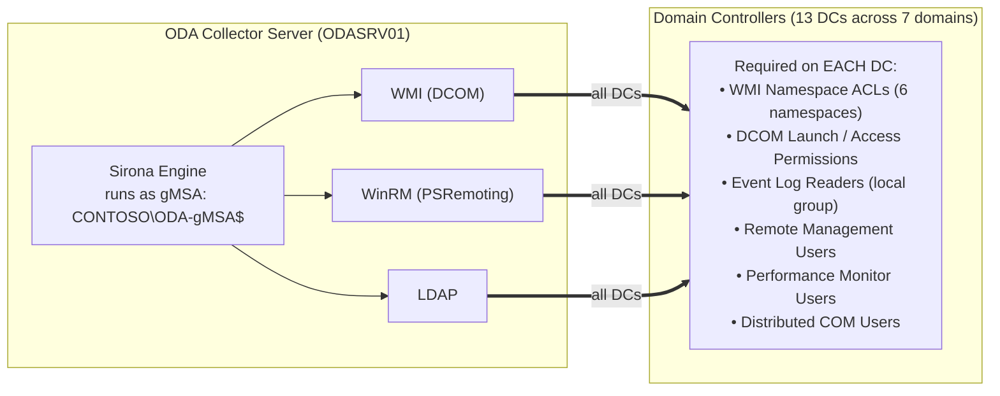
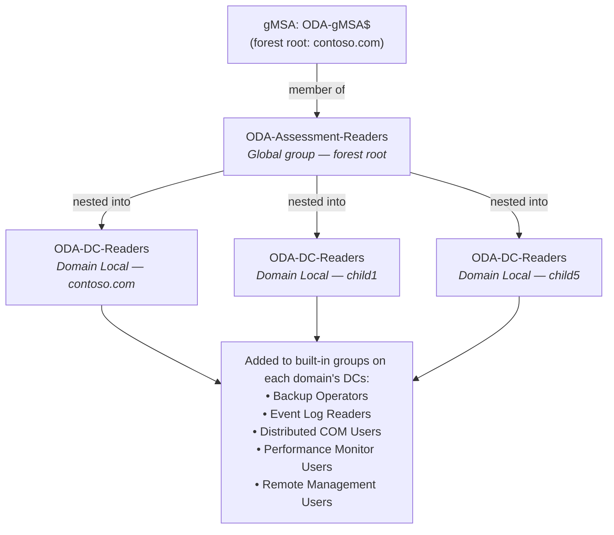

# ODA AD Assessment — Least-Privilege Delegation Guide

**🌐 Language:** English · [Deutsch](ODA-Delegation-Guide.de.md)

## 1. Executive Summary

This document describes how to delegate the minimum required permissions for the Microsoft **On-Demand Assessment (ODA)** AD Assessment to a **Group Managed Service Account (gMSA)** — eliminating the need for Domain Admin or Enterprise Admin credentials.

The ODA Sirona engine collects data from all Domain Controllers (DCs) in a forest using three primary mechanisms:

| Collector Mechanism | Data Collected | Permission Required |
|---|---|---|
| **WMI (DCOM)** | Win32\_\* classes, registry via StdRegProv, event logs, DFSR, trust status | WMI namespace ACLs + DCOM launch/access |
| **WinRM (PSRemoting)** | PowerShell-based collectors (SpeculationControl, UserRights, DFS Shares, QFE) | Remote Management Users + WinRM policy |
| **LDAP** | AD objects, trusts, GPOs, replication metadata | Authenticated Users (default read) |

### Impact of Missing Permissions

A comparison of the baseline assessment (2026-04-27, full DA rights) against the reduced-rights assessment (2026-04-28) showed:

| Category | Sheets Affected | Rows Lost | Root Cause |
|---|---|---|---|
| WMI Win32\_\* queries | 22 checks | ~3,200 | WMI `Access denied` on `root\cimv2` |
| Remote Registry (via WMI) | 29 checks | ~1,400 | WMI `Access denied` (StdRegProv) |
| Event Logs | 7 checks | ~130 | WMI + Event Log Readers missing |
| DFSR / SYSVOL | 15 checks | ~200 | WMI `root\cimv2` + DFSR namespace |
| Trust validation | 2 checks | ~23 | WMI `root\MicrosoftActiveDirectory` |
| AD Replication | 2 checks | ~13 | Replication read rights |
| WinRM collectors | 4 checks (4 DCs) | ~680 | HTTP 403 — PSRemoting denied |
| **Total** | **74 collectors failed** | **~5,400 rows** | |

## 2. Architecture Overview



## 3. Prerequisites

### 3.1 gMSA Account

The gMSA only needs to be created **once in a single domain** of the forest — typically the **forest root domain** (e.g., `contoso.com`). It does **not** need to exist in every child domain. Cross-domain access is achieved through group nesting (see Section 3.2).

Requirements for the gMSA:

- The ODA collector server's computer account must be listed in `PrincipalsAllowedToRetrieveManagedPassword`
- The KDS Root Key must exist in the forest (one-time setup)
- The gMSA is a member of the placeholder Global group (see Section 3.2)

```powershell
# Example: Create gMSA in the forest root domain
New-ADServiceAccount -Name 'ODA-gMSA' `
    -DNSHostName 'oda-gmsa.contoso.com' `
    -PrincipalsAllowedToRetrieveManagedPassword 'ODASRV01$' `
    -Enabled $true
```

### 3.2 Group Nesting Strategy for Cross-Domain Delegation

Since the gMSA exists in only one domain but must have permissions on DCs in all child domains, use the **AGDLP** (Account → Global → Domain Local → Permission) nesting pattern:



> The `...` between `child1` and `child5` represents the remaining child domains — every child domain gets its own **Domain Local** `ODA-DC-Readers` group following the same pattern.

#### Step-by-step setup:

1. **Forest root domain** (`contoso.com`): Create a **Global** security group `ODA-Assessment-Readers` and add the gMSA as member.

2. **Each child domain**: Create a **Domain Local** security group `ODA-DC-Readers` and nest the forest root's Global group into it.

3. Use the **Domain Local** group (`ODA-DC-Readers`) in each domain for all local permission assignments (GPO group memberships, WMI ACLs, DCOM security).

```powershell
# 1. Forest root — create Global group, add gMSA
New-ADGroup -Name 'ODA-Assessment-Readers' -GroupScope Global `
    -GroupCategory Security -Path 'OU=Groups,DC=contoso,DC=com'
Add-ADGroupMember -Identity 'ODA-Assessment-Readers' -Members 'ODA-gMSA$'

# 2. Each child domain — create Domain Local group, nest the Global group
$childDomains = @('child1.contoso.com','child2.contoso.com',
                  'child3.contoso.com','child4.contoso.com',
                  'child5.contoso.com','child6.contoso.com')

foreach ($domain in $childDomains) {
    New-ADGroup -Name 'ODA-DC-Readers' -GroupScope DomainLocal `
        -GroupCategory Security -Server $domain
    Add-ADGroupMember -Identity 'ODA-DC-Readers' `
        -Members 'CN=ODA-Assessment-Readers,OU=Groups,DC=contoso,DC=com' `
        -Server $domain
}
```

> **Why this works**: Global groups from the forest root can be nested into Domain Local groups in any domain within the same forest. The Domain Local group is then used for all local resource permissions (built-in group memberships, WMI ACLs, DCOM). This is the standard AGDLP model.

**Benefit**: If the gMSA changes, only the Global group membership in the forest root needs updating — not every GPO, WMI ACL, and local group across all domains.

## 4. Delegation Steps

### 4.1 AD Group Memberships (per Domain in the Forest)

Since the gMSA is an Authenticated User, it already has standard AD read permissions. The **Domain Local group** (`ODA-DC-Readers`) from each domain (which contains the forest root's Global group with the gMSA — see Section 3.2) must be added to these **built-in groups on the DCs in each domain**:

| Group | Purpose | Fixes |
|---|---|---|
| **Backup Operators** | Grants access to admin shares (`C$`) for file-based collectors | Netlogon.dns, Netlogon.log collectors (see Section 4.11) |
| **Distributed COM Users** | Allows DCOM calls to WMI | WMI prerequisite check |
| **Event Log Readers** | Read Application, System, Directory Service, DNS event logs | 7 event log collectors |
| **Performance Monitor Users** | Read performance counters | Performance data collectors |
| **Remote Management Users** | WinRM/PSRemoting access | 4 WinRM-based collectors (UserRights, SpeculationControl, DFS Shares, QFE) |

> **⚠ Security Note — Backup Operators**
>
> **Backup Operators** is the highest-privilege built-in group in this delegation package. Members can read **all files** on the system (via `SeBackupPrivilege`), access **all admin shares** (`C$`, `ADMIN$`), and — on Domain Controllers — can **log on locally** and **shut down the system**. This makes it a **Tier 0** sensitive group in most hardening frameworks (Microsoft ESAE, ERNW AD Tier Model).
>
> **If the customer refuses Backup Operators membership**, the following impact applies:
>
> | Collector | Excel Sheet | Data Lost | Severity |
> |---|---|---|---|
> | `AD_NameResolution_DCNetlogon.dns` | Netlogon_DNS | DNS registration records per DC | Low — advisory, DNS issues visible via other checks |
> | `FILE_Netlogon.log` | Netlogon_Log | Netlogon debug log entries (secure channel, DC locator) | Low — advisory, useful for troubleshooting but not critical health data |
>
> **Recommendation — JIT (Just-In-Time) Group Membership (Best Practice)**:
>
> Instead of granting **permanent** Backup Operators membership, use **time-limited group membership** so the gMSA is only a member during the ODA assessment window. This follows the **principle of least privilege over time** and is the recommended approach for Tier 0 group access.
>
> **Option 1 — Privileged Access Management (PAM) with TTL** (AD Forest Functional Level 2016+):
>
> The PAM feature (introduced with Windows Server 2016 FFL) supports **time-bound group membership** natively via the `-MemberTimeToLive` parameter. The membership automatically expires — no cleanup needed.
>
> ```powershell
> # Enable PAM feature (one-time, requires Forest Functional Level 2016+)
> Enable-ADOptionalFeature 'Privileged Access Management Feature' `
>     -Scope ForestOrConfigurationSet -Target 'contoso.com'
>
> # Add gMSA to Backup Operators with a 4-hour TTL (adjust to assessment duration)
> # Run this in EACH domain against the Domain Local group on the DCs
> $ttl = New-TimeSpan -Hours 4
> Add-ADGroupMember -Identity 'Backup Operators' `
>     -Members 'CN=ODA-DC-Readers,OU=Groups,DC=contoso,DC=com' `
>     -MemberTimeToLive $ttl
>
> # Verify TTL membership
> Get-ADGroup 'Backup Operators' -Properties member -ShowMemberTimeToLive
> ```
>
> **Option 2 — Scheduled Task (any Forest Functional Level)**:
>
> For forests below 2016 FFL, use a scheduled task or manual process to add the group before the assessment and remove it afterwards:
>
> ```powershell
> # Before assessment — add membership
> Add-ADGroupMember -Identity 'Backup Operators' `
>     -Members 'CN=ODA-DC-Readers,OU=Groups,DC=contoso,DC=com'
>
> # After assessment — remove membership
> Remove-ADGroupMember -Identity 'Backup Operators' `
>     -Members 'CN=ODA-DC-Readers,OU=Groups,DC=contoso,DC=com' -Confirm:$false
> ```
>
> **Important**: After adding or removing the gMSA from Backup Operators, the **Sirona scheduled task must be restarted** to force a Kerberos TGT renewal — cached tokens do not reflect group changes until renewal (up to 10 hours).
>
> **Option 3 — Accept the gap**: If the customer refuses Backup Operators membership entirely (even with JIT), **accept the gap**. The two affected sheets provide supplementary diagnostic data — they do not affect the core AD health assessment (replication, GPO, trusts, security configuration). All other collectors (WMI, WinRM, LDAP, Event Logs) continue to work without Backup Operators.

**How to apply**: Use GPO with **Restricted Groups** or **Group Policy Preferences → Local Users and Groups**, linked to the Domain Controllers OU in each domain.

GPO Path:

```
Computer Configuration
 └─ Policies
    └─ Windows Settings
       └─ Security Settings
          └─ Restricted Groups
             (or)
       └─ Preferences
          └─ Control Panel Settings
             └─ Local Users and Groups
```

### 4.2 DCOM Security (Machine-Level Launch and Access)

Since the DCOM hardening changes in 2022, being a member of `Distributed COM Users` is necessary but may not be sufficient. The DCOM Machine Access and Launch Restrictions must explicitly allow the ODA account.

**Check if Distributed COM Users already inherits these rights.** If not, configure via GPO:

GPO Path:

```
Computer Configuration
 └─ Policies
    └─ Windows Settings
       └─ Security Settings
          └─ Local Policies
             └─ Security Options
```

| Policy | Rights to Grant |
|---|---|
| **DCOM: Machine Access Restrictions** | Local Access, Remote Access |
| **DCOM: Machine Launch Restrictions** | Local Launch, Remote Launch, Local Activation, Remote Activation |

Reference: [DCOM Authentication Hardening](https://techcommunity.microsoft.com/blog/windows-itpro-blog/dcom-authentication-hardening-what-you-need-to-know/3657154)

> **Important**: DCOM access is a two-layer model. Layer 1 (Machine Restrictions) gates whether the account can use DCOM at all. Layer 2 (per-application permissions) controls individual DCOM applications. If Layer 1 blocks, Layer 2 is never evaluated — similar to Share Permissions vs. NTFS ACLs.

### 4.3 WinRM Policy (GPO on Domain Controllers OU)

Ensure WinRM is enabled and allows remote management on all DCs:

GPO Path:

```
Computer Configuration
 └─ Policies
    └─ Administrative Templates
       └─ Windows Components
          └─ Windows Remote Management (WinRM)
             └─ WinRM Service
```

Policy: **Allow remote server management through WinRM**

- Set to **Enabled**
- IPv4 filter: `*` (or restrict to the ODA collector server IP for tighter security)

### 4.4 Windows Firewall Inbound Rules (GPO on Domain Controllers OU)

The following inbound firewall rule groups must be enabled on all DCs:

GPO Path:

```
Computer Configuration
 └─ Policies
    └─ Windows Settings
       └─ Windows Defender Firewall with Advanced Security
          └─ Inbound Rules
```

| Firewall Rule Group | Purpose |
|---|---|
| **Windows Management Instrumentation (WMI)** | DCOM/WMI remote access |
| **Windows Remote Management** | WinRM/PSRemoting |
| **Remote Event Log Management** | Event log reading |

Optionally restrict the remote IP scope to the ODA collector server's IPv4 address for tighter security.

SMB (port 445) is also needed for Netlogon and SYSVOL share access but should already be active on DCs.

### 4.5 WMI Namespace ACLs (per DC — Cannot Be Set via GPO)

This is the most critical step. WMI namespace security is **local to each machine** and cannot be fully configured via GPO UI. The ODA account needs `Execute Methods`, `Enable Account`, and `Remote Enable` on three WMI namespaces.

| Namespace | What It Contains | Collectors Fixed |
|---|---|---|
| `Root\CIMV2` | Win32\_\* classes, event log objects, DFSR via cimv2 | 51 collectors (Win32\_\*, EventLogs\_\*, DFSR\_\*) |
| `Root\default` | **StdRegProv** (remote registry via WMI) | **All Registry\_\* collectors + Sirona "Registry Check" prereq** — cascade-blocks ~30 collectors if missing |
| `Root\MicrosoftActiveDirectory` | Microsoft\_DomainTrustStatus, trust validation | 2 collectors (trust status, trust validation) |
| `Root\directory` | LDAP/AD WMI providers | AD WMI-based collectors |
| `Root\MicrosoftDFS` | DFS namespace and folder target information | DFS-related collectors |
| `Root\MicrosoftDNS` | MicrosoftDNS\_\* classes — DNS server config, zones, forwarders | 4 collectors (`DNS_Server_Log`, `Dns_Forwarders`, `Local_Dns_Zones`, `DNS_Zones`) |

> **CRITICAL — `Root\default`**: The Sirona engine runs a "Registry Check" prereq against `\\<DC>\root\default` (StdRegProv) for every DC. If this prereq fails, the DC node is marked as failed and **all downstream WMI collectors targeting that DC are skipped** — including DFSR, DNS, registry, boot configuration, and BIOS collectors. This is a cascade failure that produces empty Excel sheets with no explicit error. The `Root\default` namespace is separate from `Root\CIMV2` and must be delegated independently.

#### Required WMI Permissions

| Permission | WMI Security Name | Purpose |
|---|---|---|
| **Remote Enable** | `RemoteAccess` | Allows WMI access from another machine |
| **Enable Account** | `Enable` | Allows reading WMI classes and instances |
| **Execute Methods** | `MethodExecute` | Call WMI methods |

> **Note**: `Remote Enable` is the one that is typically missing for Authenticated Users. Without it, the ODA account can access WMI locally but NOT from a remote machine.

#### Applying WMI ACLs with Set-WmiNamespaceSecurity.ps1

Use the script from [BetaHydri/ODA-Delegation-Toolkit](https://github.com/BetaHydri/ODA-Delegation-Toolkit):

```powershell
# Set WMI ACLs for all 5 namespaces
$account = 'CONTOSO\ODA-Assessment-Readers'  # placeholder group or gMSA$

# Root\CIMV2 — Win32_*, event logs, DFSR
.\Set-WMINamespaceACL.ps1 -namespace "Root\CIMV2" `
    -operation add -account $account `
    -permissionsString "Enable,MethodExecute,RemoteAccess" `
    -allowInherit $true

# Root\default — StdRegProv (remote registry) + Sirona Registry Check prereq
.\Set-WMINamespaceACL.ps1 -namespace "Root\default" `
    -operation add -account $account `
    -permissionsString "Enable,MethodExecute,RemoteAccess" `
    -allowInherit $true

# Root\MicrosoftActiveDirectory — trust status
.\Set-WMINamespaceACL.ps1 -namespace "Root\MicrosoftActiveDirectory" `
    -operation add -account $account `
    -permissionsString "Enable,MethodExecute,RemoteAccess" `
    -allowInherit $true

# Root\directory — AD/LDAP WMI providers
.\Set-WMINamespaceACL.ps1 -namespace "Root\directory" `
    -operation add -account $account `
    -permissionsString "Enable,MethodExecute,RemoteAccess" `
    -allowInherit $true

# Root\MicrosoftDFS — DFS namespace and folder targets
.\Set-WMINamespaceACL.ps1 -namespace "Root\MicrosoftDFS" `
    -operation add -account $account `
    -permissionsString "Enable,MethodExecute,RemoteAccess" `
    -allowInherit $true

# Root\MicrosoftDNS — DNS server config, zones, forwarders (DNS_Server_Log, Dns_Forwarders, Local_Dns_Zones, DNS_Zones)
.\Set-WMINamespaceACL.ps1 -namespace "Root\MicrosoftDNS" `
    -operation add -account $account `
    -permissionsString "Enable,MethodExecute,RemoteAccess" `
    -allowInherit $true
```

> **Note on `Root\MicrosoftDNS`**: This namespace exists only on DCs running the **DNS Server** role. The DNS WMI provider may also perform its own authorization check — if collectors still fail after the ACL is set, verify the ODA group has DNS read rights (e.g., via `DnsAdmins` membership or a custom DNS delegation). See Section 4.6.

> **Note**: The scripts are idempotent — running them again when the ACE already exists will skip with a warning, not create duplicates. An optional `-logPath` parameter writes timestamped change entries to a log file.

To **revert** (remove the ACL entry):

```powershell
.\Set-WMINamespaceACL.ps1 -namespace "Root\CIMV2" `
    -operation delete -account $account
```

#### Deployment Options for WMI ACLs

Since WMI namespace ACLs are local per machine, choose one of:

| Method | Pros | Cons |
|---|---|---|
| **GPO Startup Script** | Runs automatically on every boot, self-healing | Script must be idempotent |
| **DSC (Desired State Configuration)** | Declarative, drift detection | Requires DSC infrastructure |
| **One-time Admin Script via Invoke-Command** | Quick, no infrastructure needed | Not self-healing, manual re-run on new DCs |

Example one-time deployment:

```powershell
$dcs = @(
    'DC01', 'DC02',           # contoso.com
    'DC03', 'DC04',           # child1.contoso.com
    'DC05', 'DC06',           # child2.contoso.com
    'DC07', 'DC08',           # child4.contoso.com
    'DC09', 'DC10',           # child5.contoso.com
    'DC11', 'DC12',           # child3.contoso.com
    'DC13'                         # child6.contoso.com
)
$account = 'CONTOSO\ODA-Assessment-Readers'
$namespaces = @('Root\CIMV2', 'Root\default', 'Root\MicrosoftActiveDirectory', 'Root\directory', 'Root\MicrosoftDFS', 'Root\MicrosoftDNS')

foreach ($dc in $dcs) {
    foreach ($ns in $namespaces) {
        Invoke-Command -ComputerName $dc -ScriptBlock {
            param($ns, $acct)
            # Script must be present on the DC or passed inline
            & C:\Scripts\Set-WMINamespaceACL.ps1 `
                -namespace $ns -operation add `
                -account $acct `
                -permissionsString "Enable,MethodExecute,RemoteAccess" `
                -allowInherit $true
        } -ArgumentList $ns, $account
    }
}
```

Alternatively, use the included `Process-DCs.ps1` orchestration script which handles all 6 WMI namespaces, the SCM DACL (see Section 4.5a), and Netlogon file NTFS permissions (see Section 4.11) in a single run with centralized logging on the admin server. The script supports both `-operation add` and `-operation delete` for rollback, detects loopback (when the target DC is the local machine) to avoid WinRM self-connection failures, and logs each individual setting with its result.

### 4.5a Service Control Manager (SCM) DACL

`Win32_Service` WMI queries go through **two** security layers:

1. **WMI namespace ACL** (`Root\CIMV2`) — checked first by the WMI provider
2. **Service Control Manager DACL** — checked second when the provider calls `EnumServicesStatus`

If the WMI namespace grants access but the SCM denies `SC_MANAGER_ENUMERATE_SERVICE`, the query fails with _Access Denied_ — even though other `Root\CIMV2` classes like `Win32_BIOS` or `Win32_NetworkAdapterConfiguration` work fine.

#### Required SCM Permissions (least privilege)

| Right | Hex | SDDL | Purpose |
|---|---|---|---|
| `SC_MANAGER_CONNECT` | `0x0001` | `CC` | Connect to the SCM |
| `SC_MANAGER_ENUMERATE_SERVICE` | `0x0004` | `LC` | Enumerate services |

#### Applying SCM DACL with Set-SCM_ACL.ps1

Use the `Set-SCM_ACL.ps1` script from [BetaHydri/ODA-Delegation-Toolkit](https://github.com/BetaHydri/ODA-Delegation-Toolkit):

```powershell
# Grant SCM enumerate access on a remote DC
.\Set-SCM_ACL.ps1 -operation add -account "CONTOSO\ODA-Assessment-Readers" -computerName "DC01"

# Remove SCM ACE
.\Set-SCM_ACL.ps1 -operation delete -account "CONTOSO\ODA-Assessment-Readers" -computerName "DC01"
```

After each operation, the script displays the resulting SCM DACL with actual permission names (`SC_MANAGER_CONNECT`, `SC_MANAGER_ENUMERATE_SERVICE`, etc.).

> **Note**: The SCM DACL is local per machine and cannot be set via GPO. Use `Process-DCs.ps1 -operation add` to apply it across all DCs in one run — the script handles WMI namespace ACLs, SCM DACL, and Netlogon NTFS permissions together, with centralized logging on the admin server. For rollback, use `Process-DCs.ps1 -operation delete`.

> **Important — gMSA Token Refresh**: After applying SCM DACL changes (or any group membership change), you must **restart the Sirona scheduled task** on the ODA collector server to force the gMSA to obtain a fresh Kerberos TGT. Kerberos tokens cache group memberships for up to 10 hours. Without a task restart, the gMSA's token will not reflect the new SCM permissions and `Win32_Service` / `IsWindowsDNS` checks will continue to fail.

### 4.6 DNS Read Delegation

The ODA account needs read access to DNS zones stored in AD. Delegate via:

```powershell
# Grant read on DNS zone objects in AD
# For each AD-integrated DNS zone:
$zones = Get-DnsServerZone -ComputerName <DC> |
    Where-Object { $_.ZoneType -eq 'Primary' -and $_.IsDsIntegrated }

foreach ($zone in $zones) {
    # Add read permission to the zone
    Add-DnsServerResourceRecordPermission ... # or use DNS Manager GUI
}
```

Alternatively, add the ODA group to the **DnsAdmins** group (read-only is sufficient, but DnsAdmins has full DNS control — consider a custom delegation if least-privilege is critical).

> **Cross-domain group membership tip**: When adding a group from a child domain to `DnsAdmins` in the root domain (or vice versa), `Add-ADGroupMember` may fail with a _referral_ error because it tries to validate the foreign DN on the target server. Use `Set-ADObject` instead:
>
> ```powershell
> # Add cross-domain member to DnsAdmins — avoids referral error
> Set-ADObject -Identity 'CN=DnsAdmins,CN=Users,DC=contoso,DC=com' `
>     -Add @{member='CN=G-D-Contoso-Child1-RemoteAccess,OU=Groups,OU=ODA,OU=Applications,DC=child1,DC=contoso,DC=com'} `
>     -Server DC01.contoso.com
> ```
>
> **Rule**: The `-Server` must hold the naming context (partition) that the target group (`-Identity`) belongs to. For cross-domain member DNs, `Set-ADObject` writes the `member` attribute directly via LDAP without foreign DN validation.

### 4.7 ODA Collector Server — Local Permissions

On the ODA collector server (ODASRV01) itself, the gMSA needs:

| Permission | Purpose |
|---|---|
| **Local Administrator** | Run the Sirona engine |
| **Log on as a batch job** | Scheduled task execution |

### 4.8 AD Replication Convergence — Replicating Directory Changes

The AD Convergence collectors (`IPBB_ADREPLICATIONSTATUS_GetADConvergence_Init` / `_Collect`) write a test attribute to an AD object via LDAP and monitor replication latency across DCs. This requires the **"Replicating Directory Changes"** extended right on each domain naming context.

Without this right, the collector fails with:
```
The user has insufficient access rights.
Type=System.DirectoryServices.Protocols.DirectoryOperationException
```

**Impact**: `AD_Convergence` and `AD_Convergence_Details` Excel sheets will be empty.

#### Applying the Delegation

Grant the extended right on each domain NC in the forest using `dsacls`:

```powershell
$gmsaOrGroup = 'CONTOSO\ODA-Assessment-Readers'  # Global group containing the gMSA

$domainNCs = @(
    'DC=contoso,DC=com',
    'DC=child1,DC=contoso,DC=com',
    'DC=child2,DC=contoso,DC=com',
    'DC=child3,DC=contoso,DC=com',
    'DC=child4,DC=contoso,DC=com',
    'DC=child5,DC=contoso,DC=com',
    'DC=child6,DC=contoso,DC=com'
)

foreach ($dn in $domainNCs) {
    dsacls $dn /G "${gmsaOrGroup}:CA;Replicating Directory Changes"
}
```

> **Note**: This is a **read-only** replication right — it does NOT grant password replication (`Replicating Directory Changes All`). It only permits reading replication metadata and writing convergence test attributes.

#### Rollback

```powershell
foreach ($dn in $domainNCs) {
    dsacls $dn /R $gmsaOrGroup
}
```

### 4.9 SYSVOL Write Access for Convergence Test

The SYSVOL Convergence collectors (`IPBB_SYSVOLREPLICATION_Convergence_Init` / `_Collect`) measure DFS-R replication latency by **creating a temporary file** (`<guid>.txt`) in `\\<DC>\SYSVOL\<domain>\` on one DC per domain and monitoring its replication to other DCs. This requires **write access** to the SYSVOL domain folder.

Without this right, the collector fails with:
```
Access to the path '\\DC01.CONTOSO.COM\SYSVOL\contoso.com\<guid>.txt' is denied.
Type=System.UnauthorizedAccessException
```

**Impact**: `Sysvol_Convergence` and `Convergence_Detail` Excel sheets will be empty.

#### Applying the Delegation

Grant NTFS Modify permission on the SYSVOL domain root folder on **one DC per domain** (typically the PDC emulator — DFS-R will replicate the file to other DCs):

```powershell
$gmsaOrGroup = 'CONTOSO\ODA-Assessment-Readers'

# Map: domain DNS name → one DC FQDN (preferably PDCe)
$domainToDC = @{
    'contoso.com'           = 'DC01'
    'child1.contoso.com'    = 'DC03'
    'child2.contoso.com'    = 'DC05'
    'child3.contoso.com'    = 'DC11'
    'child4.contoso.com'    = 'DC07'
    'child5.contoso.com'    = 'DC09'
    'child6.contoso.com'    = 'DC13'
}

foreach ($domain in $domainToDC.Keys) {
    $dc = $domainToDC[$domain]
    $sysvolPath = "\\$dc\SYSVOL\$domain"
    Write-Host "Granting Modify on $sysvolPath..."
    icacls $sysvolPath /grant "${gmsaOrGroup}:(OI)(CI)M"
}
```

> **Security note**: This grants write access to the SYSVOL domain root. The ODA convergence test creates and deletes a single small text file. Consider restricting to `(W)` (Write) instead of `(M)` (Modify) if least-privilege is critical. After the assessment, the NTFS ACE can be removed (see Rollback).

#### Rollback

```powershell
foreach ($domain in $domainToDC.Keys) {
    $dc = $domainToDC[$domain]
    $sysvolPath = "\\$dc\SYSVOL\$domain"
    icacls $sysvolPath /remove $gmsaOrGroup
}
```

### 4.10 LSA Policy Access for UserRights Collector

The `UPGRADEASSESSMENT_Collect_User_Rights` collector calls the **native Win32 LSA API** (`LsaOpenPolicy`) on each DC to enumerate user rights assignments (e.g., `SeInteractiveLogonRight`, `SeRemoteInteractiveLogonRight`). This requires `POLICY_VIEW_LOCAL_INFORMATION` access on each DC's LSA policy object.

This is **not** granted by Remote Management Users, Event Log Readers, or any of the other group memberships. It is an LSA-level permission.

Without this right, the collector fails with:
```
Attempted to perform an unauthorized operation.
Type=System.UnauthorizedAccessException
at Microsoft.Sirona.Native.UnsafeNativeMethodWrappers.LsaOpenPolicy(...)
```

**Impact**: `UserRights` Excel sheet will be empty.

#### Options (choose one)

| Option | Pros | Cons |
|---|---|---|
| **A) Add to local Administrators on DCs** | Simple, guaranteed to work | Violates least-privilege; grants full DC admin |
| **B) Grant LSA policy read via security template** | Least-privilege | Complex; requires `secedit` or custom script per DC |
| **C) Accept the gap** | No risk, no change | `UserRights` sheet will remain empty |

#### Option B: Applying LSA Policy Read (Least-Privilege)

The LSA policy object ACL can be modified using `LsaSetSecurityObject` or via a security template exported/imported with `secedit`. This is an advanced operation:

```powershell
# Export current LSA policy security on a DC
Invoke-Command -ComputerName DC01 -ScriptBlock {
    secedit /export /cfg C:\Temp\secpol.cfg /areas USER_RIGHTS
}

# The UserRights collector needs POLICY_VIEW_LOCAL_INFORMATION
# on the LSA Policy object — this is NOT the same as a user right assignment.
# It is a permission on the Policy object itself.
# Manual approach: use ntrights.exe or a custom C# / PowerShell wrapper
# around LsaOpenPolicy / LsaSetSecurityObject.
```

> **Recommendation**: For most environments, **Option A** (local Administrators) is the pragmatic choice since the gMSA already requires significant access. If the customer refuses, accept the gap (Option C) — the `UserRights` sheet provides advisory information, not critical health data.

### 4.11 Netlogon.dns and Netlogon.log File Access (Admin Share C$)

The `AD_NameResolution_DCNetlogon.dns` collector reads `\\<DC>\C$\Windows\system32\config\netlogon.dns` and the `FILE_Netlogon.log` collector reads `\\<DC>\C$\Windows\debug\netlogon.log` via the administrative share `C$`.

Access to `C$` requires either **local Administrators** or **Backup Operators** membership. If the ODA group is already a member of **Backup Operators** (see Section 4.1), the SMB share gate is passed. However, the Sirona collector uses standard .NET file I/O (`System.IO.File.OpenText`) which does **not** invoke `SeBackupPrivilege` / `FILE_FLAG_BACKUP_SEMANTICS`. Therefore, the NTFS ACL on the file must independently grant read access — the Backup Operators privilege alone is not sufficient for the file read.

Without the NTFS ACE, the collector fails with:
```
Access to the path '\\DC01.CONTOSO.COM\C$\Windows\system32\config\netlogon.dns' is denied.
Type=System.UnauthorizedAccessException
at Microsoft.Sirona.IPBB.DataCollectors.NetlogonDnsDataCollector
```

**Impact**: `Netlogon_DNS` and `Netlogon_Log` Excel sheets will be empty.

#### Applying NTFS Read ACE (Least-Privilege)

Since Backup Operators membership already grants access to the `C$` share, only the NTFS file-level ACE is needed. Deploy via **GPO Startup Script** on the Domain Controllers OU for self-healing on every boot:

```powershell
# GPO Startup Script — grant NTFS read on netlogon files for ODA group
$account = 'CONTOSO\ODA-DC-Readers'  # Domain Local group per domain
$files = @(
    "$env:SystemRoot\system32\config\netlogon.dns",
    "$env:SystemRoot\debug\netlogon.log"
)

foreach ($file in $files) {
    if (Test-Path $file) {
        $acl = Get-Acl $file
        $existingAce = $acl.Access | Where-Object {
            $_.IdentityReference.Value -eq $account -and
            $_.FileSystemRights -band [System.Security.AccessControl.FileSystemRights]::Read
        }
        if (-not $existingAce) {
            $rule = New-Object System.Security.AccessControl.FileSystemAccessRule(
                $account, 'Read', 'Allow')
            $acl.AddAccessRule($rule)
            Set-Acl $file $acl
        }
    }
}
```

Alternatively, apply once via `Invoke-Command` across all DCs:

```powershell
$account = 'CONTOSO\ODA-Assessment-Readers'
$dcs = @('DC01','DC03','DC05','DC07','DC09','DC11','DC13')

foreach ($dc in $dcs) {
    Invoke-Command -ComputerName $dc -ScriptBlock {
        param($acct)
        $files = @(
            "$env:SystemRoot\system32\config\netlogon.dns",
            "$env:SystemRoot\debug\netlogon.log"
        )
        foreach ($file in $files) {
            if (Test-Path $file) {
                icacls $file /grant "${acct}:(R)"
            }
        }
    } -ArgumentList $account
}
```

#### Rollback

```powershell
foreach ($dc in $dcs) {
    Invoke-Command -ComputerName $dc -ScriptBlock {
        param($acct)
        $files = @(
            "$env:SystemRoot\system32\config\netlogon.dns",
            "$env:SystemRoot\debug\netlogon.log"
        )
        foreach ($file in $files) {
            if (Test-Path $file) {
                icacls $file /remove $acct
            }
        }
    } -ArgumentList $account
}
```

> **Note**: If the ODA group is **not** in Backup Operators, the `C$` share itself will deny access regardless of the NTFS ACE. In that case, local Administrators membership is required, or accept the gap — these collectors provide advisory data.

### 4.12 DFSR Configuration and NTDS Settings — AD Read Delegation

The Sirona engine reads DFSR topology and NTDS Settings objects via LDAP from the following AD containers:

| AD Container | Partition | Collectors Affected |
|---|---|---|
| `CN=DFSR-GlobalSettings,CN=System,DC=<domain>` (subtree) | Domain NC | `LDAP_DomainNamingContext_CN_System_CN_DFSR-GlobalSettings`, DFSR topology collectors |
| `CN=Domain System Volume,CN=DFSR-GlobalSettings,...` | Domain NC | `IPBB_SYSVOLREPLICATION_MicrosoftDfs_DfsrConnectionConfig`, `DfsrReplicatedFolderConfig` |
| `CN=<DC>,CN=Topology,CN=Domain System Volume,...` | Domain NC | DFSR member/connection topology per DC |
| `CN=Sites,CN=Configuration,DC=<forestRoot>` (subtree) | Configuration | `NTDSDSASetting_*` — NTDS Settings objects for all DCs |

By default, **Authenticated Users** have Generic Read on these containers. However, in hardened environments (e.g., AdminSDHolder propagation, custom DACLs), these default permissions may be removed. When the gMSA cannot read these objects, the collectors complete "successfully" but return **zero data** — resulting in empty Excel sheets for `Dfsr_Info`, `Volume_Config`, `Dfsr_Connection`, and `NTDS_Settings`.

**Impact**: DFSR topology sheets and NTDS Settings sheet will be empty.

#### Applying the Delegation

Grant Generic Read (GR) on the DFSR-GlobalSettings container (with subtree inheritance) in each domain, and on the Sites container in the Configuration partition:

```powershell
$gmsaOrGroup = 'CONTOSO\ODA-Assessment-Readers'

# 1. DFSR-GlobalSettings in each domain NC (subtree)
$domainNCs = @(
    'DC=contoso,DC=com',
    'DC=child1,DC=contoso,DC=com',
    'DC=child2,DC=contoso,DC=com',
    'DC=child3,DC=contoso,DC=com',
    'DC=child4,DC=contoso,DC=com',
    'DC=child5,DC=contoso,DC=com',
    'DC=child6,DC=contoso,DC=com'
)

foreach ($dn in $domainNCs) {
    $dfsrDN = "CN=DFSR-GlobalSettings,CN=System,$dn"
    dsacls $dfsrDN /I:T /G "${gmsaOrGroup}:GR"
}

# 2. Sites container in Configuration partition (subtree — covers all NTDS Settings)
$sitesDN = 'CN=Sites,CN=Configuration,DC=contoso,DC=com'
dsacls $sitesDN /I:T /G "${gmsaOrGroup}:GR"
```

> **Note**: The `/I:T` flag applies inheritance to "This object and all child objects" (subtree). Generic Read (GR) includes Read Property, List Contents, and List Object — all read-only.

#### Rollback

```powershell
foreach ($dn in $domainNCs) {
    $dfsrDN = "CN=DFSR-GlobalSettings,CN=System,$dn"
    dsacls $dfsrDN /R $gmsaOrGroup
}
dsacls $sitesDN /R $gmsaOrGroup
```

#### DFSR WMI Provider Limitation

The WMI-based DFSR collectors (`MicrosoftDfs_DfsrVolumeConfig`, `MicrosoftDfs_DfsrVolumeInfo`, `MicrosoftDfs_DfsrReplicatedFolderInfo`) query the `Root\MicrosoftDFS` WMI namespace. While the WMI namespace ACL grants remote access, the **DFSR WMI provider** (`dfsrprov.dll`) performs its own internal authorization check. It typically returns **zero instances** for non-administrator callers — the query succeeds but the result set is empty.

This is a provider-level restriction that cannot be resolved through WMI namespace ACLs, AD DACLs, or group memberships (short of local Administrators). The affected sheets are:

| Sheet | WMI Class | Impact |
|---|---|---|
| Volume_Config | `MicrosoftDfs_DfsrVolumeConfig` | DFSR volume paths (e.g., `\\.\C:\System Volume Information\DFSR`) |
| Volume_Info | `MicrosoftDfs_DfsrVolumeInfo` | DFSR volume state and free space |

> **Recommendation**: Accept this gap. The critical DFSR health data (replication topology, connection status, replicated folder configuration) is available via the **AD LDAP-based collectors** (fixed by the delegation above). The WMI-based volume details are supplementary — DFSR volume issues are also visible through Event Log collectors (`DFS Replication` log).

## 5. Affected Domain Controllers

The WMI namespace ACLs and local group memberships must be applied to **all DCs in all domains of the forest**:

| Domain | DCs |
|---|---|
| contoso.com | DC01, DC02 |
| child1.contoso.com | DC03, DC04 |
| child2.contoso.com | DC05, DC06 |
| child4.contoso.com | DC07, DC08 |
| child5.contoso.com | DC09, DC10 |
| child3.contoso.com | DC11, DC12 |
| child6.contoso.com | DC13 |

**Total: 13 DCs across 7 domains.**

## 6. Verification Checklist

After applying all delegations, verify before running a full ODA assessment:

### 6.1 WMI Access Test

```powershell
# Test from the ODA collector server as the gMSA
$cred = $null  # gMSA retrieves credentials automatically
$dcs = @('DC01','DC03','DC05','DC07','DC09','DC11','DC13')

foreach ($dc in $dcs) {
    Write-Host "Testing $dc..." -NoNewline
    try {
        $os = Get-CimInstance -ClassName Win32_OperatingSystem -ComputerName $dc -ErrorAction Stop
        Write-Host " OK ($($os.Caption))" -ForegroundColor Green
    } catch {
        Write-Host " FAILED: $($_.Exception.Message)" -ForegroundColor Red
    }
}
```

### 6.2 WinRM Access Test

```powershell
foreach ($dc in $dcs) {
    Write-Host "Testing WinRM $dc..." -NoNewline
    try {
        $result = Invoke-Command -ComputerName $dc -ScriptBlock { $env:COMPUTERNAME } -ErrorAction Stop
        Write-Host " OK ($result)" -ForegroundColor Green
    } catch {
        Write-Host " FAILED: $($_.Exception.Message)" -ForegroundColor Red
    }
}
```

### 6.3 Trust Status WMI Test

```powershell
foreach ($dc in $dcs) {
    Write-Host "Testing MicrosoftActiveDirectory WMI on $dc..." -NoNewline
    try {
        $trusts = Get-CimInstance -Namespace 'root\MicrosoftActiveDirectory' `
            -ClassName 'Microsoft_DomainTrustStatus' -ComputerName $dc -ErrorAction Stop
        Write-Host " OK ($($trusts.Count) trusts)" -ForegroundColor Green
    } catch {
        Write-Host " FAILED: $($_.Exception.Message)" -ForegroundColor Red
    }
}
```

### 6.4 Event Log Read Test

```powershell
foreach ($dc in $dcs) {
    Write-Host "Testing Event Log on $dc..." -NoNewline
    try {
        $events = Get-WinEvent -ComputerName $dc -LogName System -MaxEvents 1 -ErrorAction Stop
        Write-Host " OK" -ForegroundColor Green
    } catch {
        Write-Host " FAILED: $($_.Exception.Message)" -ForegroundColor Red
    }
}
```

### 6.5 Win32_Service Test (SCM DACL Verification)

This test verifies that **both** the WMI namespace ACL and the SCM DACL are correct. If the WMI ACL on `Root\CIMV2` is set but the SCM DACL is missing `SC_MANAGER_ENUMERATE_SERVICE`, this query will fail with _Access Denied_ while `Win32_OperatingSystem` (Test 6.1) works fine.

```powershell
foreach ($dc in $dcs) {
    Write-Host "Testing Win32_Service on $dc..." -NoNewline
    try {
        $svc = Get-CimInstance -ClassName Win32_Service -ComputerName $dc `
            -Filter "Name='DNS'" -ErrorAction Stop
        Write-Host " OK ($($svc.DisplayName) - $($svc.State))" -ForegroundColor Green
    } catch {
        Write-Host " FAILED: $($_.Exception.Message)" -ForegroundColor Red
    }
}
```

> **Diagnostic tip**: If Test 6.1 (`Win32_OperatingSystem`) passes but this test fails, the issue is the SCM DACL, not the WMI namespace ACL. Apply `Set-SCM_ACL.ps1` to fix it.

### 6.6 Remote Registry Test (Root\default — StdRegProv)

This is the **most critical** verification test. The Sirona "Registry Check" prereq queries `Root\default` (StdRegProv). If this fails, ~30 collectors are silently skipped (no error, just empty data).

```powershell
foreach ($dc in $dcs) {
    Write-Host "Testing Root\default (StdRegProv) on $dc..." -NoNewline
    try {
        $reg = Get-CimInstance -Namespace 'root\default' -ClassName 'StdRegProv' `
            -ComputerName $dc -ErrorAction Stop
        Write-Host " OK" -ForegroundColor Green
    } catch {
        Write-Host " FAILED: $($_.Exception.Message)" -ForegroundColor Red
    }
}
```

> **Diagnostic tip**: If this test fails but Test 6.1 (`Win32_OperatingSystem` on `root\cimv2`) passes, the `Root\default` WMI namespace ACL is missing. This is the #1 cause of empty DFSR, Registry, and Boot_Configuration sheets.

### 6.7 AD Convergence Test (Replicating Directory Changes)

```powershell
# Test LDAP write access required for convergence test
$forestRoot = 'DC=contoso,DC=com'
$testDN = "CN=ODA-Test,CN=System,$forestRoot"
try {
    # Attempt to read replication metadata — requires Replicating Directory Changes
    $result = repadmin /showmeta $forestRoot 2>&1
    if ($LASTEXITCODE -eq 0) {
        Write-Host "Replicating Directory Changes: OK" -ForegroundColor Green
    } else {
        Write-Host "Replicating Directory Changes: FAILED" -ForegroundColor Red
    }
} catch {
    Write-Host "Replicating Directory Changes: FAILED - $($_.Exception.Message)" -ForegroundColor Red
}
```

### 6.8 SYSVOL Write Test (Convergence)

```powershell
$domainToDC = @{
    'contoso.com' = 'DC01'
    # ... add one DC per domain
}

foreach ($domain in $domainToDC.Keys) {
    $dc = $domainToDC[$domain]
    $testFile = "\\$dc\SYSVOL\$domain\oda-test-$(New-Guid).txt"
    Write-Host "Testing SYSVOL write on $dc ($domain)..." -NoNewline
    try {
        [System.IO.File]::WriteAllText($testFile, 'ODA test')
        Remove-Item $testFile -Force
        Write-Host " OK" -ForegroundColor Green
    } catch {
        Write-Host " FAILED: $($_.Exception.Message)" -ForegroundColor Red
    }
}
```

## 7. Collector-to-Permission Mapping

Full mapping of all 74 previously failing collectors to the required permission:

### 7.1 Fixed by WMI Namespace ACL on Root\\CIMV2 (51 collectors)

| Collector Name | WMI Class / Registry Key |
|---|---|
| WMI\_Win32\_Process | Win32\_Process |
| WMI\_Win32\_Service | Win32\_Service (**also requires SCM DACL**, see Section 4.5a) |
| WMI\_Win32\_PnPSignedDriver | Win32\_PnPSignedDriver |
| WMI\_Win32\_Volume | Win32\_Volume |
| WMI\_Win32\_LogicalDisk | Win32\_LogicalDisk |
| WMI\_Win32\_NetworkAdapter | Win32\_NetworkAdapter |
| WMI\_Win32\_NetworkAdapterConfiguration | Win32\_NetworkAdapterConfiguration |
| WMI\_Win32\_Share | Win32\_Share |
| WMI\_Win32\_BootConfiguration | Win32\_BootConfiguration |
| WMI\_Win32\_Bios | Win32\_BIOS |
| WMI\_Win32\_BaseBoard | Win32\_BaseBoard |
| WMI\_Win32\_ComputerSystem | Win32\_ComputerSystem |
| WMI\_Win32\_ComputerSystemProduct | Win32\_ComputerSystemProduct |
| WMI\_Win32\_OperatingSystem | Win32\_OperatingSystem |
| WMI\_Win32\_Processor | Win32\_Processor |
| WMI\_Win32\_ServerFeature | Win32\_ServerFeature |
| WMI\_Win32\_TimeZone | Win32\_TimeZone |
| Win32\_NTEventlogFile | Win32\_NTEventlogFile |
| Registry\_HKLM\_SYSTEM\\\...\\Lsa | StdRegProv |
| Registry\_HKLM\_SYSTEM\\\...\\KDC | StdRegProv |
| Registry\_HKLM\_SYSTEM\\\...\\NTDS | StdRegProv |
| Registry\_HKLM\_SYSTEM\\\...\\DFSR | StdRegProv |
| Registry\_HKLM\_SYSTEM\\\...\\Netlogon | StdRegProv |
| Registry\_HKLM\_SYSTEM\\\...\\Tcpip | StdRegProv |
| (+ 27 more registry and system collectors) | StdRegProv / Win32\_\* |

### 7.2 Fixed by WMI Namespace ACL on Root\\MicrosoftActiveDirectory (2 collectors)

| Collector Name | WMI Class |
|---|---|
| IPBB\_FORESTDOMAININFO\_Microsoft\_DomainTrustStatus | Microsoft\_DomainTrustStatus |
| IPBB\_FORESTDOMAININFO\_Visualizer\_Trusts | Microsoft\_DomainTrustStatus |

### 7.2a Fixed by WMI Namespace ACL on Root\\MicrosoftDNS (7 collectors)

| Failing Sheet | Collector Workflow | WMI Class |
|---|---|---|
| DNS\_Server\_Log | EventLogs\_DNSServer\_NoInformation | MicrosoftDNS\_Server |
| Dns\_Forwarders | AD\_NameResolution\_ServerDetails | MicrosoftDNS\_Server |
| Local\_Dns\_Zones | AD\_NameResolution\_ZoneDetails | MicrosoftDNS\_Zone |
| DNS\_Zones | AD\_NameResolution\_DNSZones | MicrosoftDNS\_Zone |
| DNS\_Statistics | AD\_NameResolution\_Microsoft\_Dns\_Statistics | MicrosoftDNS\_Statistic |
| DNS\_Registry | AD\_NameResolution\_HKLM\_SYSTEM\_CurrentControlSet\_Services\_DNS | StdRegProv (DNS config) |
| DNS\_Server\_Visualizer | AD\_NameResolution\_Visualizer\_MicrosoftDnsServer | MicrosoftDNS\_Server |

> Applies only to DCs running the DNS Server role. The WMI namespace ACL is necessary; the DNS provider may additionally enforce its own auth check (DnsAdmins or custom DNS delegation — see Section 4.6).

> **Important — SCM DACL dependency**: The Sirona `IsWindowsDNS` discovery check runs `select State from Win32_Service where Name='DNS'` on every DC. This query requires the SCM DACL (Section 4.5a). If the SCM DACL is missing, `IsWindowsDNS` fails and the DC is **not** registered as a DNS server node — causing **all** DNS collectors to be silently skipped even if `Root\MicrosoftDNS` ACLs are correctly set. Always apply the SCM DACL before troubleshooting DNS collection failures.

### 7.3 Fixed by Event Log Readers Group (7 collectors)

| Collector Name | Log |
|---|---|
| Eventlogs\_Application\_Summary\_NoInformation | Application |
| EventLogs\_DirectoryService\_InformationOnly | Directory Service |
| EventLogs\_DirectoryService\_NoInformation | Directory Service |
| EventLogs\_System\_InformationOnly | System |
| EVT\_System\_NoInformational | System |
| EventLogs\_FileReplicationService\_NoInformation | File Replication Service |
| WINBASE\_EventLogLocationsAndSizes | All logs (metadata) |
| WINBASE\_EventLogSettings | Win32\_NTEventlogFile (cascade — requires SCM DACL, Section 4.5a) |

### 7.4 Fixed by Remote Management Users / WinRM (8 collectors)

| Collector Name | Mechanism |
|---|---|
| UPGRADEASSESSMENT\_Collect\_User\_Rights | PSRemoting **+ LSA Policy access** (see Section 4.10) |
| UPGRADEASSESSMENT\_Collect\_DFS\_Shares | PSRemoting |
| Speculation\_Control\_Settings | PSRemoting |
| Win32\_QuickFixEngineering\_PS | PSRemoting |
| IPBB\_SYSVOLREPLICATION\_Convergence\_Init | PSRemoting + WMI |
| IPBB\_SYSVOLREPLICATION\_Convergence\_Collect | PSRemoting + WMI |
| IPBB\_SYSVOLREPLICATION\_Get\_Staging\_Details | PSRemoting + WMI |
| IPBB\_OSINFORMATION\_Binary\_Versions | PSRemoting |
| IPBB\_OSINFORMATION\_Visualizer\_OS\_Information | PSRemoting |

### 7.5 Fixed by WMI Namespace ACL on Root\default (30+ collectors — cascade)

| Collector Name | WMI Provider |
|---|---|
| Registry\_HKLM\_SYSTEM\_CurrentControlSet\_Services\_\* | StdRegProv on `Root\default` |
| Registry\_HKLM\_SYSTEM\_CurrentControlSet\_Control\_\* | StdRegProv on `Root\default` |
| Registry\_HKLM\_SOFTWARE\_\* | StdRegProv on `Root\default` |
| REG\_HKLM\_\* | StdRegProv on `Root\default` |
| All DFSR MicrosoftDfs\_\* collectors (cascade) | Blocked by failed Registry Check prereq |
| WMI\_Win32\_BootConfiguration (cascade) | Blocked by failed Registry Check prereq |
| WMI\_Win32\_Bios (partial — registry BIOS fields) | Blocked by failed Registry Check prereq |

> **Note**: The `Root\default` ACL does not directly fix the DFSR or Win32\_\* collectors. It fixes the Sirona **"Registry Check" prereq** which gates whether the DC node is valid for downstream collection. Without it, the engine silently skips all collectors targeting that DC — no error, just empty data.

### 7.6 Fixed by AD Delegation — Replicating Directory Changes (2 collectors)

| Collector Name | Requirement |
|---|---|
| IPBB\_ADREPLICATIONSTATUS\_GetADConvergence\_Init | Replicating Directory Changes (Section 4.8) |
| IPBB\_ADREPLICATIONSTATUS\_GetADConvergence\_Collect | Replicating Directory Changes (Section 4.8) |

### 7.7 Fixed by SYSVOL Write Access (3 collectors)

| Collector Name | Requirement |
|---|---|
| IPBB\_SYSVOLREPLICATION\_Convergence\_Init | SYSVOL NTFS Write (Section 4.9) |
| IPBB\_SYSVOLREPLICATION\_Convergence\_Collect | SYSVOL NTFS Write (Section 4.9) |
| IPBB\_SYSVOLREPLICATION\_Get\_Staging\_Details | SYSVOL NTFS Write (Section 4.9) |

### 7.8 Fixed by LSA Policy Access (1 collector)

| Collector Name | Requirement |
|---|---|
| UPGRADEASSESSMENT\_Collect\_User\_Rights | LSA `POLICY_VIEW_LOCAL_INFORMATION` (Section 4.10) |

### 7.9 Fixed by Admin Share / Local Administrator Access (2 collectors)

These collectors access files via the `C$` administrative share, which requires local administrator membership on the target DC.

| Collector Name | File Path | Requirement |
|---|---|---|
| AD\_NameResolution\_DCNetlogon.dns | `\\<DC>\C$\Windows\system32\config\netlogon.dns` | Local Administrators (Section 4.11) |
| FILE\_Netlogon.log | `\\<DC>\C$\Windows\debug\netlogon.log` | Local Administrators (Section 4.11) |

> **Note**: If the customer does not grant local administrator rights, these two sheets (`Netlogon_DNS`, `Netlogon_Log`) will remain empty. This is advisory data and can be accepted as a gap.

## 8. GPO Summary

| GPO Name (suggested) | Scope | Settings |
|---|---|---|
| **ODA-DC-GroupMemberships** | Domain Controllers OU (each domain) | Restricted Groups: add ODA group to Distributed COM Users, Event Log Readers, Performance Monitor Users, Remote Management Users |
| **ODA-DC-DCOM-Security** | Domain Controllers OU (each domain) | DCOM Machine Access + Launch Restrictions for ODA group |
| **ODA-DC-WinRM** | Domain Controllers OU (each domain) | Enable WinRM remote management |
| **ODA-DC-Firewall** | Domain Controllers OU (each domain) | Inbound rules: WMI, WinRM, Remote Event Log, (SMB) |
| **ODA-DC-WMI-ACL** *(Startup Script)* | Domain Controllers OU (each domain) | Startup script calling Set-WMINamespaceACL.ps1 for **6 namespaces** (CIMV2, default, MicrosoftActiveDirectory, directory, MicrosoftDFS, MicrosoftDNS) + Set-SCM_ACL.ps1 + Set-NetlogonPermissions.ps1 |

### Script Inventory

All scripts support `-operation add` (grant) and `-operation delete` (rollback).

| Script | Scope | Purpose |
|---|---|---|
| **Process-DCs.ps1** | Full orchestrator (AD-level + per-DC) | Phase 1: AD delegations (convergence, SYSVOL, DFSR/NTDS Read). Phase 2: per-DC settings (WMI, SCM, Netlogon NTFS) via WinRM |
| **Set-WMINamespaceACL.ps1** | Per DC (local) | WMI namespace ACLs (6 namespaces) |
| **Set-SCM_ACL.ps1** | Per DC (local or remote) | Service Control Manager DACL |
| **Set-NetlogonPermissions.ps1** | Per DC (local) | NTFS Read on netlogon.dns and netlogon.log |
| **Set-ADConvergenceRights.ps1** | Per domain NC (run once from admin workstation) | "Replicating Directory Changes" via dsacls |
| **Set-SYSVOLWriteAccess.ps1** | Per domain (one DC each, run once from admin workstation) | SYSVOL NTFS Modify via icacls |
| **Set-DfsrReadAccess.ps1** | Per domain NC + Configuration partition (run once) | Read on DFSR-GlobalSettings (subtree) + CN=Sites (NTDS Settings) via dsacls |

#### Execution Order

```powershell
# 1. Full delegation (AD-level + per-DC) — single command
.\Process-DCs.ps1 -operation add
#    Phase 1: AD Convergence rights, SYSVOL write access, DFSR/NTDS Read delegation
#    Phase 2: WMI ACLs, SCM DACL, Netlogon NTFS on each DC

# 2. Restart Sirona scheduled task on ODA collector server to refresh gMSA Kerberos TGT
```

Individual scripts can also be run standalone for targeted fixes:

```powershell
# AD Convergence rights only
.\Set-ADConvergenceRights.ps1 -operation add -account 'CONTOSO\ODA-Assessment-Readers'

# SYSVOL write access only
.\Set-SYSVOLWriteAccess.ps1 -operation add -account 'CONTOSO\ODA-Assessment-Readers'

# DFSR/NTDS Settings AD Read delegation only
.\Set-DfsrReadAccess.ps1 -operation add -account 'CONTOSO\ODA-Assessment-Readers'
```

## 9. Rollback Procedure

All scripts support `-operation delete` for rollback. Run in reverse order.

### Remove All Per-DC Settings (WMI + SCM + Netlogon NTFS)

```powershell
.\Process-DCs.ps1 -operation delete
```

This removes all delegations in reverse order: AD-level (convergence, SYSVOL, DFSR/NTDS Read) and per-DC (WMI ACLs, SCM DACL, Netlogon NTFS) in one run.

Individual rollback scripts can also be run standalone:

```powershell
# AD Convergence rights
.\Set-ADConvergenceRights.ps1 -operation delete -account 'CONTOSO\ODA-Assessment-Readers'

# SYSVOL write access
.\Set-SYSVOLWriteAccess.ps1 -operation delete -account 'CONTOSO\ODA-Assessment-Readers'

# DFSR/NTDS Settings AD Read delegation
.\Set-DfsrReadAccess.ps1 -operation delete -account 'CONTOSO\ODA-Assessment-Readers'
```

### Remove Group Memberships

Unlink or disable the GPO that adds the ODA group to the local groups. Run `gpupdate /force` on DCs.

### Remove DCOM Permissions

Revert the DCOM Machine Access/Launch Restriction GPO settings.

### Remove AD Replication Convergence Rights

Alternatively, if not using the script:

```powershell
$gmsaOrGroup = 'CONTOSO\ODA-Assessment-Readers'
$domainNCs = @(
    'DC=contoso,DC=com',
    'DC=child1,DC=contoso,DC=com',
    'DC=child2,DC=contoso,DC=com',
    'DC=child3,DC=contoso,DC=com',
    'DC=child4,DC=contoso,DC=com',
    'DC=child5,DC=contoso,DC=com',
    'DC=child6,DC=contoso,DC=com'
)
foreach ($dn in $domainNCs) {
    dsacls $dn /R $gmsaOrGroup
}
```

### Remove SYSVOL Write Access

Alternatively, if not using the script:

```powershell
$gmsaOrGroup = 'CONTOSO\ODA-Assessment-Readers'
$domainToDC = @{
    'contoso.com'           = 'DC01'
    'child1.contoso.com'    = 'DC03'
    'child2.contoso.com'    = 'DC05'
    'child3.contoso.com'    = 'DC11'
    'child4.contoso.com'    = 'DC07'
    'child5.contoso.com'    = 'DC09'
    'child6.contoso.com'    = 'DC13'
}
foreach ($domain in $domainToDC.Keys) {
    $dc = $domainToDC[$domain]
    icacls "\\$dc\SYSVOL\$domain" /remove $gmsaOrGroup
}
```

## 10. Just-In-Time (JIT) Delegation Model

Sections 3–9 describe **standing** delegation: the rights remain assigned 24/7. The ODA
AD Assessment, however, only collects data during a short window — typically **once every
7 days** for 1–2 hours, launched by the `OMSAssessment.exe` scheduled task on the
collector server. During the other ~166 hours per week the delegated rights are
completely unused but still exposed.

The **Just-In-Time (JIT)** model removes that exposure: the sensitive rights are granted
**immediately before** each collection run and revoked (or auto-expired) **immediately
after**. This implements *least privilege over time* in addition to *least privilege of
scope* — the core principle behind Tier-0 hardening frameworks (Microsoft ESAE / Enterprise
Access Model, ERNW AD Tier Model).

> **This section is an alternative / complement to the standing model, not a replacement.**
> The recommended production design is a **hybrid** (Section 10.3): keep the low-risk,
> read-only delegations standing and apply JIT only to the high-privilege, write-capable
> rights.

### 10.1 Which Rights to JIT vs. Keep Standing

Not every delegation benefits equally from JIT. Two factors decide:

1. **Sensitivity** — read-only rights carry little risk if left standing; write-capable and
   Tier-0 rights carry high risk.
2. **Kerberos token dependency** (see Section 10.2) — group *memberships* are baked into the
   gMSA's Kerberos ticket at logon and cannot be toggled mid-run; resource *ACLs* are
   evaluated at access time and can be toggled freely.

| Delegation | Type | Sensitivity | Recommendation |
|---|---|---|---|
| WMI namespace ACLs (6 namespaces) | Resource ACL | Low (read) | **Standing** |
| SCM DACL (`SC_MANAGER_ENUMERATE_SERVICE`) | Resource ACL | Low (read) | **Standing** |
| DCOM / WinRM / firewall (GPO) | Config | Low | **Standing** |
| Distributed COM Users, Event Log Readers, Performance Monitor Users, Remote Management Users | Group membership | Low (read) | **Standing** |
| DNS read, DFSR/NTDS Read (dsacls GR) | Resource ACL | Low (read) | **Standing** |
| **Replicating Directory Changes** (dsacls CA) | Resource ACL | Medium (write test attribute) | **JIT** |
| **SYSVOL Write** (NTFS Modify) | Resource ACL | Medium (write) | **JIT** |
| **Backup Operators** membership | Group membership | **High (Tier 0)** | **JIT** (PAM TTL preferred) |
| Local Administrators / LSA (if used for UserRights, Netlogon) | Group membership | **High (Tier 0)** | **JIT** or accept gap |

> **Rule of thumb**: JIT the four rows in **bold**. Leaving the read-only rows standing keeps
> the weekly automation simple and reliable while still eliminating standing Tier-0 exposure —
> which is the actual security objective.

### 10.2 The Kerberos Token Timing Constraint (read this first)

This is the single most important design fact for ODA JIT and the reason a naive
"grant on `OMSAssessment.exe` start" trigger **does not work** for group memberships.

- **Group memberships** (Backup Operators, etc.) are expanded into the gMSA's **Kerberos TGT
  when the assessment process authenticates**. The SIDs are then cached for the lifetime of
  the ticket (up to **10 hours**). Granting a membership *after* `OMSAssessment.exe` has
  already started has **no effect on the running collection** — the token was already minted
  without the SID. See `activeContext.md` / `debugging-insights.md`: this is exactly why the
  standing model requires a Sirona task restart after any membership change.
- **Resource ACLs** (WMI namespace, SCM DACL, dsacls extended rights, SYSVOL/Netlogon NTFS)
  are evaluated by the target DC **at the moment of access**, against the SIDs already in the
  caller's token. If the delegation targets the **permanent** group `ODA-Assessment-Readers`
  (of which the gMSA is always a member), the ACL can be added or removed at any time and
  takes effect on the next access — **no token refresh required**.

**Consequences for the trigger design:**

| Right | Can be granted *on* process start? | Correct JIT timing |
|---|---|---|
| Backup Operators (membership) | ❌ No — token already minted | Grant **before** the task starts, or use **PAM TTL** |
| SYSVOL Write / Repl. Dir. Changes / NTFS (ACL on permanent group) | ⚠️ Technically yes, but racy (a collector may run seconds after start) | Grant **before** the window to be safe |

This leads directly to the recommended pattern: **grant is time-based (pre-window); revoke is
event-based (on completion)**.

### 10.3 Recommended Architecture — Hybrid: Time-Grant + Event-Revoke

```
 ┌────────────────────────── Standing (24/7, read-only) ──────────────────────────┐
 │  WMI ACLs · SCM DACL · DCOM/WinRM/Firewall · DNS read · DFSR/NTDS read ·        │
 │  Distributed COM Users · Event Log Readers · Performance Monitor Users ·        │
 │  Remote Management Users     (gMSA permanently in ODA-Assessment-Readers)       │
 └─────────────────────────────────────────────────────────────────────────────────┘

 ┌────────────────────────────── JIT (only during window) ─────────────────────────┐
 │  Backup Operators (PAM TTL)  ·  SYSVOL Write  ·  Replicating Directory Changes   │
 │  [ · Local Admin / LSA if used ]                                                 │
 └─────────────────────────────────────────────────────────────────────────────────┘

 Weekly timeline (assessment runs every 7 days at a fixed, known time T):

   T-15min ──► JIT-Grant task (time trigger)     : add Tier-0 rights (PAM TTL = window+buffer)
   T       ──► OMSAssessment.exe starts          : gMSA TGT minted → INCLUDES the JIT rights
   T+~90m  ──► OMSAssessment.exe / task completes : Event 102 (or 4689) fires
              └► JIT-Revoke task (event trigger)  : remove ACL rights; PAM membership auto-expires
   T+buffer──► PAM TTL expiry (safety backstop)   : membership gone even if revoke never fired
```

Why this specific split:

- **Grant is time-based** because Backup Operators is a *membership* and must be present
  *before* `OMSAssessment.exe` authenticates (Section 10.2). The weekly start time `T` is
  fixed and readable from the assessment scheduled task (Section 10.4), so a time trigger at
  `T-15min` is deterministic.
- **Revoke is event-based** because it is safe to remove rights the instant the collection
  ends — using the exact "assessment finished" signal the user asked about
  (`OMSAssessment.exe` exit / Task Scheduler "task completed").
- **PAM TTL is the safety backstop** so that even if the revoke event is missed (server
  reboot, log gap), the Tier-0 membership still disappears automatically.

### 10.4 Reading the Assessment Window from the Scheduled Task

The ODA setup wizard (`oda-setup-guide.pdf`) registers a weekly scheduled task that launches
`OMSAssessment.exe`. Discover it and its next run time on the **collector server** — do **not**
hardcode a task name, as it varies per assessment/version:

```powershell
# Find the ODA assessment task by its action (OMSAssessment.exe), regardless of name/path
$odaTask = Get-ScheduledTask | Where-Object {
    $_.Actions.Execute -match 'OMSAssessment\.exe'
}

$odaTask | Format-List TaskName, TaskPath, State
Get-ScheduledTaskInfo -TaskName $odaTask.TaskName -TaskPath $odaTask.TaskPath |
    Select-Object LastRunTime, NextRunTime, LastTaskResult

# The weekly trigger shows the exact window start (StartBoundary) and recurrence
$odaTask.Triggers | Format-List StartBoundary, DaysInterval, WeeksInterval, DaysOfWeek
```

`NextRunTime` and the trigger's `StartBoundary` give the fixed weekly time `T`. The JIT-Grant
task is scheduled at `T − 15 min`. A small self-syncing script (Section 10.7) keeps the grant
task aligned if the assessment window is ever changed.

### 10.5 The Event Trigger (as requested) — detecting collection start/finish

Two independent event sources can drive the automation. **Prefer the Task Scheduler
Operational log** — it needs no audit-policy change and lets you match the assessment task by
its exact `TaskName`.

**Source A — Task Scheduler Operational log** (recommended):

| Event ID | Log | Meaning | Use for |
|---|---|---|---|
| `100` | `Microsoft-Windows-TaskScheduler/Operational` | Task started | (optional early signal) |
| `102` | `Microsoft-Windows-TaskScheduler/Operational` | **Task completed** | **Revoke trigger** |

Ensure the Operational log is enabled (`wevtutil sl Microsoft-Windows-TaskScheduler/Operational /e:true`).
Subscription for the revoke trigger (substitute the real `TaskName` from Section 10.4):

```xml
<QueryList>
  <Query Id="0" Path="Microsoft-Windows-TaskScheduler/Operational">
    <Select Path="Microsoft-Windows-TaskScheduler/Operational">
      *[System[(EventID=102)]]
      and
      *[EventData[Data[@Name='TaskName']='\Microsoft\ODA\AD Assessment']]
    </Select>
  </Query>
</QueryList>
```

**Source B — Process creation/termination** (keys directly on `OMSAssessment.exe`):

Enable auditing (once, ideally via GPO on the collector):

```powershell
auditpol /set /subcategory:"Process Creation"    /success:enable   # Event 4688 (start)
auditpol /set /subcategory:"Process Termination" /success:enable   # Event 4689 (exit)
```

XPath cannot substring-match, so use the **exact** full path of `OMSAssessment.exe`
(field `NewProcessName` for 4688, `ProcessName` for 4689):

```xml
<QueryList>
  <Query Id="0" Path="Security">
    <Select Path="Security">
      *[System[(EventID=4689)]]
      and
      *[EventData[Data[@Name='ProcessName']='C:\Program Files\Microsoft ODA\OMSAssessment.exe']]
    </Select>
  </Query>
</QueryList>
```

> **Keep the privileged action off the collector.** The collector is an on-prem member server;
> storing Tier-0 credentials or running forest-wide grants *there* would defeat the purpose.
> Use **Windows Event Forwarding (WEF)**: the collector forwards event `102`/`4689` to a
> hardened **management/Tier-0 server** whose event-triggered task performs the AD action. If
> WEF is not available, the collector's event-triggered task should only *signal* the
> management server (e.g., drop a flag file on a share the management server polls), never hold
> the AD rights itself.

### 10.6 Registering the Event-Triggered Revoke Task

On the **management server**, register a task that runs the revoke script when the collection
finishes. Use the gMSA that holds the JIT-executor rights (Section 10.9):

```xml
<?xml version="1.0" encoding="UTF-16"?>
<Task version="1.4" xmlns="http://schemas.microsoft.com/windows/2004/02/mit/task">
  <RegistrationInfo>
    <Description>ODA JIT — revoke Tier-0 delegations when the assessment completes</Description>
  </RegistrationInfo>
  <Triggers>
    <EventTrigger>
      <Enabled>true</Enabled>
      <Subscription>&lt;QueryList&gt;&lt;Query Id="0" Path="ForwardedEvents"&gt;&lt;Select Path="ForwardedEvents"&gt;*[System[(EventID=102)]] and *[EventData[Data[@Name='TaskName']='\Microsoft\ODA\AD Assessment']]&lt;/Select&gt;&lt;/Query&gt;&lt;/QueryList&gt;</Subscription>
    </EventTrigger>
  </Triggers>
  <Principals>
    <Principal id="Author">
      <UserId>CONTOSO\gMSA-ODA-JIT$</UserId>
      <LogonType>Password</LogonType>
      <RunLevel>HighestAvailable</RunLevel>
    </Principal>
  </Principals>
  <Settings>
    <MultipleInstancesPolicy>IgnoreNew</MultipleInstancesPolicy>
    <StartWhenAvailable>true</StartWhenAvailable>
    <ExecutionTimeLimit>PT30M</ExecutionTimeLimit>
  </Settings>
  <Actions Context="Author">
    <Exec>
      <Command>powershell.exe</Command>
      <Arguments>-NoProfile -ExecutionPolicy Bypass -File "C:\ODA\JIT\Revoke-OdaJitDelegation.ps1"</Arguments>
    </Exec>
  </Actions>
</Task>
```

```powershell
# Import the task (gMSA needs "Log on as a batch job" on the management server)
Register-ScheduledTask -Xml (Get-Content 'C:\ODA\JIT\Revoke-OdaJit.xml' -Raw) `
    -TaskName 'ODA-JIT-Revoke' -TaskPath '\ODA\' -User 'CONTOSO\gMSA-ODA-JIT$' -LogonType Password
```

### 10.7 The Time-Triggered Grant Task (self-syncing to the window)

Schedule the grant at `T − 15 min`. This helper reads the assessment window from the
collector and (re)creates the grant trigger, so it stays correct even if the assessment
schedule changes:

```powershell
# Update-OdaJitGrantSchedule.ps1  — run periodically (e.g., daily) or after ODA re-enrollment
$leadMinutes = 15
$collector   = 'ODASRV01'

# Read the assessment window from the collector's ODA task
$odaTrigger = Invoke-Command -ComputerName $collector -ScriptBlock {
    (Get-ScheduledTask | Where-Object { $_.Actions.Execute -match 'OMSAssessment\.exe' }).Triggers |
        Select-Object -First 1
}
$start     = [datetime]$odaTrigger.StartBoundary
$grantTime = $start.AddMinutes(-$leadMinutes)

# Weekly trigger for the grant task at T-15min on the same day of week
$trigger = New-ScheduledTaskTrigger -Weekly -DaysOfWeek $start.DayOfWeek -At $grantTime.TimeOfDay
$action  = New-ScheduledTaskAction -Execute 'powershell.exe' `
    -Argument '-NoProfile -ExecutionPolicy Bypass -File "C:\ODA\JIT\Grant-OdaJitDelegation.ps1"'
$principal = New-ScheduledTaskPrincipal -UserId 'CONTOSO\gMSA-ODA-JIT$' -LogonType Password -RunLevel Highest

Register-ScheduledTask -TaskName 'ODA-JIT-Grant' -TaskPath '\ODA\' `
    -Trigger $trigger -Action $action -Principal $principal -Force
```

### 10.8 The Grant / Revoke Scripts

Both scripts operate only on the **JIT subset** (Section 10.1) and reuse the package scripts
already documented in Sections 4.8–4.9. They are idempotent and log every change.

```powershell
# Grant-OdaJitDelegation.ps1  — runs at T-15min on the management/Tier-0 server
$ErrorActionPreference = 'Stop'
$group = 'CONTOSO\ODA-Assessment-Readers'            # permanent Global group holding the gMSA
$groupDN = 'CN=ODA-Assessment-Readers,OU=Groups,DC=contoso,DC=com'
$log   = "C:\ODA\JIT\Logs\Grant_$(Get-Date -f yyyyMMdd_HHmmss).log"
Start-Transcript -Path $log

# 1) Backup Operators — MEMBERSHIP → use PAM TTL so it auto-expires (window + buffer)
#    Requires Forest Functional Level 2016+ and the PAM optional feature enabled once.
$ttl = New-TimeSpan -Hours 3
foreach ($domain in @('contoso.com','child1.contoso.com','child2.contoso.com',
                      'child3.contoso.com','child4.contoso.com','child5.contoso.com',
                      'child6.contoso.com')) {
    Add-ADGroupMember -Identity 'Backup Operators' -Members $groupDN `
        -MemberTimeToLive $ttl -Server $domain
}

# 2) Replicating Directory Changes + SYSVOL Write — RESOURCE ACLs on the permanent group
.\Set-ADConvergenceRights.ps1 -operation add -account $group
.\Set-SYSVOLWriteAccess.ps1   -operation add -account $group

Stop-Transcript
```

```powershell
# Revoke-OdaJitDelegation.ps1  — runs on event 102/4689 (assessment completed)
$ErrorActionPreference = 'Continue'      # best-effort cleanup; never leave rights behind
$group = 'CONTOSO\ODA-Assessment-Readers'
$groupDN = 'CN=ODA-Assessment-Readers,OU=Groups,DC=contoso,DC=com'
$log   = "C:\ODA\JIT\Logs\Revoke_$(Get-Date -f yyyyMMdd_HHmmss).log"
Start-Transcript -Path $log

# 1) Remove Backup Operators membership early (PAM TTL is only the backstop)
foreach ($domain in @('contoso.com','child1.contoso.com','child2.contoso.com',
                      'child3.contoso.com','child4.contoso.com','child5.contoso.com',
                      'child6.contoso.com')) {
    Remove-ADGroupMember -Identity 'Backup Operators' -Members $groupDN `
        -Server $domain -Confirm:$false -ErrorAction SilentlyContinue
}

# 2) Remove the resource ACLs
.\Set-ADConvergenceRights.ps1 -operation delete -account $group
.\Set-SYSVOLWriteAccess.ps1   -operation delete -account $group

Stop-Transcript
```

> **Why PAM TTL for Backup Operators and not for the ACLs**: Backup Operators is a *membership*
> (token-cached), so the pre-window PAM TTL grant guarantees the right is present in the TGT
> minted at `T` and *guarantees* it disappears at expiry even if the revoke event is missed.
> The two ACL rights target the permanent group and take effect/removal immediately at the
> resource, so a plain add/delete around the window is sufficient.

### 10.9 Least Privilege for the JIT Executor (important caveat)

The account that **performs** the grant/revoke is necessarily privileged — be honest about this:

- Adding/removing membership of **Backup Operators** touches an **AdminSDHolder-protected**
  group. Delegated "write member" ACEs on protected groups are **reset by SDProp every ~60
  minutes**, so the executor cannot reliably be a low-privileged delegate here — it must be
  **Administrators / Domain Admins** in each domain (or use PAM shadow principals).
- Granting **Replicating Directory Changes** (`dsacls` on the domain NC) and **SYSVOL Write**
  (`icacls`) also requires Domain/Enterprise Admin-equivalent rights.

**Therefore the JIT executor identity is effectively Tier-0.** The security win is *not* that
the executor is unprivileged — it is that the **assessment gMSA never holds standing Tier-0
rights**; its blast radius and audit surface shrink from 24/7 to ~1–2 h/week. Protect the
executor accordingly:

- Dedicated **gMSA** (`gMSA-ODA-JIT$`) used **only** for this automation.
- Runs **only** on a hardened Tier-0 management server / PAW — never interactive, `Deny log on
  locally/RDP`, `Log on as a batch job` only.
- `PrincipalsAllowedToRetrieveManagedPassword` limited to that one server.
- Full logging (transcripts + the 4720/4732/4733 membership-change audit on the DCs).
- Treat its compromise as equivalent to forest compromise.

### 10.10 Alternative — PAM TTL Only (simplest, no event trigger)

If the only right you JIT is **Backup Operators** (accepting the other gaps, or leaving
Replication/SYSVOL standing as read-mostly), you can drop the event trigger entirely:

- Keep everything else **standing**.
- Schedule a weekly grant at `T − 15 min` that adds Backup Operators with
  `-MemberTimeToLive (window + buffer)`.
- The membership **auto-expires** — no revoke task, no event subscription, no cleanup logic.

This is the lowest-complexity JIT design and is often sufficient, because Backup Operators is
the only true Tier-0 item in the delegation.

### 10.11 Standing vs. JIT — Comparison

| Aspect | Standing (Sections 3–9) | JIT Hybrid (10.3) | PAM TTL Only (10.10) |
|---|---|---|---|
| Tier-0 exposure | 24/7 | ~1–2 h/week | ~1–2 h/week (Backup Ops only) |
| Complexity | Low | Medium (grant + revoke + WEF) | Low |
| Kerberos-safe | n/a | Yes (time-grant) | Yes (time-grant) |
| Cleanup safety net | n/a | Event revoke **+** PAM TTL | PAM TTL auto-expiry |
| Requires FFL 2016+ | No | Recommended (PAM) | **Yes** |
| Executor privilege | n/a | Tier-0 automation gMSA | Tier-0 automation gMSA |
| Assessment task restart needed | On each change | No (grant precedes run) | No |

### 10.12 Caveats & Failure Handling

- **Miss the window and the run gets a partial dataset.** If the grant fails, that week's
  Backup Operators-dependent sheets (and SYSVOL/convergence) are empty — same gap as the
  standing model when a right is missing. Alert on grant-task failure.
- **Time sync matters.** The `T − 15 min` lead assumes the collector and management server
  clocks agree (they do in a domain). Keep the 15-min lead comfortably larger than any skew.
- **Idempotency.** Re-running grant/revoke must be safe; the package scripts already skip
  existing ACEs. `Remove-ADGroupMember` on an absent member is harmless with
  `-ErrorAction SilentlyContinue`.
- **Backstop cleanup.** Independently of the event trigger, keep the PAM TTL (or a daily
  "revoke if past window" scheduled task) so rights can never be left granted after a missed
  event.
- **Do not JIT the read-only ACLs.** Toggling WMI/SCM/DNS ACLs across 13 DCs every week adds
  fragility for no security benefit — those are read-only and belong in the standing baseline.

### 10.13 Variant — Full Elevation (Enterprise Admin)

Microsoft's **documented** prerequisite for the AD On-Demand Assessment account is in fact
**Enterprise Administrator** plus administrative access to every DC and DNS server
([Getting Started with AD ODA](https://learn.microsoft.com/services-hub/unified/health/getting-started-ad)).
The granular delegation in Sections 3–9 exists precisely to *avoid* that. A third JIT option is
to **time-box Microsoft's own baseline**: instead of the granular subset, grant the gMSA a
single **Enterprise Admins** membership (forest root) with a PAM TTL just before the window and
remove it after.

```powershell
# Enterprise Admins cascades into Administrators of every domain -> covers every DC + DNS server
$ttl = New-TimeSpan -Hours 3
Add-ADGroupMember -Identity 'Enterprise Admins' `
    -Members 'CN=ODA-Assessment-Readers,OU=Groups,DC=contoso,DC=com' `
    -MemberTimeToLive $ttl -Server 'DC01.contoso.com'   # a forest root DC

# Revoke on completion (PAM TTL is the backstop)
Remove-ADGroupMember -Identity 'Enterprise Admins' `
    -Members 'CN=ODA-Assessment-Readers,OU=Groups,DC=contoso,DC=com' `
    -Server 'DC01.contoso.com' -Confirm:$false
```

The package script implements this as `Invoke-ODAJitDelegation.ps1 -Mode FullEA`.

**Pros**: one toggle, no per-DC or ACL work, trivially **100% data parity** with the DA/EA
baseline (95 sheets). The same Kerberos timing applies — grant **before** the assessment task
authenticates (Section 10.2).

**Cons — the decision point**: Enterprise Admins makes the gMSA forest-wide admin. Because the
collector server's computer account can retrieve the gMSA password, the **on-prem collector is
effectively Tier-0 during the window**. If it is compromised (or the weekly window is abused),
it is a full-forest compromise — exactly what hardened environments forbid.

| | Granular JIT (10.3) | Full Elevation (`-Mode FullEA`) |
|---|---|---|
| Rights toggled | Backup Operators + SYSVOL + Repl. Dir. Changes | Enterprise Admins (forest root) |
| Data parity | High | **100%** (DA/EA baseline) |
| Collector trust tier during window | Tier-1 + scoped Tier-0 sub-rights | **Full Tier-0** |
| Complexity | Medium | **Lowest** (one membership) |
| Use when | Hardened env forbids collector Tier-0 | Collector is treated as a Tier-0 / PAW asset |

> **Recommendation**: prefer the **granular hybrid** (Section 10.3) in hardened / regulated
> environments where the collector cannot be a Tier-0 asset. Choose **Full Elevation** only when
> the customer accepts hardening the data collection machine to Tier-0 / PAW grade (locked down,
> restricted gMSA password retrieval, EA-change alerting, ideally approval-gated).

#### 10.13.1 Which account runs the `-Mode FullEA` toggle?

A recurring design question: *must the Enterprise Admins grant/revoke be automated by a static
Domain Admin account, or can we keep the number of Tier-0 accounts to a minimum?*

**The executor does not have to be a static human DA — but it is unavoidably a *standing*
Tier-0 identity.** Membership of `Enterprise Admins` cannot be delegated to a lower tier:

- `Enterprise Admins` is **AdminSDHolder-protected**. A delegated *write member* ACE placed on
  the group is **stripped by SDProp within ~60 minutes**, so no durable sub-Tier-0 delegation
  is possible.
- Whoever can write the `member` attribute of EA can add themselves to EA, i.e. is
  EA-equivalent. There is no "write-member-only, not really admin" middle ground for protected
  groups. (The same is true of `Backup Operators` in the granular variant — see Section 10.9.)

So the JIT chain must terminate at a standing Tier-0 principal. Make that principal a single,
locked-down, non-interactive **automation gMSA** rather than a human account:

| Requirement | Setting |
|---|---|
| Identity | Dedicated gMSA `svc-ODA-JIT$` (a.k.a. `gMSA-ODA-JIT$`) — this automation only |
| Standing rights | Member of a forest-root Tier-0 group (Administrators / Domain Admins / Enterprise Admins) so the EA write survives SDProp |
| Password retrieval | `PrincipalsAllowedToRetrieveManagedPassword` limited to the single PAW / management host |
| Logon rights (GPO) | `Deny log on locally` + `Deny log on through RDP` (never interactive); `Log on as a batch job` only, on that PAW. **Do not** blanket-deny network logon — see the note below |
| Host | Runs on a hardened Tier-0 management server / PAW — never the collector |
| Auditing | 4728/4729 EA membership-change alerts + grant/revoke task-failure alerts |

> **Two different gMSAs — do not confuse their network-logon needs.** *"Deny access to this
> computer from the network"* must **not** be applied blanket to either account, because both
> depend on network logon:
>
> - The **assessment gMSA** (ODA collection account) authenticates *from the collector to every
>   DC and DNS server* over remote WMI / RPC / LDAP / SMB. It **requires** the *Access this
>   computer from the network* right on all of those targets — denying it breaks the assessment
>   entirely. Harden it via deny interactive/RDP, password retrieval scoped to the collector
>   host only, the PAM-TTL elevation window, and EA-change alerting — not via a network-logon
>   deny on the DCs.
> - The **executor gMSA** (`svc-ODA-JIT$`) performs an *outbound LDAP write to a forest-root DC*
>   to toggle the membership, so it likewise needs network logon **on that DC**; it runs as a
>   scheduled (batch) task on the PAW.
>
> Apply *Deny access to this computer from the network* for these Tier-0 accounts only on
> **Tier-1 / Tier-2 machines** to block lateral reuse — never on the DCs / DNS servers each
> account must legitimately reach.

**How many Tier-0 accounts does this cost?** Exactly **one** new *standing* Tier-0 identity —
the automation gMSA. The **assessment gMSA holds zero standing Tier-0 rights** and is elevated
only during the weekly window. The account *count* is identical for the granular and FullEA
variants; only the **breadth** of the transient elevation differs (scoped subset vs. full EA).
The least-privilege lever is therefore the **variant**, not the executor: keep the one
automation gMSA and prefer the granular hybrid (10.3) to minimise the assessment gMSA's weekly
blast radius. If an even smaller standing footprint is required, the only way to make the
executor itself non-standing is an external PAM / MIM bastion forest — which is itself Tier-0,
so it moves rather than removes the exposure.

## 11. References

| Resource | URL |
|---|---|
| Set-WMINamespaceACL / Set-SCM_ACL / Process-DCs / Set-NetlogonPermissions Scripts | <https://github.com/BetaHydri/ODA-Delegation-Toolkit> |
| Set-ADConvergenceRights / Set-SYSVOLWriteAccess Scripts | Included in the ODA Delegation Package |
| ODA Setup Guide (OMSAssessment.exe, scheduled task) | <https://learn.microsoft.com/services-hub/health/getting_started_with_on_demand_assessments/oda-setup-guide.pdf> |
| Privileged Access Management (time-bound group membership / TTL) | <https://learn.microsoft.com/windows-server/identity/ad-ds/manage/how-to-configure-privileged-access-management> |
| Windows Event Forwarding (WEF) | <https://learn.microsoft.com/windows/security/threat-protection/use-windows-event-forwarding-to-assist-in-intrusion-detection> |
| Trigger a scheduled task on an event | <https://learn.microsoft.com/windows/win32/taskschd/task-scheduler-start-a-program-on-an-event> |
| Audit Process Creation (Event 4688) | <https://learn.microsoft.com/windows/security/threat-protection/auditing/event-4688> |
| WMI Remote Connection Security | <https://learn.microsoft.com/windows/win32/wmisdk/securing-a-remote-wmi-connection> |
| DCOM Authentication Hardening | <https://techcommunity.microsoft.com/blog/windows-itpro-blog/dcom-authentication-hardening-what-you-need-to-know/3657154> |
| ODA Prerequisites | <https://learn.microsoft.com/services-hub/unified/health/getting-started-setup> |
| SCM Security and Access Rights | <https://learn.microsoft.com/windows/win32/services/service-security-and-access-rights> |

## Appendix A: Evidence from Assessment Comparison

### Files Compared

| File | Date | Size |
|---|---|---|
| ADVisualizersSheet-20260427.xlsx (Baseline, full DA) | 2026-04-27 | 1,294,531 bytes |
| ADVisualizersSheet-20260428.xlsx (Reduced rights) | 2026-04-28 | 926,437 bytes |

### All Changed Sheets (42 of 95)

| Sheet | Old Rows | New Rows | Diff |
|---|---|---|---|
| Processes | 1511 | 14 | -1497 |
| Win32\_PnPSignedDriver | 1244 | 14 | -1230 |
| UserRights | 696 | 14 | -682 |
| System\_CurrentControlSet\_Ser002 | 378 | 14 | -364 |
| System\_CurrentControlSet\_Ser003 | 206 | 14 | -192 |
| System\_CurrentControlSet\_Servic | 206 | 14 | -192 |
| System\_CurrentControlSet\_Ser001 | 194 | 14 | -180 |
| Local\_Dns\_Zones | 174 | 2 | -172 |
| Event\_Logs\_Settings | 182 | 14 | -168 |
| Network\_Adapter\_Configuration | 146 | 14 | -132 |
| FileSystemShares | 98 | 14 | -84 |
| System\_Log | 79 | 2 | -77 |
| AD\_OBJECTCOUNT\_Statistics | 379 | 315 | -64 |
| Application\_Log | 54 | 14 | -40 |
| Sync\_Info | 26 | 2 | -24 |
| Connection\_Info | 26 | 2 | -24 |
| Connection\_Config | 26 | 2 | -24 |
| Dns\_Forwarders | 26 | 2 | -24 |
| Trust\_Relationships | 32 | 9 | -23 |
| Directory\_Service\_Log | 15 | 2 | -13 |
| Replicated\_Folder\_Config | 14 | 2 | -12 |
| Boot\_Configuration | 14 | 2 | -12 |
| Convergence\_Detail | 14 | 2 | -12 |
| IP\_Information | 26 | 14 | -12 |
| Replication\_Group\_Config | 14 | 2 | -12 |
| AD\_Convergence\_Details | 14 | 2 | -12 |
| Volume\_Config | 14 | 2 | -12 |
| Replicated\_FolderInfo | 14 | 2 | -12 |
| Machine\_Config | 14 | 2 | -12 |
| Local\_Member\_Config | 14 | 2 | -12 |
| Dfsr\_Info | 14 | 2 | -12 |
| Domain\_System\_Volume | 14 | 2 | -12 |
| DNS\_Server\_Log | 14 | 2 | -12 |
| DFS\_Replication\_Log | 14 | 2 | -12 |
| Volume\_Info | 14 | 2 | -12 |
| Domain\_Admins | 16 | 9 | -7 |
| Sysvol\_Convergence | 8 | 2 | -6 |
| Denied\_RODC\_Password\_Replicatio | 86 | 80 | -6 |
| Administrators | 49 | 43 | -6 |
| AD\_Convergence | 3 | 2 | -1 |
| Contributing\_Groups | 137 | 138 | +1 |
| User\_Token\_Size | 2434 | 2452 | +18 |

**Total rows lost: 5,412 | Total rows gained: 19**

### Sirona Log Error Summary

- **Log file**: `SironaLog_Advisor_20260428_060608.log` (50,968 lines, 7.3 MB)
- **Error lines**: 8,707
- **Primary failure**: WMI prerequisite check (`WMI Check`) failed with `Access denied` on all 13 DCs
- **Secondary failure**: WinRM HTTP 403 on 4 DCs (DC02, DC05, DC06, DC12)
- **Cascade**: Failed collectors caused downstream analyzers to throw `DataNodeNotFoundAnalysisException`