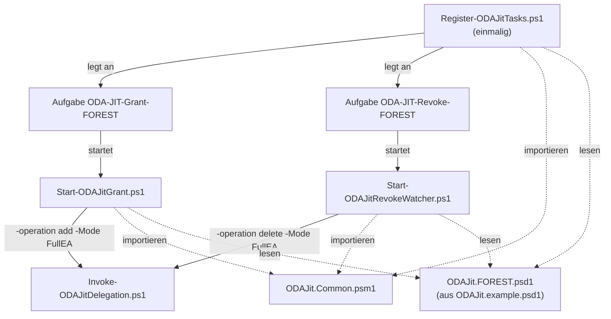
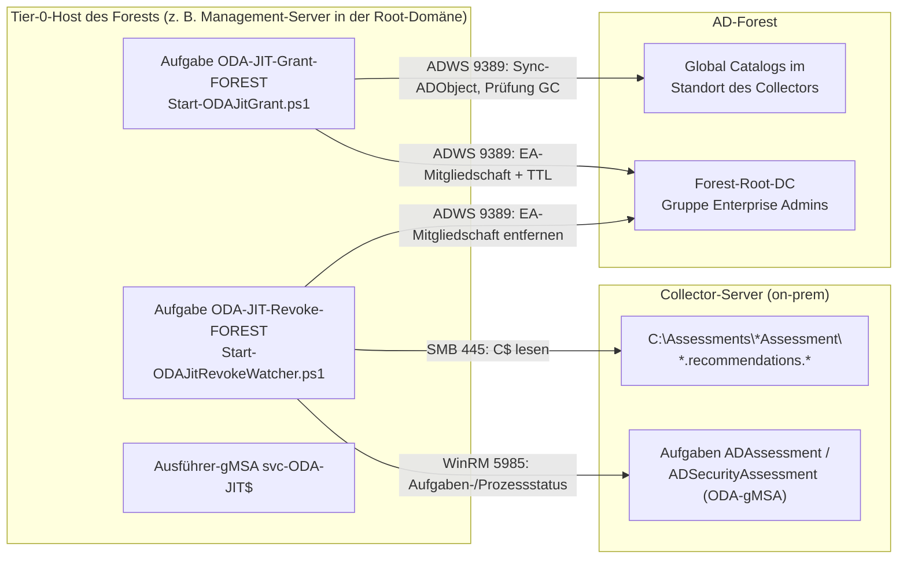

# ODA-JIT – Bereitstellung auf dem Tier-0-Host
<!-- docx-meta: Dokument=ODA-JIT-Deployment (FullEA); Version / Status=1.0; Datum=05.10.2026 -->

**🌐 Sprache:** [English](ODA-JIT-Deployment.md) · Deutsch

Diese Anleitung beschreibt, **wo** und **wie** die ODA-JIT-Skripte installiert werden, damit das
Assessment-gMSA der ODA-Assessments AD und AD Security in **jedem AD-Forest** nur für das
wöchentliche Sammelfenster Mitglied der Gruppe Enterprise Admins ist.

Hintergrund und Begründung des Verfahrens (Ende-Signale, Karenzzeit, Kerberos-Timing) stehen
im Konzept [ODA-JIT-EnterpriseAdmin-Konzept.docx](ODA-JIT-EnterpriseAdmin-Konzept.docx). Die
Einrichtung der Assessments selbst (Azure, Engage Center Connector, Collector) beschreibt der
[Setup-Leitfaden](ODA-MultiForest-Setup-Leitfaden.docx).

## 0. Kurzfassung: Welche Dateien braucht der FullEA-Modus?

Für den FullEA-Modus werden **genau sechs Dateien** aus dem Repository gebraucht. Alle sechs
kommen auf den **Tier-0-Host** des Forests in den Ordner `C:\ODA-JIT`. Auf den Collector-Server
und die DCs wird **nichts** kopiert.

| # | Datei | Rolle | Wird gestartet von |
| - | ----- | ----- | ------------------ |
| 1 | `Register-ODAJitTasks.ps1` | **Einrichtung:** legt die beiden geplanten Aufgaben an, erstellt Ereignisquelle und Log-Ordner | Administrator, einmalig je Forest |
| 2 | `Start-ODAJitGrant.ps1` | **Grant:** nimmt die Assessment-Gruppe vor dem Fenster in Enterprise Admins auf, repliziert auf die GCs und prüft | geplante Aufgabe `ODA-JIT-Grant-<Forest>` (oder manuell) |
| 3 | `Start-ODAJitRevokeWatcher.ps1` | **Revoke:** wartet auf das Ende des ODA-Laufs, Karenzzeit, entzieht EA und prüft; Deadline | geplante Aufgabe `ODA-JIT-Revoke-<Forest>` (oder manuell, `-RevokeNow` im Notfall) |
| 4 | `Invoke-ODAJitDelegation.ps1` | **Ausführung:** setzt bzw. entfernt die EA-Mitgliedschaft (`-Mode FullEA`) | Nr. 2 und Nr. 3 (nicht direkt aufrufen) |
| 5 | `ODAJit.Common.psm1` | **Bibliothek:** Konfiguration, Zeitfenster, Ende-Erkennung, Logging, Events | wird von Nr. 1–3 importiert |
| 6 | `ODAJit.example.psd1` | **Vorlage:** wird je Forest als `ODAJit.<forest>.psd1` kopiert und ausgefüllt | wird von Nr. 1–3 gelesen (`-ConfigPath`) |

Die folgende Tabelle fasst **Fähigkeiten und Zweck** der sechs Skripte zusammen (ergänzend zur
Rolle oben):

| Skript | Zweck (wofür) | Wichtigste Fähigkeiten | Typ |
| ------ | ------------- | ---------------------- | --- |
| `Register-ODAJitTasks.ps1` | Einmalige Einrichtung je Forest | Legt die Aufgaben `ODA-JIT-Grant/Revoke-<Forest>`, Ereignisquelle und Log-Ordner an; vergleicht die Collector-Trigger mit der Konfiguration; `-Unregister` zum Entfernen; `-WhatIf` | Einrichtung |
| `Start-ODAJitGrant.ps1` | EA **vor** dem Fenster vergeben | Nimmt die Gruppe mit TTL in Enterprise Admins auf, repliziert auf die GCs und prüft die Sichtbarkeit; `-StartOdaTasks` startet die ODA-Aufgaben sofort (Testlauf); `-WhatIf` | Laufzeit (Grant) |
| `Start-ODAJitRevokeWatcher.ps1` | EA **nach** dem Lauf entziehen | Erkennt das Ende (Task-Status, `OMSAssessment.exe`, `*.recommendations.*`), hält die Karenzzeit, klassifiziert das Ergebnis, erzwingt die Deadline; `-RevokeNow` (Notfall), `-WindowStart` | Laufzeit (Revoke) |
| `Invoke-ODAJitDelegation.ps1` | Eigentliche EA-Änderung | Setzt bzw. entfernt die EA-Mitgliedschaft (`-Mode FullEA`, `-operation add/delete`); **nicht** direkt aufrufen | Hilfsskript |
| `ODAJit.Common.psm1` | Gemeinsame Logik | Konfiguration laden/prüfen, Zeitfenster berechnen, Ende-Signale auswerten, Logging, Events, AD-Helfer | Bibliothek |
| `ODAJit.example.psd1` | Konfigurationsvorlage | Alle Parameter je Forest: Konten, Collector, `OdaTaskNames`, Fenster, Timing, PAM (`UsePamTtl`) | Konfiguration |


<!-- docx-alt: Aufrufkette: | Register-ODAJitTasks.ps1 legt einmalig die Aufgaben ODA-JIT-Grant-<Forest> und ODA-JIT-Revoke-<Forest> an. Die Grant-Aufgabe startet Start-ODAJitGrant.ps1, die Revoke-Aufgabe Start-ODAJitRevokeWatcher.ps1. Beide rufen Invoke-ODAJitDelegation.ps1 -Mode FullEA auf (-operation add bzw. delete). Alle drei Skripte importieren ODAJit.Common.psm1 und lesen ODAJit.<forest>.psd1 (erstellt aus ODAJit.example.psd1). -->

**Zum Testen zusätzlich** (auf einem Admin- oder Test-System, nicht zwingend auf dem Tier-0-Host):

| Datei | Wofür |
| ----- | ----- |
| `Tests\ODAJit.Common.Tests.ps1` | Pester-5-Tests der Logik (Konfiguration, Zeitfenster, Ende-Erkennung, Karenzzeit, Deadline): `Invoke-Pester .\Tests` |
| `Get-ODADelegationStatus.ps1` | Optional: prüft nach einem Lauf, ob Rechte fehlen (Diagnose bei leeren Tabellenblättern) |

**Für FullEA nicht benötigt** – diese Skripte gehören zur granularen Delegation bzw. zu
`-Mode Granular`:

`Set-WMINamespaceACL.ps1`, `Set-SCM_ACL.ps1`, `Set-NetlogonPermissions.ps1`,
`Set-ADConvergenceRights.ps1`, `Set-SYSVOLWriteAccess.ps1`, `Set-DfsrReadAccess.ps1`,
`Process-DCs.ps1`.

So wird das Paket aus einem Repository-Klon zusammengestellt:

```powershell
$repo = 'C:\Source\ODA-Delegation-Toolkit'          # lokaler Klon bzw. entpacktes ZIP
$pkg  = 'C:\Temp\ODA-JIT-FullEA'                      # wird auf den Tier-0-Host kopiert
New-Item -ItemType Directory -Path $pkg -Force | Out-Null
'Register-ODAJitTasks.ps1', 'Start-ODAJitGrant.ps1', 'Start-ODAJitRevokeWatcher.ps1',
'Invoke-ODAJitDelegation.ps1', 'ODAJit.Common.psm1', 'ODAJit.example.psd1' |
    ForEach-Object { Copy-Item (Join-Path $repo $_) $pkg }
```

## 1. Wo läuft was?


<!-- docx-alt: Datenflüsse vom Tier-0-Host: | Grant → Forest-Root-DC (ADWS TCP 9389: EA-Mitgliedschaft mit TTL) und → GCs im Standort des Collectors (ADWS TCP 9389: Sync-ADObject, Prüfung). Watcher → Collector-Server (WinRM TCP 5985: Status der Aufgaben ADAssessment/ADSecurityAssessment und von OMSAssessment.exe; SMB TCP 445: C:\Assessments\*Assessment\*.recommendations.*) und → Forest-Root-DC (ADWS TCP 9389: EA-Mitgliedschaft entfernen). -->

| Komponente | Ort | Hinweis |
| ---------- | --- | ------- |
| Skripte + Konfiguration | **Tier-0-Host** des jeweiligen Forests, Ordner `C:\ODA-JIT` | Nie auf dem Collector-Server. Der Ausführer darf Enterprise Admins ändern und ist damit Tier-0 |
| Geplante Aufgaben `\ODA-JIT\ODA-JIT-Grant-<Forest>` und `ODA-JIT-Revoke-<Forest>` | Tier-0-Host | Werden von `Register-ODAJitTasks.ps1` angelegt, laufen als Ausführer-gMSA |
| Ausführer-gMSA `svc-ODA-JIT$` | AD, Forest-Root-Domäne | Ein Konto **pro Forest**, dauerhaft Tier-0 |
| Assessment-gMSA (z. B. `gMSA-ODA$`) | AD, Domäne des Collectors | Mitglied einer **festen Gruppe**. Diese Gruppe wird per JIT in Enterprise Admins aufgenommen |
| ODA-Aufgaben `ADAssessment`, `ADSecurityAssessment` | Collector-Server | Unverändert, nur der Zeitplan wird festgelegt. Weitere Assessments auf demselben Collector (z. B. `WindowsServerAssessment` für Member-Server) laufen unabhängig und brauchen **kein** Enterprise-Admins-JIT |

> **Ein Tier-0-Host pro Forest.** Die Forests sind voneinander getrennt. Ein zentraler Host mit
> einem Konto, das in mehreren Forests Enterprise Admins ändern darf, würde diese Trennung
> aufheben. Jeder Forest bekommt deshalb seinen eigenen Tier-0-Host, seinen eigenen Ausführer
> und seine eigene Konfigurationsdatei.

### Namen im Überblick

| Art | Name |
| --- | ---- |
| Dateien | `ODAJit.Common.psm1`, `ODAJit.example.psd1`, `ODAJit.<forest>.psd1`, `*-ODAJit*.ps1` |
| Installationsordner | `C:\ODA-JIT` (Skripte), `C:\ODA-JIT\Config`, `C:\ODA-JIT\Logs` |
| Aufgabenordner / Aufgaben | `\ODA-JIT\ODA-JIT-Grant-<Forest>`, `\ODA-JIT\ODA-JIT-Revoke-<Forest>` |
| Ereignisquelle (Application-Log) | `ODA-JIT`, Event-IDs 1000–1013 |

## 2. Voraussetzungen

### 2.1 Tier-0-Host

| Anforderung | Wert |
| ----------- | ---- |
| System | Dedizierter Tier-0-Management-Server oder PAW, Mitglied der **Forest-Root-Domäne** (ersatzweise ein DC, weil der ohnehin Tier-0 ist) |
| Betriebssystem | Windows Server 2016 oder neuer |
| PowerShell | Windows PowerShell 5.1 (die Aufgaben starten `powershell.exe`) |
| Module | RSAT-AD-PowerShell (`ActiveDirectory`), `ScheduledTasks` (integriert) |
| Härtung | Nur Tier-0-Administratoren dürfen sich anmelden, kein Internet-Browsing, EDR/Patching wie bei DCs |

```powershell
# Server: AD-Modul installieren
Install-WindowsFeature RSAT-AD-PowerShell
# Windows 10/11 (PAW): Add-WindowsCapability -Online -Name Rsat.ActiveDirectory.DS-LDS.Tools~~~~0.0.1.0
```

### 2.2 Netzwerk vom Tier-0-Host

| Ziel | Port | Wofür |
| ---- | ---- | ----- |
| Forest-Root-DC (`ForestRootServer`) | TCP 9389 (AD Web Services) | Enterprise Admins ändern und prüfen |
| GCs im Standort des Collectors (`SiteGlobalCatalogs`) | TCP 9389 | `Sync-ADObject`, Prüfung der Mitgliedschaft über den GC |
| Collector-Server | TCP 5985 (WinRM/CIM) | Status der geplanten Aufgaben und von `OMSAssessment.exe` |
| Collector-Server | TCP 445 (SMB) | Ergebnisdateien über `\\<Collector>\C$` lesen |

WinRM ist auf Windows Server standardmäßig aktiv. Prüfen kann man das vom Tier-0-Host mit
`Test-WSMan <Collector>`.

### 2.3 Rechte des Ausführer-gMSA `svc-ODA-JIT$`

| Recht | Wo | Warum |
| ----- | -- | ----- |
| Mitglied in **Domain Admins der Forest-Root-Domäne** (oder Enterprise Admins) | AD | Enterprise Admins ist durch AdminSDHolder geschützt; delegierte Schreibrechte setzt SDProp nach ~60 min zurück. Nur ein Tier-0-Konto kann die Mitgliedschaft dauerhaft ändern |
| **Lokaler Administrator** auf dem Collector-Server | Collector-Server (on-prem, Windows) – **nicht** das Arc-Objekt, keine Azure-Rolle | Der Watcher fragt vom Tier-0-Host per WinRM/CIM die geplanten Aufgaben und `OMSAssessment.exe` ab und liest per SMB `C$`. Domain Admins der Root-Domäne sind auf Servern einer Child-Domäne **nicht** automatisch lokaler Admin |
| **Als Stapelverarbeitungsauftrag anmelden** (Log on as a batch job) | Tier-0-Host | Die geplanten Aufgaben laufen als Batch-Anmeldung |
| Lesen auf `C:\ODA-JIT`, Ändern auf `C:\ODA-JIT\Logs` | Tier-0-Host | Skripte/Konfiguration lesen, Logs schreiben |
| Kennwortabruf nur durch den Tier-0-Host | AD (`PrincipalsAllowedToRetrieveManagedPassword`) | Nur dieser Host kann das Konto verwenden |

Härtung: Interaktive Anmeldung und RDP für das Konto verweigern. Die Netzwerkanmeldung **nicht**
verweigern, denn das Konto braucht sie für die DCs und den Collector. Änderungen an Enterprise
Admins überwachen (Event 4756/4757).

### 2.4 Optional: PAM-Feature (zeitgebundene Mitgliedschaft)

Mit dem Privileged-Access-Management-Feature läuft die EA-Mitgliedschaft nach `TtlHours` von
selbst ab, auch wenn der Tier-0-Host ausfällt. Voraussetzung ist Forest-Funktionsebene 2016. Die
Aktivierung **lässt sich nicht rückgängig machen**.

```powershell
Get-ADOptionalFeature -Filter "Name -eq 'Privileged Access Management Feature'" | Select-Object Name, EnabledScopes
Enable-ADOptionalFeature 'Privileged Access Management Feature' -Scope ForestOrConfigurationSet -Target '<forest.dns>'
```

> **Ist das Aktivieren sicher? (FFL 2016+)** Ja. Das Einschalten des Features ist für sich genommen
> **nicht disruptiv**: Es schaltet nur die Möglichkeit zeitgebundener Gruppenmitgliedschaften frei
> und ändert **keine** bestehende Gruppe, Mitgliedschaft, ACL oder Replikation – nichts erhält
> rückwirkend eine TTL. Es ist **kein** Schema-Update, **kein** DC-Upgrade und **kein** AD Recycle
> Bin, MIM, Admin-Forest oder Trust nötig. Einziger wichtiger Punkt: Die Aktivierung ist
> **irreversibel** und gilt **forest-weit**. Daher vorab im Lab testen, dokumentieren und abstimmen,
> dann in der Produktion aktivieren. Hinweis: TTL-Mitgliedschaften sehen für die meisten Tools
> normal aus – die Restlaufzeit zeigt nur `-ShowMemberTimeToLive`.

> **TTL-Feature ≠ PIM-Trust/Shadow Principals.** Für ODA-JIT (FullEA) genügt **allein** das
> PAM-Optional-Feature (zeitgebundene Mitgliedschaften, TTL) **im Produktions-Forest**. Man braucht
> dafür **keinen** Admin-Forest, **keinen** PIM-Trust und **keine** Shadow Principals. Diese drei
> Dinge sind ein **separates, optionales** Szenario (Ausführer im Admin-Forest), beschrieben in
> [PAM-Trust-Shadow-Principals.de.md](PAM-Trust-Shadow-Principals.de.md) – und **keine**
> Voraussetzung, nur um die TTL zu aktivieren. `Enable-ADOptionalFeature 'Privileged Access
> Management Feature'` genügt.

Ohne PAM in der Konfiguration `UsePamTtl = $false` setzen. Dann sind Watcher-Deadline und
Monitoring die einzige Absicherung.

> **`EnabledScopes` prüfen.** Ist `EnabledScopes` in der Ausgabe oben **leer**, ist PAM **nicht**
> aktiv. Dann entweder das Feature aktivieren (`Enable-ADOptionalFeature`, irreversibel, FFL 2016)
> **oder** `UsePamTtl = $false` setzen – danach sind Watcher-Deadline und Grace die einzige
> Absicherung (für ein Testlab in Ordnung). Bei `UsePamTtl = $true` ohne aktives PAM bricht der
> Grant mit einem Fehler bei `-MemberTimeToLive` ab (siehe Abschnitt 6).

**Nur zur Info – PAM manuell nutzen.** Ist das PAM-Feature aktiv, können Forest-Admins dieselbe
Technik auch **ad hoc** und **unabhängig von ODA-JIT** verwenden, um sich (oder ein anderes Konto)
zeitgebunden in eine geschützte Gruppe wie Enterprise Admins oder Domain Admins aufzunehmen. Die
Mitgliedschaft läuft nach der TTL von selbst ab – kein manuelles Entfernen und kein Reset durch
AdminSDHolder/SDProp nötig:

```powershell
# Zeitgebundene Aufnahme (läuft nach 60 Minuten automatisch ab)
Add-ADGroupMember -Identity 'Enterprise Admins' -Members 'FORESTA\admin' `
    -MemberTimeToLive (New-TimeSpan -Minutes 60)

# Verbleibende TTL der Mitglieder anzeigen (Restsekunden im Präfix <TTL=...>)
Get-ADGroup 'Enterprise Admins' -ShowMemberTimeToLive -Properties member |
    Select-Object -ExpandProperty member
```

Voraussetzung ist dieselbe wie oben (PAM aktiv, FFL 2016). Ohne aktives PAM schlägt
`-MemberTimeToLive` fehl. Diese manuelle Nutzung ist nicht Teil von ODA-JIT und wird hier nur zur
Information gezeigt.

## 3. Einrichtung je Forest – Schritt für Schritt

Die Beispiele verwenden Forest `forest-a.example`, Root-Domäne `FORESTA`, Collector-Domäne
`child.forest-a.example` (`CHILDA`), Tier-0-Host `T0-MGMT-A` und Collector `ODA-COL-A`.

### Schritt 1 – Ausführer-gMSA anlegen (Forest-Root-Domäne)

```powershell
New-ADServiceAccount -Name 'svc-ODA-JIT' -DNSHostName 'svc-ODA-JIT.forest-a.example' `
    -PrincipalsAllowedToRetrieveManagedPassword 'T0-MGMT-A$' `
    -KerberosEncryptionType AES128, AES256
Add-ADGroupMember -Identity (Get-ADGroup -Identity "$((Get-ADDomain).DomainSID)-512") -Members 'svc-ODA-JIT$'  # Domain Admins (sprachunabhängig per SID)

# Auf dem Tier-0-Host (nach Neustart bzw. klist -li 0x3e7 purge)
Install-ADServiceAccount -Identity 'svc-ODA-JIT'
Test-ADServiceAccount   -Identity 'svc-ODA-JIT'      # muss True liefern
```

### Schritt 2 – Feste Gruppe für das Assessment-gMSA (Domäne des Collectors)

Die JIT-Skripte nehmen nicht das gMSA selbst, sondern eine feste **globale Gruppe** in
Enterprise Admins auf. Der Name der Gruppe ändert sich nie, das gMSA ist dauerhaft Mitglied.

```powershell
New-ADGroup -Name 'ODA-Assessment-Accounts' -GroupScope Global -GroupCategory Security `
    -Path 'OU=Tier0-Groups,DC=child,DC=forest-a,DC=example' -Server 'child.forest-a.example'
Add-ADGroupMember -Identity 'ODA-Assessment-Accounts' -Members 'gMSA-ODA$' -Server 'child.forest-a.example'
(Get-ADGroup 'ODA-Assessment-Accounts' -Server 'child.forest-a.example').DistinguishedName   # -> AccountGroupDN
```

Eine bestehende **dauerhafte** EA-Mitgliedschaft des gMSA wird erst in Schritt 9 entfernt, wenn
der JIT-Ablauf funktioniert.

### Schritt 3 – Ausführer auf dem Collector-Server berechtigen

```powershell
# Auf dem Collector (oder per GPO "Restricted Groups"/"Lokale Benutzer und Gruppen")
Add-LocalGroupMember -SID 'S-1-5-32-544' -Member 'FORESTA\svc-ODA-JIT$'

# Vom Tier-0-Host testen (in einer Sitzung als svc-ODA-JIT$ bzw. später im Probelauf)
Test-WSMan ODA-COL-A.child.forest-a.example
Test-Path  '\\ODA-COL-A.child.forest-a.example\C$\Assessments'
```

Firewall des Collectors: TCP 5985 und 445 **nur** vom Tier-0-Host zulassen.

### Schritt 4 – Dateien auf dem Tier-0-Host ablegen

```powershell
New-Item -ItemType Directory -Path 'C:\ODA-JIT', 'C:\ODA-JIT\Config', 'C:\ODA-JIT\Logs' -Force | Out-Null

# Dateien aus dem in Abschnitt 0 erstellten Paket kopieren
$files = 'Register-ODAJitTasks.ps1', 'Start-ODAJitGrant.ps1', 'Start-ODAJitRevokeWatcher.ps1',
         'Invoke-ODAJitDelegation.ps1', 'ODAJit.Common.psm1', 'ODAJit.example.psd1'
Copy-Item -Path ($files | ForEach-Object { Join-Path '<Paketordner>' $_ }) -Destination 'C:\ODA-JIT'
Get-ChildItem 'C:\ODA-JIT' -File | Unblock-File       # Internet-Kennzeichnung entfernen (RemoteSigned)

# Berechtigungen: nur Administratoren/SYSTEM schreiben, Ausführer liest, Logs darf er schreiben
icacls 'C:\ODA-JIT' /inheritance:r /grant:r 'SYSTEM:(OI)(CI)F' '*S-1-5-32-544:(OI)(CI)F' 'FORESTA\svc-ODA-JIT$:(OI)(CI)RX'
icacls 'C:\ODA-JIT\Logs' /grant 'FORESTA\svc-ODA-JIT$:(OI)(CI)M'
```

> **Empfehlung für Tier-0:** Die Skripte mit einem Code-Signing-Zertifikat signieren
> (`Set-AuthenticodeSignature`) und die Aufgaben mit `-ExecutionPolicy AllSigned` registrieren
> (Schritt 8). Jede Änderung an den Skripten erfordert dann eine neue Signatur.

### Schritt 5 – Konfiguration anlegen

```powershell
Copy-Item 'C:\ODA-JIT\ODAJit.example.psd1' 'C:\ODA-JIT\Config\ODAJit.forest-a.psd1'
notepad 'C:\ODA-JIT\Config\ODAJit.forest-a.psd1'
```

| Schlüssel | Bedeutung | So findet man den Wert |
| --------- | --------- | ---------------------- |
| `ForestName` | Kurzname für Aufgaben, Logs, Events | frei, z. B. `forest-a.example` |
| `ForestRootServer` | Beschreibbarer DC der **Root-Domäne** | `(Get-ADDomainController -DomainName forest-a.example -Discover -Writable).HostName` |
| `AccountGroupDN` | DN der festen Gruppe aus Schritt 2 | siehe Schritt 2 |
| `SiteGlobalCatalogs` | GCs im AD-Standort des Collectors | Standort: `nltest /dsgetsite` auf dem Collector; dann `Get-ADDomainController -Filter "IsGlobalCatalog -eq 'True' -and Site -eq '<Standort>'" -Server child.forest-a.example` |
| `ExecutorAccount` | Ausführer-gMSA | `FORESTA\svc-ODA-JIT$` |
| `Collector` | **FQDN des Collector-Servers on-prem** (nicht der Name des Arc-Objekts) | `ODA-COL-A.child.forest-a.example` |
| `WorkingDirectory` | Ordner auf dem Collector, der die `*Assessment`-Unterordner enthält | Je nach ODA-Version `C:\Assessments` oder `C:\MicrosoftAssessments\Collect`. Der Watcher liest darunter **alle** `*Assessment`-Ordner (`*.recommendations.*`) |
| `OdaTaskNames` | Namen der ODA-Aufgaben, die Enterprise Admins brauchen | Standard `ADAssessment`, `ADSecurityAssessment`. **Nur** die AD-Assessments eintragen; Assessments ohne EA-Bedarf (z. B. `WindowsServerAssessment`) hier weglassen |
| `WindowDay` / `WindowStart` | Wochentag (englisch) und Startzeit der **ersten** ODA-Aufgabe | muss zum Zeitplan auf dem Collector passen (Schritt 6) |
| `GrantLeadMinutes`, `GraceMinutes`, `NoStartTimeoutMinutes`, `DeadlineHours`, `TtlHours` | Zeitsteuerung | Standard 60 / 30 / 90 / 6 / 8. Deadline ≥ 3× längste gemessene Laufzeit; TTL > Vorlauf + Deadline |
| `UsePamTtl` | PAM-TTL verwenden | `$false`, falls PAM nicht aktiv ist (2.4) |
| `LogDirectory` | Log-Ordner | `C:\ODA-JIT\Logs` |

> **Ein Aufgabenpaar pro Forest reicht.** `OdaTaskNames` ist eine **Liste** – ein einziges
> Grant-/Watcher-Paar deckt **alle** aufgeführten AD-Assessments ab. Der Watcher entzieht EA erst,
> wenn **alle** aufgeführten Aufgaben beendet sind, und `WorkingDirectory` ist **ein** Ordner, unter
> dem er die `*Assessment`-Unterordner selbst findet – kein eigener Watcher, keine Aufgabe und kein
> Pfad je Assessment.
>
> **Nur die AD-Assessments gehören in den JIT-Ablauf.** Ein Collector führt oft weitere
> ODA-Assessments aus (z. B. `WindowsServerAssessment` für Member-Server). Diese haben eigene
> Voraussetzungen (lokaler Admin/WinRM auf den Zielservern) und brauchen **keine** Enterprise
> Admins. Sie dürfen deshalb **nicht** in `OdaTaskNames` stehen, sonst wartet der Watcher auf eine
> Aufgabe, die mit dem EA-Fenster nichts zu tun hat. `WorkingDirectory` zeigt auf den Ordner, der
> die `*Assessment`-Unterordner enthält – je nach Installation `C:\Assessments` oder
> `C:\MicrosoftAssessments\Collect`.

Ob die Konfiguration gültig ist, prüft man so:

```powershell
Import-Module C:\ODA-JIT\ODAJit.Common.psm1
Import-ODAJitConfig -Path C:\ODA-JIT\Config\ODAJit.forest-a.psd1    # wirft eine Meldung bei Fehlern
```

### Schritt 6 – Zeitplan der ODA-Aufgaben auf dem Collector festlegen

Die ODA-Aufgaben laufen alle 7 Tage. Ihr Startzeitpunkt muss zu `WindowDay`/`WindowStart` passen.
Im Beispiel startet AD sonntags um 02:00 und AD Security sonntags um 02:30.

- Aufgabenplanung auf dem Collector → Microsoft → Operations Management Suite → AOI-… →
  Assessments → `ADAssessment` bzw. `ADSecurityAssessment` → Trigger bearbeiten.
- Danach prüfen:

```powershell
Get-ScheduledTask -TaskName ADAssessment, ADSecurityAssessment |
    Select-Object TaskName, @{ n = 'Start'; e = { $_.Triggers.StartBoundary } }
```

`Register-ODAJitTasks.ps1` vergleicht die Trigger in Schritt 8 automatisch mit der Konfiguration
und warnt bei Abweichungen.

Beide ODA-Aufgaben müssen am **selben Wochentag** laufen. Das JIT-Fenster deckt genau einen
`WindowDay` ab. Laufen `ADAssessment` und `ADSecurityAssessment` an **verschiedenen Tagen** (im
obigen Befehl unterschiedliche `StartBoundary`), wertet der Watcher den am Fenstertag fehlenden
Task nach `NoStartTimeoutMinutes` als *nicht gelaufen* (`Incomplete`), entzieht EA – und das
Assessment am anderen Tag läuft **ohne** EA, also mit unvollständigen Ergebnissen.

**Option A (empfohlen): beide Trigger auf denselben Tag.** Kurz nacheinander, passend zu
`WindowDay`/`WindowStart` (z. B. Sonntag 02:00 und 02:30):

```powershell
Set-ScheduledTask -TaskName ADAssessment         -Trigger (New-ScheduledTaskTrigger -Weekly -DaysOfWeek Sunday -At 02:00)
Set-ScheduledTask -TaskName ADSecurityAssessment -Trigger (New-ScheduledTaskTrigger -Weekly -DaysOfWeek Sunday -At 02:30)
```

**Option B (getrennte Tage beibehalten): zwei JIT-Fenster.** Pro Tag ein eigenes
Config-/Grant-/Watcher-Paar mit **nur einem** Assessment in `OdaTaskNames` und **eigenem
`ForestName`-Label** (sonst kollidieren die Tasknamen `ODA-JIT-Grant-<ForestName>`). `AccountGroupDN`,
`ForestRootServer`, `SiteGlobalCatalogs`, `Collector` und `ExecutorAccount` bleiben identisch;
dasselbe gMSA bekommt an beiden Tagen für je ein kurzes Fenster EA.

| Config | `ForestName` | `WindowDay` / `WindowStart` | `OdaTaskNames` |
| ------ | ------------ | --------------------------- | -------------- |
| `ODAJit.<forest>-ad.psd1` | `forest-a-ad` | Tuesday / 06:00 | `@('ADAssessment')` |
| `ODAJit.<forest>-adsec.psd1` | `forest-a-adsec` | Wednesday / 05:43 | `@('ADSecurityAssessment')` |

`DeadlineHours`/`TtlHours` **nicht** über mehrere Tage dehnen – EA bliebe sonst 24 h+ aktiv und der
JIT-Zweck wäre dahin.

**Startzeit oder Wochentag einer Assessment-Aufgabe ändern (läuft unter gMSA).** Müssen Kunden
Tag/Uhrzeit anpassen, reicht `Set-ScheduledTask` mit einem neuen Trigger – der **gMSA-Principal
bleibt erhalten** und es ist **kein Kennwort** nötig (LogonType `Password`: das OS holt das
verwaltete Kennwort selbst). Beispiel: AD Security auf **Dienstag 07:00** (passend zu `ADAssessment`
am Dienstag):

```powershell
# 1) Principal prüfen (UserId = DOMAIN\ODA-SVC$, LogonType = Password)
(Get-ScheduledTask -TaskName ADSecurityAssessment).Principal

# 2) TaskPath ermitteln – ODA-Aufgaben liegen in einem Unterordner, daher Pflicht
$tp = (Get-ScheduledTask -TaskName ADSecurityAssessment).TaskPath   # z. B. \Microsoft\Operations Management Suite\AOI-…\Assessments\

# 3) Nur den Trigger ändern – gMSA bleibt unangetastet, kein Passwort nötig
$trigger = New-ScheduledTaskTrigger -Weekly -DaysOfWeek Tuesday -At ([datetime]'07:00')
Set-ScheduledTask -TaskName ADSecurityAssessment -TaskPath $tp -Trigger $trigger

# 3b) Nur falls Set-ScheduledTask nach dem Principal fragt: gMSA explizit (weiterhin ohne Passwort)
$principal = New-ScheduledTaskPrincipal -UserId 'DOMAIN\ODA-SVC$' -LogonType Password -RunLevel Highest
Set-ScheduledTask -TaskName ADSecurityAssessment -TaskPath $tp -Trigger $trigger -Principal $principal

# 4) Prüfen – beide auf Dienstag, RunAs = gMSA
Get-ScheduledTask -TaskName ADAssessment, ADSecurityAssessment |
    Select-Object TaskName,
        @{ n = 'Start'; e = { $_.Triggers.StartBoundary } },
        @{ n = 'RunAs'; e = { $_.Principal.UserId } }
```

- **`-TaskPath` ist für die ODA-Aufgaben praktisch immer erforderlich.** Sie liegen unter
  `\Microsoft\Operations Management Suite\…\Assessments\`. `Set-ScheduledTask` sucht ohne `-TaskPath`
  nur im Stammordner `\` und bricht mit `0x80070002` / `ObjectNotFound` ab, obwohl
  `Get-ScheduledTask -TaskName` die Aufgabe (ordnerübergreifend) findet. Alternativ das Task-Objekt
  ändern und zurückpipen: `$t = Get-ScheduledTask -TaskName ADSecurityAssessment; $t.Triggers = @($trigger); $t | Set-ScheduledTask`.
- `-LogonType Password` ist für gMSA korrekt (kein Klartext-Kennwort, anders als bei einem normalen
  Konto). `-RunLevel Highest` nur, wenn die Aufgabe bisher mit höchsten Rechten läuft (Schritt 1).
- Danach die JIT-Konfiguration anpassen (`WindowDay`, `WindowStart` = Start der **ersten** Aufgabe,
  `NoStartTimeoutMinutes` > Abstand zur letzten Aufgabe) und `Register-ODAJitTasks.ps1` erneut
  ausführen.
- Nach einem ODA-Update kann das Assessment-Setup den Trigger zurücksetzen – kurz gegenprüfen.

### Schritt 7 – Probelauf (ohne Änderungen)

```powershell
cd C:\ODA-JIT
.\Register-ODAJitTasks.ps1       -ConfigPath C:\ODA-JIT\Config\ODAJit.forest-a.psd1 -WhatIf   # Zeiten + Abgleich mit Collector
.\Start-ODAJitGrant.ps1          -ConfigPath C:\ODA-JIT\Config\ODAJit.forest-a.psd1 -WhatIf   # Vorprüfung Collector, kein Grant
.\Start-ODAJitRevokeWatcher.ps1  -ConfigPath C:\ODA-JIT\Config\ODAJit.forest-a.psd1 -RevokeNow -WhatIf
```

Danach einen **echten Testlauf außerhalb des Fensters** im Kontext des Ausführer-gMSA ausführen.
Am einfachsten registriert man dazu die Aufgaben (Schritt 8) und startet sie manuell:

```powershell
# Grant + ODA-Aufgaben sofort starten, danach Watcher mit Fensterstart "jetzt"
.\Start-ODAJitGrant.ps1         -ConfigPath C:\ODA-JIT\Config\ODAJit.forest-a.psd1 -StartOdaTasks
.\Start-ODAJitRevokeWatcher.ps1 -ConfigPath C:\ODA-JIT\Config\ODAJit.forest-a.psd1 -WindowStart (Get-Date)
```

Prüfen: Grant-Log OK, Event 1000; Watcher erkennt Ende → Event 1010; das gMSA ist danach nicht
mehr in Enterprise Admins; die ODA-Ergebnisse sind vollständig (keine leeren Tabellenblätter).

> **Info – was „echter Testlauf" bedeutet.** Der erste Block (`-WhatIf`) ändert **nichts**: kein
> Grant, kein Assessment-Start, kein Revoke – nur Vorprüfungen. Der zweite Block ist der
> **Live-Test**: `-StartOdaTasks` setzt EA **wirklich** und startet die ODA-Aufgaben sofort, der
> Watcher (`-WindowStart (Get-Date)`) wartet auf das Ende und entzieht EA wieder. Daher am besten in
> einem Wartungsfenster/Lab.
>
> **Info – `-StartOdaTasks` legt keine ODA-Aufgabe an.** Die Aufgaben `ADAssessment` /
> `ADSecurityAssessment` müssen auf dem Collector **bereits existieren** (angelegt durch das
> ODA-/On-Demand-Assessment-Setup, nicht durch dieses Toolkit). `-StartOdaTasks` **startet** nur die
> vorhandenen Aufgaben sofort (per CIM, `Start-ScheduledTask`) statt auf den Wochen-Trigger zu
> warten. Fehlt eine Aufgabe (falscher Name), legt das Skript sie **nicht** an, sondern warnt:
> `ODA task(s) not found on <Collector>: … - check OdaTaskNames`.
>
> **Info – „im Kontext des Ausführer-gMSA".** Grant/Watcher müssen als `svc-ODA-JIT$` laufen (nur
> dieses Konto hat die EA- und Collector-Rechte). Am einfachsten die JIT-Aufgaben aus Schritt 8
> registrieren und in der Aufgabenplanung manuell per **„Ausführen"** starten – dann laufen sie als
> gMSA. Startet man die `.ps1` direkt in einer Admin-Shell, laufen sie als das eigene Konto, nicht
> als gMSA.

### Schritt 8 – Geplante Aufgaben registrieren

In einer **PowerShell als Administrator** auf dem Tier-0-Host:

```powershell
.\Register-ODAJitTasks.ps1 -ConfigPath C:\ODA-JIT\Config\ODAJit.forest-a.psd1
# mit signierten Skripten:
.\Register-ODAJitTasks.ps1 -ConfigPath C:\ODA-JIT\Config\ODAJit.forest-a.psd1 -ExecutionPolicy AllSigned
```

Das Skript

- legt `\ODA-JIT\ODA-JIT-Grant-forest-a.example` (Sonntag 01:00) und
  `\ODA-JIT\ODA-JIT-Revoke-forest-a.example` (Sonntag 02:15) an, beide mit dem Ausführer-gMSA
  als Principal,
- legt die Ereignisquelle `ODA-JIT` und den Log-Ordner an,
- vergleicht die Trigger der ODA-Aufgaben auf dem Collector mit der Konfiguration.

```powershell
Get-ScheduledTask -TaskPath '\ODA-JIT\' | Get-ScheduledTaskInfo |
    Select-Object TaskName, NextRunTime, LastRunTime, LastTaskResult
```

### Schritt 9 – Auf JIT umstellen

1. Dauerhafte EA-Mitgliedschaft des Assessment-gMSA bzw. der Gruppe entfernen (falls vorhanden).
2. Ersten regulären Lauf abwarten und Events 1000 → 1010 sowie die Ergebnisse prüfen.
3. Im SIEM überwachen:
   - Events 1001, 1011, 1012, 1013 (Quelle `ODA-JIT`) auf dem Tier-0-Host
   - 4756/4757 für Enterprise Admins außerhalb des Fensters oder durch ein anderes Konto als `svc-ODA-JIT$`

## 4. Mehrere Forests

Für jeden weiteren Forest werden die Schritte 1–9 **in diesem Forest** wiederholt, mit eigenem
Tier-0-Host, eigenem `svc-ODA-JIT$` und eigener `ODAJit.<forest>.psd1`.

| Forest | Tier-0-Host | Ausführer | Konfiguration | Fenster |
| ------ | ----------- | --------- | ------------- | ------- |
| forest-a.example | T0-MGMT-A | `FORESTA\svc-ODA-JIT$` | `ODAJit.forest-a.psd1` | So 02:00 |
| forest-b.example | T0-MGMT-B | `FORESTB\svc-ODA-JIT$` | `ODAJit.forest-b.psd1` | So 05:00 |

Technisch kann ein Host mehrere Konfigurationen haben (die Aufgabennamen enthalten den
Forest-Namen). Das geht aber nur, wenn ein Konto in mehreren Forests Enterprise Admins ändern
darf, und genau das widerspricht der Forest-Trennung. **Nicht empfohlen.**

> **Variante mit Admin-Forest:** Mit einem eigenen, gehärteten Admin-Forest und einem PIM-Trust kann
> der Ausführer im Admin-Forest leben. Er erhält Enterprise-Admin-Rechte in Produktion dann über einen
> Shadow Principal, ohne dauerhafte Mitgliedschaft in einer Produktionsgruppe. Grundlagen, Einrichtung
> und Grenzen beschreibt [PAM-Trust-Shadow-Principals.de.md](PAM-Trust-Shadow-Principals.de.md).
> Das ODA-gMSA bleibt im Produktions-Forest.

## 5. Betrieb

| Aufgabe | Vorgehen |
| ------- | -------- |
| Konfiguration ändern (z. B. Zeitfenster) | `ODAJit.<forest>.psd1` anpassen, dann `Register-ODAJitTasks.ps1` erneut ausführen (überschreibt die Aufgaben) |
| Skripte aktualisieren | Dateien ersetzen, `Unblock-File` bzw. neu signieren, Probelauf (Schritt 7) |
| Notfall: EA sofort entziehen | `.\Start-ODAJitRevokeWatcher.ps1 -ConfigPath … -RevokeNow` |
| Manueller ODA-Lauf | `Start-ODAJitGrant.ps1 -StartOdaTasks`, danach `Start-ODAJitRevokeWatcher.ps1 -WindowStart (Get-Date)` |
| Logs | `C:\ODA-JIT\Logs` – ältere Dateien regelmäßig bereinigen, z. B. nach 90 Tagen |
| Deinstallation | `.\Register-ODAJitTasks.ps1 -ConfigPath … -Unregister`, danach Ordner, Ausführer-gMSA und Collector-Rechte entfernen |

## 6. Fehlerbehebung

| Symptom | Ursache | Lösung |
| ------- | ------- | ------ |
| Aufgabe startet nicht, Ergebnis 0x8007052E / 0x80070569 | gMSA nicht installiert oder kein Batch-Anmelderecht | `Test-ADServiceAccount svc-ODA-JIT` auf dem Tier-0-Host; „Als Stapelverarbeitungsauftrag anmelden“ prüfen |
| Grant Exit 1 / Event 1001 „FAILED“ | Ausführer ohne Rechte auf Enterprise Admins, `ForestRootServer` nicht erreichbar | Mitgliedschaft in Domain Admins der Root-Domäne prüfen; TCP 9389 |
| Grant Exit 2 / Event 1001 „NOT visible on GC“ | Replikation zum GC im Collector-Standort fehlt | `SiteGlobalCatalogs` prüfen, `repadmin /showrepl`, TCP 9389 zu den GCs |
| Fehler bei `-MemberTimeToLive` | PAM-Feature nicht aktiv | PAM aktivieren (2.4) oder `UsePamTtl = $false` |
| Watcher: „Collector query failed“ | WinRM gesperrt oder Ausführer nicht lokaler Admin auf dem Collector-Server | `Test-WSMan`, Firewall 5985, Schritt 3 |
| Watcher: „Result file check failed“ | Kein Zugriff auf `C$` des Collector-Servers | Firewall 445, lokaler Admin auf dem Collector-Server, `WorkingDirectory` prüfen |
| Watcher endet immer mit Deadline (Event 1012) | Zeitplan der ODA-Aufgaben passt nicht zu `WindowDay`/`WindowStart`, falsche `OdaTaskNames` | Schritt 6; Log zeigt `Missing=[…]` |
| Watcher endet mit `Incomplete`, ein Assessment fehlt (Event 1013) | `ADAssessment` und `ADSecurityAssessment` laufen an **verschiedenen Tagen** | Beide auf denselben `WindowDay` legen (Schritt 6, Option A) oder zwei getrennte Fenster (Option B) |
| Keine Events im Application-Log | Ereignisquelle fehlt | `Register-ODAJitTasks.ps1` als Administrator ausführen |
| Skript startet nicht („nicht digital signiert“) | Internet-Kennzeichnung oder `AllSigned` ohne Signatur | `Unblock-File` bzw. Skripte signieren |
