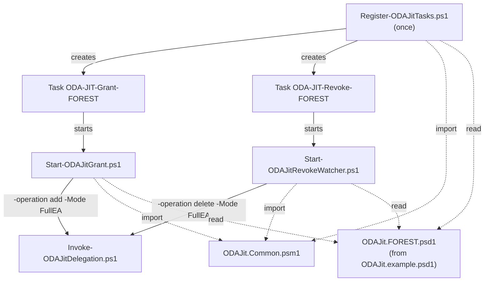
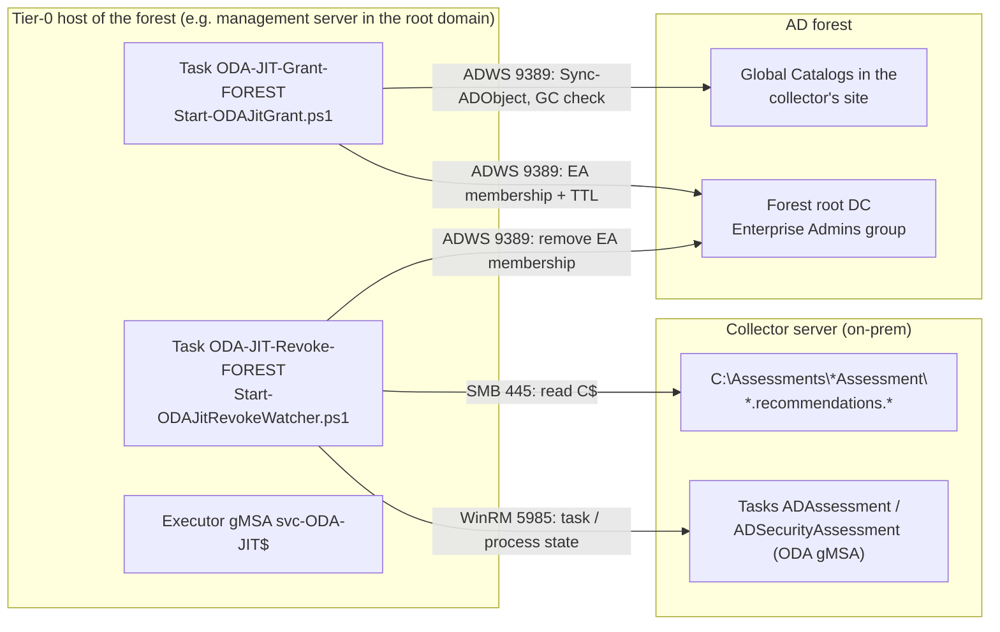

# ODA-JIT – Deployment on the Tier-0 host

**🌐 Language:** English · [Deutsch](ODA-JIT-Deployment.de.md)

This guide describes **where** and **how** to install the ODA-JIT scripts so that the assessment
gMSA of the ODA AD and AD Security assessments is a member of Enterprise Admins in **each AD
forest** only during the weekly collection window.

Background and rationale (end-of-collection signals, grace period, Kerberos timing) are in the
concept [ODA-JIT-EnterpriseAdmin-Konzept.docx](ODA-JIT-EnterpriseAdmin-Konzept.docx) (German).
Setting up the assessments themselves (Azure, Engage Center Connector, collector) is covered by the
[setup guide](ODA-MultiForest-Setup-Leitfaden.docx) (German).

## 0. Summary: which files does FullEA mode need?

FullEA mode needs **exactly six files** from the repository. All six go onto the forest's
**Tier-0 host** into `C:\ODA-JIT`. **Nothing** is copied to the collector server or the DCs.

| # | File | Role | Started by |
| - | ---- | ---- | ---------- |
| 1 | `Register-ODAJitTasks.ps1` | **Setup:** creates the two scheduled tasks, the event source and the log folder | administrator, once per forest |
| 2 | `Start-ODAJitGrant.ps1` | **Grant:** adds the assessment group to Enterprise Admins before the window, replicates to the GCs and verifies | scheduled task `ODA-JIT-Grant-<Forest>` (or manually) |
| 3 | `Start-ODAJitRevokeWatcher.ps1` | **Revoke:** waits for the ODA run to end, grace period, removes EA and verifies; deadline | scheduled task `ODA-JIT-Revoke-<Forest>` (or manually, `-RevokeNow` in an emergency) |
| 4 | `Invoke-ODAJitDelegation.ps1` | **Execution:** adds/removes the EA membership (`-Mode FullEA`) | #2 and #3 (do not call directly) |
| 5 | `ODAJit.Common.psm1` | **Library:** configuration, window, end detection, logging, events | imported by #1–#3 |
| 6 | `ODAJit.example.psd1` | **Template:** copied per forest as `ODAJit.<forest>.psd1` and filled in | read by #1–#3 (`-ConfigPath`) |



**Additionally for testing** (on an admin or test system, not necessarily on the Tier-0 host):

| File | Purpose |
| ---- | ------- |
| `Tests\ODAJit.Common.Tests.ps1` | Pester 5 tests of the logic (configuration, window, end detection, grace period, deadline): `Invoke-Pester .\Tests` |
| `Get-ODADelegationStatus.ps1` | Optional: checks after a run whether rights are missing (diagnosis of empty sheets) |

**Not needed for FullEA** – these belong to the granular delegation or `-Mode Granular`:

`Set-WMINamespaceACL.ps1`, `Set-SCM_ACL.ps1`, `Set-NetlogonPermissions.ps1`,
`Set-ADConvergenceRights.ps1`, `Set-SYSVOLWriteAccess.ps1`, `Set-DfsrReadAccess.ps1`,
`Process-DCs.ps1`.

Building the package from a repository clone:

```powershell
$repo = 'C:\Source\ODA-Delegation-Toolkit'          # local clone or extracted ZIP
$pkg  = 'C:\Temp\ODA-JIT-FullEA'                      # copied to the Tier-0 host
New-Item -ItemType Directory -Path $pkg -Force | Out-Null
'Register-ODAJitTasks.ps1', 'Start-ODAJitGrant.ps1', 'Start-ODAJitRevokeWatcher.ps1',
'Invoke-ODAJitDelegation.ps1', 'ODAJit.Common.psm1', 'ODAJit.example.psd1' |
    ForEach-Object { Copy-Item (Join-Path $repo $_) $pkg }
```

## 1. What runs where?



| Component | Location | Note |
| --------- | -------- | ---- |
| Scripts + configuration | the forest's **Tier-0 host**, folder `C:\ODA-JIT` | Never on the collector server. The executor can modify Enterprise Admins and is therefore Tier-0 |
| Scheduled tasks `\ODA-JIT\ODA-JIT-Grant-<Forest>` and `ODA-JIT-Revoke-<Forest>` | Tier-0 host | Created by `Register-ODAJitTasks.ps1`, run as the executor gMSA |
| Executor gMSA `svc-ODA-JIT$` | AD, forest root domain | One account **per forest**, standing Tier-0 |
| Assessment gMSA (e.g. `gMSA-ODA$`) | AD, collector's domain | Member of a **fixed group**; that group is added to Enterprise Admins just in time |
| ODA tasks `ADAssessment`, `ADSecurityAssessment` | Collector server | Unchanged; only the schedule is fixed. Other assessments on the same collector (e.g. `WindowsServerAssessment` for member servers) run independently and need **no** Enterprise Admins JIT |

> **One Tier-0 host per forest.** The forests are separate. A central host with an account that
> can modify Enterprise Admins in several forests would break that separation. Each forest
> therefore gets its own Tier-0 host, its own executor and its own configuration file.

### Names at a glance

| Kind | Name |
| ---- | ---- |
| Files | `ODAJit.Common.psm1`, `ODAJit.example.psd1`, `ODAJit.<forest>.psd1`, `*-ODAJit*.ps1` |
| Install folders | `C:\ODA-JIT` (scripts), `C:\ODA-JIT\Config`, `C:\ODA-JIT\Logs` |
| Task folder / tasks | `\ODA-JIT\ODA-JIT-Grant-<Forest>`, `\ODA-JIT\ODA-JIT-Revoke-<Forest>` |
| Event source (Application log) | `ODA-JIT`, event IDs 1000–1013 |

## 2. Prerequisites

### 2.1 Tier-0 host

| Requirement | Value |
| ----------- | ----- |
| System | Dedicated Tier-0 management server or PAW, member of the **forest root domain** (a DC as fallback – it is Tier-0 anyway) |
| Operating system | Windows Server 2016 or later |
| PowerShell | Windows PowerShell 5.1 (the tasks start `powershell.exe`) |
| Modules | RSAT-AD-PowerShell (`ActiveDirectory`), `ScheduledTasks` (built in) |
| Hardening | Logon for Tier-0 admins only, no internet browsing, EDR/patching like DCs |

```powershell
# Server: install the AD module
Install-WindowsFeature RSAT-AD-PowerShell
# Windows 10/11 (PAW): Add-WindowsCapability -Online -Name Rsat.ActiveDirectory.DS-LDS.Tools~~~~0.0.1.0
```

### 2.2 Network from the Tier-0 host

| Target | Port | Purpose |
| ------ | ---- | ------- |
| Forest root DC (`ForestRootServer`) | TCP 9389 (AD Web Services) | Modify and verify Enterprise Admins |
| GCs in the collector's site (`SiteGlobalCatalogs`) | TCP 9389 | `Sync-ADObject`, membership check via the GC |
| Collector server | TCP 5985 (WinRM/CIM) | State of the scheduled tasks and `OMSAssessment.exe` |
| Collector server | TCP 445 (SMB) | Read result files via `\\<Collector>\C$` |

WinRM is enabled by default on Windows Server. Check from the Tier-0 host with
`Test-WSMan <Collector>`.

### 2.3 Rights of the executor gMSA `svc-ODA-JIT$`

| Right | Where | Why |
| ----- | ----- | --- |
| Member of **Domain Admins of the forest root domain** (or Enterprise Admins) | AD | Enterprise Admins is AdminSDHolder-protected; SDProp reverts delegated write ACEs within ~60 min. Only a Tier-0 account can change the membership durably |
| **Local administrator** on the collector server | Collector server (on-prem, Windows) – **not** the Arc resource, no Azure role | From the Tier-0 host the watcher queries the scheduled tasks and `OMSAssessment.exe` via WinRM/CIM and reads `C$` via SMB. Root-domain Domain Admins are **not** automatically local admins on child-domain servers |
| **Log on as a batch job** | Tier-0 host | The scheduled tasks run as batch logons |
| Read on `C:\ODA-JIT`, modify on `C:\ODA-JIT\Logs` | Tier-0 host | Read scripts/configuration, write logs |
| Password retrieval only by the Tier-0 host | AD (`PrincipalsAllowedToRetrieveManagedPassword`) | Only this host can use the account |

Hardening: deny interactive logon and RDP for the account. Do **not** deny network logon – it is
needed for the DCs and the collector. Monitor Enterprise Admins changes (events 4756/4757).

### 2.4 Optional: PAM feature (time-bound membership)

With the Privileged Access Management feature the EA membership expires on its own after
`TtlHours`, even if the Tier-0 host fails. Requires forest functional level 2016. Enabling it
**cannot be undone**.

```powershell
Get-ADOptionalFeature -Filter "Name -eq 'Privileged Access Management Feature'" | Select-Object Name, EnabledScopes
Enable-ADOptionalFeature 'Privileged Access Management Feature' -Scope ForestOrConfigurationSet -Target '<forest.dns>'
```

> **Is enabling it safe? (FFL 2016+)** Yes. Turning the feature on is **non-disruptive** by itself:
> it only unlocks time-bound group memberships and changes **no** existing group, membership, ACL or
> replication – nothing receives a TTL retroactively. It needs **no** schema update, **no** DC
> upgrade and **no** AD Recycle Bin, MIM, admin forest or trust. The one key point: enabling is
> **irreversible** and applies **forest-wide**. So validate in a lab, document it and get sign-off,
> then enable in production. Note: TTL memberships look normal to most tools – only
> `-ShowMemberTimeToLive` reveals the remaining time.

Without PAM set `UsePamTtl = $false` in the configuration; the watcher deadline and monitoring
are then the only backstop.

> **Check `EnabledScopes`.** If `EnabledScopes` in the output above is **empty**, PAM is **not**
> enabled. Then either enable the feature (`Enable-ADOptionalFeature`, irreversible, FFL 2016) **or**
> set `UsePamTtl = $false` – the watcher deadline and grace are then the only backstop (fine for a
> test lab). With `UsePamTtl = $true` and PAM inactive the grant fails with an error on
> `-MemberTimeToLive` (see section 6).

**For information only – using PAM manually.** When the PAM feature is enabled, forest admins can
use the same technique **ad hoc** and **independently of ODA-JIT** to add themselves (or another
account) to a protected group such as Enterprise Admins or Domain Admins for a limited time. The
membership expires on its own after the TTL – no manual removal and no reset by AdminSDHolder/SDProp:

```powershell
# Time-bound membership (expires automatically after 60 minutes)
Add-ADGroupMember -Identity 'Enterprise Admins' -Members 'FORESTA\admin' `
    -MemberTimeToLive (New-TimeSpan -Minutes 60)

# Show the remaining TTL of the members (seconds left in the <TTL=...> prefix)
Get-ADGroup 'Enterprise Admins' -ShowMemberTimeToLive -Properties member |
    Select-Object -ExpandProperty member
```

The prerequisite is the same as above (PAM enabled, FFL 2016). Without active PAM,
`-MemberTimeToLive` fails. This manual use is not part of ODA-JIT and is shown here for information
only.

## 3. Setup per forest – step by step

The examples use forest `forest-a.example`, root domain `FORESTA`, collector domain
`child.forest-a.example` (`CHILDA`), Tier-0 host `T0-MGMT-A` and collector `ODA-COL-A`.

### Step 1 – Create the executor gMSA (forest root domain)

```powershell
New-ADServiceAccount -Name 'svc-ODA-JIT' -DNSHostName 'svc-ODA-JIT.forest-a.example' `
    -PrincipalsAllowedToRetrieveManagedPassword 'T0-MGMT-A$' `
    -KerberosEncryptionType AES128, AES256
Add-ADGroupMember -Identity (Get-ADGroup -Identity "$((Get-ADDomain).DomainSID)-512") -Members 'svc-ODA-JIT$'  # Domain Admins (locale-independent via SID)

# On the Tier-0 host (after a reboot or klist -li 0x3e7 purge)
Install-ADServiceAccount -Identity 'svc-ODA-JIT'
Test-ADServiceAccount   -Identity 'svc-ODA-JIT'      # must return True
```

### Step 2 – Fixed group for the assessment gMSA (collector's domain)

The JIT scripts do not add the gMSA itself but a fixed **global group** to Enterprise Admins. The
group name never changes; the gMSA is a permanent member.

```powershell
New-ADGroup -Name 'ODA-Assessment-Accounts' -GroupScope Global -GroupCategory Security `
    -Path 'OU=Tier0-Groups,DC=child,DC=forest-a,DC=example' -Server 'child.forest-a.example'
Add-ADGroupMember -Identity 'ODA-Assessment-Accounts' -Members 'gMSA-ODA$' -Server 'child.forest-a.example'
(Get-ADGroup 'ODA-Assessment-Accounts' -Server 'child.forest-a.example').DistinguishedName   # -> AccountGroupDN
```

An existing **standing** EA membership of the gMSA is only removed in step 9, once the JIT flow
works.

### Step 3 – Grant the executor rights on the collector server

```powershell
# On the collector (or via GPO "Restricted Groups" / "Local Users and Groups")
Add-LocalGroupMember -SID 'S-1-5-32-544' -Member 'FORESTA\svc-ODA-JIT$'

# Test from the Tier-0 host (in a session as svc-ODA-JIT$ or later in the trial run)
Test-WSMan ODA-COL-A.child.forest-a.example
Test-Path  '\\ODA-COL-A.child.forest-a.example\C$\Assessments'
```

Collector firewall: allow TCP 5985 and 445 **only** from the Tier-0 host.

### Step 4 – Place the files on the Tier-0 host

```powershell
New-Item -ItemType Directory -Path 'C:\ODA-JIT', 'C:\ODA-JIT\Config', 'C:\ODA-JIT\Logs' -Force | Out-Null

# Copy the files from the package built in section 0
$files = 'Register-ODAJitTasks.ps1', 'Start-ODAJitGrant.ps1', 'Start-ODAJitRevokeWatcher.ps1',
         'Invoke-ODAJitDelegation.ps1', 'ODAJit.Common.psm1', 'ODAJit.example.psd1'
Copy-Item -Path ($files | ForEach-Object { Join-Path '<package folder>' $_ }) -Destination 'C:\ODA-JIT'
Get-ChildItem 'C:\ODA-JIT' -File | Unblock-File       # remove the internet mark (RemoteSigned)

# Permissions: only Administrators/SYSTEM write, the executor reads and may write logs
icacls 'C:\ODA-JIT' /inheritance:r /grant:r 'SYSTEM:(OI)(CI)F' '*S-1-5-32-544:(OI)(CI)F' 'FORESTA\svc-ODA-JIT$:(OI)(CI)RX'
icacls 'C:\ODA-JIT\Logs' /grant 'FORESTA\svc-ODA-JIT$:(OI)(CI)M'
```

> **Recommendation for Tier-0:** sign the scripts with a code-signing certificate
> (`Set-AuthenticodeSignature`) and register the tasks with `-ExecutionPolicy AllSigned`
> (step 8). Every script change then requires a new signature.

### Step 5 – Create the configuration

```powershell
Copy-Item 'C:\ODA-JIT\ODAJit.example.psd1' 'C:\ODA-JIT\Config\ODAJit.forest-a.psd1'
notepad 'C:\ODA-JIT\Config\ODAJit.forest-a.psd1'
```

| Key | Meaning | How to find the value |
| --- | ------- | --------------------- |
| `ForestName` | Short name for tasks, logs, events | free text, e.g. `forest-a.example` |
| `ForestRootServer` | Writable DC of the **root domain** | `(Get-ADDomainController -DomainName forest-a.example -Discover -Writable).HostName` |
| `AccountGroupDN` | DN of the fixed group from step 2 | see step 2 |
| `SiteGlobalCatalogs` | GCs in the collector's AD site | site: `nltest /dsgetsite` on the collector; then `Get-ADDomainController -Filter "IsGlobalCatalog -eq 'True' -and Site -eq '<site>'" -Server child.forest-a.example` |
| `ExecutorAccount` | Executor gMSA | `FORESTA\svc-ODA-JIT$` |
| `Collector` | **FQDN of the on-prem collector server** (not the Arc resource name) | `ODA-COL-A.child.forest-a.example` |
| `WorkingDirectory` | Folder on the collector that holds the `*Assessment` subfolders | ODA-version dependent: `C:\Assessments` or `C:\MicrosoftAssessments\Collect`. The watcher reads **all** `*Assessment` folders below it (`*.recommendations.*`) |
| `OdaTaskNames` | Names of the ODA tasks that require Enterprise Admins | default `ADAssessment`, `ADSecurityAssessment`. List **only** the AD assessments; leave out assessments that do not need EA (e.g. `WindowsServerAssessment`) |
| `WindowDay` / `WindowStart` | Weekday (English) and start time of the **first** ODA task | must match the schedule on the collector (step 6) |
| `GrantLeadMinutes`, `GraceMinutes`, `NoStartTimeoutMinutes`, `DeadlineHours`, `TtlHours` | Timing | default 60 / 30 / 90 / 6 / 8. Deadline ≥ 3× longest measured run; TTL > lead + deadline |
| `UsePamTtl` | Use the PAM TTL | `$false` if PAM is not enabled (2.4) |
| `LogDirectory` | Log folder | `C:\ODA-JIT\Logs` |

> **One task pair per forest is enough.** `OdaTaskNames` is a **list** – a single Grant/Watcher
> pair covers **all** listed AD assessments. The watcher removes EA only after **every** listed task
> has ended, and `WorkingDirectory` is **one** folder under which it discovers the `*Assessment`
> subfolders itself – no separate watcher, task, or path per assessment.
>
> **Only the AD assessments belong in the JIT flow.** A collector often runs further ODA
> assessments (e.g. `WindowsServerAssessment` for member servers). These have their own
> prerequisites (local admin/WinRM on the target servers) and need **no** Enterprise Admins, so they
> must **not** appear in `OdaTaskNames` – otherwise the watcher waits for a task unrelated to the EA
> window. `WorkingDirectory` points to the folder holding the `*Assessment` subfolders – depending
> on the install, `C:\Assessments` or `C:\MicrosoftAssessments\Collect`.

Validate the configuration:

```powershell
Import-Module C:\ODA-JIT\ODAJit.Common.psm1
Import-ODAJitConfig -Path C:\ODA-JIT\Config\ODAJit.forest-a.psd1    # throws a message on errors
```

### Step 6 – Fix the schedule of the ODA tasks on the collector

The ODA tasks run every 7 days. Their start time must match `WindowDay`/`WindowStart` – in the
example AD on Sunday 02:00 and AD Security on Sunday 02:30.

- Task Scheduler on the collector → Microsoft → Operations Management Suite → AOI-… →
  Assessments → `ADAssessment` / `ADSecurityAssessment` → edit the trigger.
- Then check:

```powershell
Get-ScheduledTask -TaskName ADAssessment, ADSecurityAssessment |
    Select-Object TaskName, @{ n = 'Start'; e = { $_.Triggers.StartBoundary } }
```

`Register-ODAJitTasks.ps1` compares the triggers with the configuration in step 8 and warns on
mismatches.

Both ODA tasks must run on the **same weekday**. The JIT window covers exactly one `WindowDay`. If
`ADAssessment` and `ADSecurityAssessment` run on **different days** (different `StartBoundary` in the
command above), the watcher treats the task missing on the window day as *not run* (`Incomplete`)
after `NoStartTimeoutMinutes`, removes EA – and the assessment on the other day runs **without** EA,
i.e. with incomplete results.

**Option A (recommended): put both triggers on the same day.** Back-to-back, matching
`WindowDay`/`WindowStart` (e.g. Sunday 02:00 and 02:30):

```powershell
Set-ScheduledTask -TaskName ADAssessment         -Trigger (New-ScheduledTaskTrigger -Weekly -DaysOfWeek Sunday -At 02:00)
Set-ScheduledTask -TaskName ADSecurityAssessment -Trigger (New-ScheduledTaskTrigger -Weekly -DaysOfWeek Sunday -At 02:30)
```

**Option B (keep separate days): two JIT windows.** One config/grant/watcher pair per day with
**only one** assessment in `OdaTaskNames` and a **distinct `ForestName` label** (otherwise the task
names `ODA-JIT-Grant-<ForestName>` collide). `AccountGroupDN`, `ForestRootServer`,
`SiteGlobalCatalogs`, `Collector` and `ExecutorAccount` stay identical; the same gMSA gets EA for one
short window on each day.

| Config | `ForestName` | `WindowDay` / `WindowStart` | `OdaTaskNames` |
| ------ | ------------ | --------------------------- | -------------- |
| `ODAJit.<forest>-ad.psd1` | `forest-a-ad` | Tuesday / 06:00 | `@('ADAssessment')` |
| `ODAJit.<forest>-adsec.psd1` | `forest-a-adsec` | Wednesday / 05:43 | `@('ADSecurityAssessment')` |

Do **not** stretch `DeadlineHours`/`TtlHours` across several days – EA would stay active for 24 h+
and defeat the JIT purpose.

**Changing an assessment task's start time or weekday (runs under a gMSA).** When customers have to
adjust the day/time, `Set-ScheduledTask` with a new trigger is enough – the **gMSA principal is
kept** and **no password** is needed (logon type `Password`: the OS retrieves the managed password
itself). Example: move AD Security to **Tuesday 07:00** (to match `ADAssessment` on Tuesday):

```powershell
# 1) Check the principal (UserId = DOMAIN\ODA-SVC$, LogonType = Password)
(Get-ScheduledTask -TaskName ADSecurityAssessment).Principal

# 2) Get the TaskPath – ODA tasks sit in a subfolder, so it is mandatory
$tp = (Get-ScheduledTask -TaskName ADSecurityAssessment).TaskPath   # e.g. \Microsoft\Operations Management Suite\AOI-…\Assessments\

# 3) Change only the trigger – the gMSA stays untouched, no password required
$trigger = New-ScheduledTaskTrigger -Weekly -DaysOfWeek Tuesday -At ([datetime]'07:00')
Set-ScheduledTask -TaskName ADSecurityAssessment -TaskPath $tp -Trigger $trigger

# 3b) Only if Set-ScheduledTask asks for the principal: pass the gMSA explicitly (still no password)
$principal = New-ScheduledTaskPrincipal -UserId 'DOMAIN\ODA-SVC$' -LogonType Password -RunLevel Highest
Set-ScheduledTask -TaskName ADSecurityAssessment -TaskPath $tp -Trigger $trigger -Principal $principal

# 4) Verify – both on Tuesday, RunAs = gMSA
Get-ScheduledTask -TaskName ADAssessment, ADSecurityAssessment |
    Select-Object TaskName,
        @{ n = 'Start'; e = { $_.Triggers.StartBoundary } },
        @{ n = 'RunAs'; e = { $_.Principal.UserId } }
```

- **`-TaskPath` is practically always required for the ODA tasks.** They live under
  `\Microsoft\Operations Management Suite\…\Assessments\`. Without `-TaskPath`, `Set-ScheduledTask`
  only looks in the root folder `\` and fails with `0x80070002` / `ObjectNotFound`, even though
  `Get-ScheduledTask -TaskName` finds the task (it searches across folders). Alternatively edit the
  task object and pipe it back: `$t = Get-ScheduledTask -TaskName ADSecurityAssessment; $t.Triggers = @($trigger); $t | Set-ScheduledTask`.
- `-LogonType Password` is correct for a gMSA (no clear-text password, unlike a normal account).
  Use `-RunLevel Highest` only if the task currently runs with highest privileges (step 1).
- Then adjust the JIT configuration (`WindowDay`, `WindowStart` = start of the **first** task,
  `NoStartTimeoutMinutes` > gap to the last task) and run `Register-ODAJitTasks.ps1` again.
- An ODA update may reset the trigger via the assessment setup – re-check afterwards.

### Step 7 – Trial run (no changes)

```powershell
cd C:\ODA-JIT
.\Register-ODAJitTasks.ps1       -ConfigPath C:\ODA-JIT\Config\ODAJit.forest-a.psd1 -WhatIf   # times + collector check
.\Start-ODAJitGrant.ps1          -ConfigPath C:\ODA-JIT\Config\ODAJit.forest-a.psd1 -WhatIf   # collector pre-check, no grant
.\Start-ODAJitRevokeWatcher.ps1  -ConfigPath C:\ODA-JIT\Config\ODAJit.forest-a.psd1 -RevokeNow -WhatIf
```

Then perform a **real test run outside the window** in the context of the executor gMSA. The
simplest way is to register the tasks (step 8) and start them manually:

```powershell
# Grant + start the ODA tasks immediately, then the watcher with window start "now"
.\Start-ODAJitGrant.ps1         -ConfigPath C:\ODA-JIT\Config\ODAJit.forest-a.psd1 -StartOdaTasks
.\Start-ODAJitRevokeWatcher.ps1 -ConfigPath C:\ODA-JIT\Config\ODAJit.forest-a.psd1 -WindowStart (Get-Date)
```

Check: grant log OK, event 1000; the watcher detects the end → event 1010; the gMSA is no longer
in Enterprise Admins; the ODA results are complete (no empty sheets).

> **Info – what "real trial run" means.** The first block (`-WhatIf`) changes **nothing**: no grant,
> no assessment start, no revoke – only pre-checks. The second block is the **live test**:
> `-StartOdaTasks` **actually** sets EA and starts the ODA tasks immediately, and the watcher
> (`-WindowStart (Get-Date)`) waits for the end and removes EA again. Best done in a maintenance
> window/lab.
>
> **Info – `-StartOdaTasks` does not create an ODA task.** The `ADAssessment` / `ADSecurityAssessment`
> tasks must **already exist** on the collector (created by the ODA / On-Demand Assessment setup, not
> by this toolkit). `-StartOdaTasks` only **starts** the existing tasks immediately (via CIM,
> `Start-ScheduledTask`) instead of waiting for the weekly trigger. If a task is missing (wrong name),
> the script does **not** create it but warns: `ODA task(s) not found on <Collector>: … - check
> OdaTaskNames`.
>
> **Info – "in the context of the executor gMSA".** Grant/watcher must run as `svc-ODA-JIT$` (only
> that account has the EA and collector rights). Easiest: register the JIT tasks from step 8 and start
> them manually via **"Run"** in Task Scheduler – then they run as the gMSA. If you call the `.ps1`
> directly in an admin shell, they run as your own account, not the gMSA.

### Step 8 – Register the scheduled tasks

In an **elevated PowerShell** on the Tier-0 host:

```powershell
.\Register-ODAJitTasks.ps1 -ConfigPath C:\ODA-JIT\Config\ODAJit.forest-a.psd1
# with signed scripts:
.\Register-ODAJitTasks.ps1 -ConfigPath C:\ODA-JIT\Config\ODAJit.forest-a.psd1 -ExecutionPolicy AllSigned
```

The script

- creates `\ODA-JIT\ODA-JIT-Grant-forest-a.example` (Sunday 01:00) and
  `\ODA-JIT\ODA-JIT-Revoke-forest-a.example` (Sunday 02:15), both with the executor gMSA as
  principal,
- creates the event source `ODA-JIT` and the log folder,
- compares the triggers of the ODA tasks on the collector with the configuration.

```powershell
Get-ScheduledTask -TaskPath '\ODA-JIT\' | Get-ScheduledTaskInfo |
    Select-Object TaskName, NextRunTime, LastRunTime, LastTaskResult
```

### Step 9 – Switch to JIT

1. Remove the standing EA membership of the assessment gMSA / group (if any).
2. Wait for the first regular run; check events 1000 → 1010 and the results.
3. Monitor in the SIEM:
   - events 1001, 1011, 1012, 1013 (source `ODA-JIT`) on the Tier-0 host
   - 4756/4757 for Enterprise Admins outside the window or by an account other than `svc-ODA-JIT$`

## 4. Multiple forests

Repeat steps 1–9 **in each additional forest**, with its own Tier-0 host, its own
`svc-ODA-JIT$` and its own `ODAJit.<forest>.psd1`.

| Forest | Tier-0 host | Executor | Configuration | Window |
| ------ | ----------- | -------- | ------------- | ------ |
| forest-a.example | T0-MGMT-A | `FORESTA\svc-ODA-JIT$` | `ODAJit.forest-a.psd1` | Sun 02:00 |
| forest-b.example | T0-MGMT-B | `FORESTB\svc-ODA-JIT$` | `ODAJit.forest-b.psd1` | Sun 05:00 |

Technically one host can hold several configurations (the task names contain the forest name),
but that requires one account that may modify Enterprise Admins in several forests – which
contradicts the forest separation. **Not recommended.**

> **Variant with an admin forest:** with a dedicated, hardened admin forest and a PIM trust the
> executor can live in the admin forest and get Enterprise Admin rights in production via a shadow
> principal – with no standing membership in a production group. Fundamentals, setup and limits are
> in [PAM-Trust-Shadow-Principals.md](PAM-Trust-Shadow-Principals.md). The ODA gMSA stays in the
> production forest.

## 5. Operations

| Task | Procedure |
| ---- | --------- |
| Change the configuration (e.g. window) | Edit `ODAJit.<forest>.psd1`, then run `Register-ODAJitTasks.ps1` again (overwrites the tasks) |
| Update the scripts | Replace the files, `Unblock-File` or re-sign, trial run (step 7) |
| Emergency: remove EA now | `.\Start-ODAJitRevokeWatcher.ps1 -ConfigPath … -RevokeNow` |
| Manual ODA run | `Start-ODAJitGrant.ps1 -StartOdaTasks`, then `Start-ODAJitRevokeWatcher.ps1 -WindowStart (Get-Date)` |
| Logs | `C:\ODA-JIT\Logs` – clean up regularly, e.g. after 90 days |
| Uninstall | `.\Register-ODAJitTasks.ps1 -ConfigPath … -Unregister`, then remove the folder, the executor gMSA and the collector rights |

## 6. Troubleshooting

| Symptom | Cause | Fix |
| ------- | ----- | --- |
| Task does not start, result 0x8007052E / 0x80070569 | gMSA not installed or no batch logon right | `Test-ADServiceAccount svc-ODA-JIT` on the Tier-0 host; check "Log on as a batch job" |
| Grant exit 1 / event 1001 "FAILED" | Executor lacks rights on Enterprise Admins, `ForestRootServer` unreachable | Check membership in root-domain Domain Admins; TCP 9389 |
| Grant exit 2 / event 1001 "NOT visible on GC" | Replication to the GC in the collector's site missing | Check `SiteGlobalCatalogs`, `repadmin /showrepl`, TCP 9389 to the GCs |
| Error on `-MemberTimeToLive` | PAM feature not enabled | Enable PAM (2.4) or `UsePamTtl = $false` |
| Watcher: "Collector query failed" | WinRM blocked or executor not local admin on the collector server | `Test-WSMan`, firewall 5985, step 3 |
| Watcher: "Result file check failed" | No access to the collector server's `C$` | Firewall 445, local admin on the collector server, check `WorkingDirectory` |
| Watcher always ends at the deadline (event 1012) | ODA task schedule does not match `WindowDay`/`WindowStart`, wrong `OdaTaskNames` | Step 6; the log shows `Missing=[…]` |
| Watcher ends with `Incomplete`, one assessment missing (event 1013) | `ADAssessment` and `ADSecurityAssessment` run on **different days** | Put both on the same `WindowDay` (step 6, option A) or use two separate windows (option B) |
| No events in the Application log | Event source missing | Run `Register-ODAJitTasks.ps1` elevated |
| Script does not start ("not digitally signed") | Internet mark or `AllSigned` without signature | `Unblock-File` or sign the scripts |
