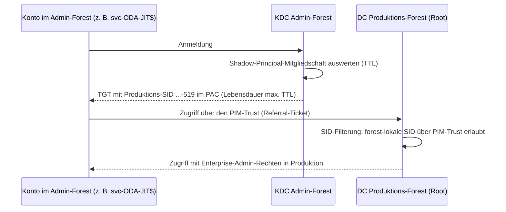

# PIM-Trust (PAM-Trust) und Shadow Principals – Just-in-Time-Rechte über Forest-Grenzen

**🌐 Sprache:** [English](PAM-Trust-Shadow-Principals.md) · Deutsch
<!-- docx-meta: Dokument=PIM-Trust und Shadow Principals (Bordmittel Windows Server / AD DS); Version / Status=1.0 – zur Abstimmung; Datum=05.10.2026 -->

Diese Anleitung erklärt drei Funktionen, die **seit Windows Server 2016 direkt in Active
Directory eingebaut** sind, und zeigt, wie man sie einrichtet. Zusätzliche Produkte braucht man
dafür nicht:

1. **PAM-Feature** (Privileged Access Management Optional Feature) – zeitgebundene
   Gruppenmitgliedschaften (TTL)
2. **Shadow Principals** – ein Objekt im Admin-Forest, das eine Gruppe eines anderen Forests
   vertritt
3. **PIM-Trust** (oft auch PAM-Trust genannt) – ein Forest-Trust, über den der Produktions-Forest seine eigenen privilegierten
   SIDs (z. B. Enterprise Admins) aus dem Admin-Forest akzeptiert

Außerdem beschreibt sie, was das für die ODA-JIT-Automatisierung (Enterprise Admin nur im
Sammelfenster) bedeutet.

> **Status beim Kunden:** Alle DCs laufen mit Windows Server 2022. Die technischen
> Voraussetzungen sind also erfüllt, sobald die Funktionsebenen passen (Abschnitt 3). Ein
> PIM-Trust ist bisher **nicht** eingerichtet.

## 1. Kurzfassung

| Frage | Antwort |
| ----- | ------- |
| Was bringt das PAM-Feature? | Gruppenmitgliedschaften mit Ablaufzeit (`Add-ADGroupMember -MemberTimeToLive`). Der KDC begrenzt die Kerberos-TGT-Lebensdauer auf die kürzeste verbleibende TTL. Funktioniert **innerhalb eines Forests**. |
| Was bringt ein Shadow Principal? | Ein Konto im **Admin-Forest** erhält in seinem Kerberos-Ticket die SID einer Gruppe des **Produktions-Forests** (z. B. Enterprise Admins), auf Wunsch nur für eine TTL. |
| Wozu der PIM-Trust? | Über einen normalen Forest-Trust filtert der Produktions-Forest seine eigenen privilegierten SIDs heraus. Ein PIM-Trust lässt sie durch, deshalb funktionieren Shadow Principals erst damit. |
| Kann damit das ODA-Assessment-gMSA erhöht werden? | **Nein.** Das gMSA lebt im Produktions-Forest (der Collector ist dort Mitglied). Shadow Principals erhöhen nur Konten des Admin-Forests. Für das ODA-gMSA bleibt das PAM-Feature (TTL) **im Produktions-Forest** das richtige Mittel. |
| Wofür ist es dann im ODA-JIT-Szenario gut? | Für den **Ausführer** `svc-ODA-JIT$`. Er kann im Admin-Forest leben und bekommt Enterprise-Admin-Rechte in Produktion über einen Shadow Principal, ohne dauerhafte Mitgliedschaft in einer Produktionsgruppe. |
| Größte Konsequenz | Wer den Admin-Forest kontrolliert, kontrolliert jeden Produktions-Forest, der ihm per PIM-Trust vertraut. Der Admin-Forest muss mindestens so gut geschützt sein wie Tier-0 der Produktion. |

## 2. Funktionsweise

### 2.1 Zeitgebundene Mitgliedschaften (PAM-Feature)

- Wird pro Forest aktiviert und lässt sich **nicht wieder deaktivieren**.
- Danach kann jede Mitgliedschaft mit einer TTL versehen werden. Läuft die TTL ab, entfernt AD
  den Link von selbst.
- Der KDC stellt TGTs höchstens bis zum Ablauf der kürzesten TTL aus. Die Rechte enden also
  auch im Ticket rechtzeitig.

### 2.2 Shadow Principals

- Objektklasse `msDS-ShadowPrincipal` im Container
  `CN=Shadow Principal Configuration,CN=Services,CN=Configuration,<Admin-Forest>`.
- Pflichtattribut `msDS-ShadowPrincipalSid`: die SID der vertretenen Gruppe im
  Produktions-Forest, z. B. `S-1-5-21-<Produktions-Root-Domäne>-519` (Enterprise Admins).
- Mitglieder sind Konten des Admin-Forests, mit oder ohne TTL.
- Bei der Anmeldung eines Mitglieds fügt der KDC des Admin-Forests die `msDS-ShadowPrincipalSid`
  in den PAC des Tickets ein. Ist die Mitgliedschaft zeitgebunden, endet das TGT spätestens mit
  der TTL.

### 2.3 PIM-Trust und SID-Filterung

Beim Weg über einen Forest-Trust filtert der vertrauende (Produktions-)Forest die SIDs im
Ticket. Laut Protokollspezifikation (MS-PAC 4.1.2.2) gilt:

| SID im Ticket | Normaler Forest-Trust | PIM-Trust |
| ------------- | --------------------- | --------- |
| Gruppen des Produktions-Forests mit RID < 1000, z. B. Enterprise Admins `-519`, Domain Admins `-512` (Kategorie „ForestSpecific“) | wird **entfernt** | wird **akzeptiert** („The trusting domain allows SIDs that are local to its forest to come over a PrivilegedIdentityManagement trust.“) |
| `BUILTIN\Administrators` `S-1-5-32-544` und alle anderen `S-1-5-32-*` | wird entfernt (AlwaysFilter) | wird entfernt (AlwaysFilter) |
| SIDs des Admin-Forests selbst | erlaubt | erlaubt |

Daraus folgt: Shadow Principals dürfen auf **Enterprise Admins** oder **Domain Admins** einer
Produktionsdomäne zeigen, aber **nicht** auf `BUILTIN\Administrators`.


<!-- docx-alt: Ablauf: | 1. Das Konto im Admin-Forest meldet sich an. 2. Der KDC des Admin-Forests wertet die Shadow-Principal-Mitgliedschaft aus und schreibt die Produktions-SID (z. B. Enterprise Admins ...-519) in den PAC; das TGT gilt höchstens bis zum Ablauf der TTL. 3. Beim Zugriff auf einen DC des Produktions-Forests (über den PIM-Trust) lässt die SID-Filterung diese forest-lokale SID durch. 4. Das Konto handelt in Produktion mit Enterprise-Admin-Rechten. -->

## 3. Voraussetzungen

| # | Voraussetzung | Admin-Forest | Produktions-Forest | Prüfen |
| - | ------------- | ------------ | ------------------ | ------ |
| 1 | Alle DCs Windows Server 2016 oder neuer | erforderlich | erforderlich (PIM-Trust) | `Get-ADDomainController -Filter * \| Select HostName, OperatingSystem` |
| 2 | Forest- und Domänen-Funktionsebene Windows Server 2016 oder höher | **erforderlich** (PAM-Feature, Shadow Principals) | empfohlen; erforderlich, wenn dort TTL-Mitgliedschaften genutzt werden | `(Get-ADForest).ForestMode`, `(Get-ADDomain).DomainMode` |
| 3 | PAM-Feature aktiviert | **erforderlich** | nur für TTL-Mitgliedschaften in Produktion (z. B. ODA-gMSA) | `Get-ADOptionalFeature -Filter "Name -eq 'Privileged Access Management Feature'"` |
| 4 | Namensauflösung zwischen den Forests | erforderlich | erforderlich | `Resolve-DnsName <anderer Forest>` |
| 5 | Firewall für Trust-Kommunikation zwischen den DCs | erforderlich | erforderlich | siehe Microsoft Learn „Configure firewall for AD domain and trusts“ |
| 6 | Admin-Forest als eigenständiger, gehärteter Single-Domain-Forest | erforderlich | – | Sicherheitskonzept |

> **Achtung:** Funktionsebene anheben und PAM-Feature aktivieren lassen sich **nicht
> rückgängig machen**. Beides vorher im Change-Prozess freigeben.

## 4. Einrichtung Schritt für Schritt

Beispielnamen: Admin-Forest `admin.example` (NetBIOS `ADMIN`), Produktions-Forest
`forest-a.example` (NetBIOS `FORESTA`).

### Schritt 1 – Funktionsebene prüfen und ggf. anheben (Admin-Forest)

```powershell
# Als Enterprise Admin des Admin-Forests
Get-ADForest admin.example | Select-Object Name, ForestMode
Get-ADDomain admin.example | Select-Object Name, DomainMode
# Falls niedriger als Windows2016Forest / Windows2016Domain:
Set-ADDomainMode -Identity admin.example -DomainMode Windows2016Domain
Set-ADForestMode -Identity admin.example -ForestMode Windows2016Forest
```

### Schritt 2 – PAM-Feature aktivieren

```powershell
# Admin-Forest (erforderlich)
Enable-ADOptionalFeature 'Privileged Access Management Feature' -Scope ForestOrConfigurationSet -Target 'admin.example'

# Produktions-Forest (nur wenn dort TTL-Mitgliedschaften genutzt werden, z. B. für das ODA-gMSA)
Enable-ADOptionalFeature 'Privileged Access Management Feature' -Scope ForestOrConfigurationSet -Target 'forest-a.example'

Get-ADOptionalFeature -Filter "Name -eq 'Privileged Access Management Feature'" | Select-Object Name, EnabledScopes
```

### Schritt 3 – Namensauflösung einrichten

```powershell
# Auf einem DNS-Server/DC des Produktions-Forests
Add-DnsServerConditionalForwarderZone -Name 'admin.example' -MasterServers <IP-DC1-Admin>, <IP-DC2-Admin> -ReplicationScope Forest
# Auf einem DNS-Server/DC des Admin-Forests
Add-DnsServerConditionalForwarderZone -Name 'forest-a.example' -MasterServers <IP-DC1-Prod>, <IP-DC2-Prod> -ReplicationScope Forest
```

### Schritt 4 – Einseitigen Forest-Trust anlegen und als PIM-Trust markieren

Richtung: **Der Produktions-Forest vertraut dem Admin-Forest**, nicht umgekehrt. Alle
`netdom`-Befehle laufen auf einem DC der Produktions-Root-Domäne. Der erste Name ist dabei immer
die vertrauende Domäne (Produktion), `/Domain:` die vertrauenswürdige (Admin).

```cmd
:: 1. Trust anlegen (Produktion vertraut Admin)
netdom trust forest-a.example /Domain:admin.example /Add /UserD:ADMIN\<EA-Admin> /PasswordD:* /UserO:FORESTA\<EA-Admin> /PasswordO:*

:: 2. Als Forest-Trust (transitiv) markieren - Voraussetzung für den PIM-Trust
netdom trust forest-a.example /Domain:admin.example /ForestTRANsitive:Yes

:: 3. SID-Verlauf über den Trust zulassen
netdom trust forest-a.example /Domain:admin.example /EnableSIDHistory:Yes

:: 4. PIM-Verhalten aktivieren
netdom trust forest-a.example /Domain:admin.example /EnablePIMTrust:Yes

:: 5. Quarantäne (SID-Filterung im Domänen-Trust-Modus) ausschalten
netdom trust forest-a.example /Domain:admin.example /Quarantine:No
```

Auf einem DC des **Admin-Forests** die Gegenseite ebenfalls als Forest-Trust markieren:

```cmd
netdom trust admin.example /Domain:forest-a.example /ForestTRANsitive:Yes
```

Optional, aber empfohlen: **selektive Authentifizierung** auf dem ausgehenden Trust der
Produktion (`netdom trust forest-a.example /Domain:admin.example /SelectiveAUTH:Yes`). Danach
dürfen sich Konten des Admin-Forests nur an Computern anmelden, auf deren Computerobjekt sie das
Recht **„Allowed to authenticate“** haben, z. B. Root-DCs, Standort-GCs und Collector-Server.

Prüfen:

```powershell
# Statusabfrage je Attribut (ohne :Yes/:No zeigt netdom den aktuellen Wert)
netdom trust forest-a.example /Domain:admin.example /EnablePIMTrust
netdom trust forest-a.example /Domain:admin.example /EnableSIDHistory

# trustAttributes: 0x8 = Forest-transitiv, 0x40 = SID-Verlauf (Treat as external), 0x400 = PIM-Trust
Get-ADTrust -Identity admin.example -Server forest-a.example | Select-Object Name, Direction, ForestTransitive, TrustAttributes
```

### Schritt 5 – Shadow Principal anlegen (Admin-Forest)

```powershell
# SID der Produktionsgruppe ermitteln (Enterprise Admins der Produktions-Root-Domäne)
$prodRoot = Get-ADDomain -Server 'forest-a.example'
$eaSid    = (Get-ADGroup -Identity "$($prodRoot.DomainSID)-519" -Server 'forest-a.example').SID

# Shadow Principal im Admin-Forest anlegen
$container = 'CN=Shadow Principal Configuration,CN=Services,' + (Get-ADRootDSE -Server 'admin.example').configurationNamingContext
New-ADObject -Server 'admin.example' -Type 'msDS-ShadowPrincipal' -Name 'FORESTA-Enterprise Admins' `
    -Path $container -OtherAttributes @{ 'msDS-ShadowPrincipalSid' = $eaSid }
```

Wer Objekte in diesem Container anlegen oder ihre Mitglieder ändern darf, kann
Enterprise-Admin-Rechte in Produktion vergeben. Diese Rechte (Write, Create/Delete child
objects) daher nur Tier-0-Administratoren des Admin-Forests geben.

### Schritt 6 – Mitglied hinzufügen (dauerhaft oder mit TTL)

Ein Shadow Principal ist keine Gruppe, `Add-ADGroupMember` funktioniert daher nicht. Das
`member`-Attribut wird direkt gesetzt. Eine TTL wird in der Form `<TTL=Sekunden,DN>` angegeben.

```powershell
$sp     = "CN=FORESTA-Enterprise Admins,$container"
$member = (Get-ADServiceAccount 'svc-ODA-JIT' -Server 'admin.example').DistinguishedName

# a) zeitgebunden (z. B. 2 Stunden)
Set-ADObject -Server 'admin.example' -Identity $sp -Add @{ member = "<TTL=7200,$member>" }

# b) dauerhaft
Set-ADObject -Server 'admin.example' -Identity $sp -Add @{ member = $member }

# Entfernen
Set-ADObject -Server 'admin.example' -Identity $sp -Remove @{ member = $member }
```

### Schritt 7 – Testen

```powershell
# Als Mitglied des Shadow Principals, auf einem Host im Admin-Forest
klist purge
whoami /groups | Select-String '-519'          # Produktions-SID ...-519 muss erscheinen
klist                                          # Endzeit des TGT <= Ablauf der TTL
Get-ADGroup -Identity "$($prodRoot.DomainSID)-519" -Server 'forest-a.example' -Properties member   # Lesezugriff Produktion
```

Ein Schreibtest auf eine Testgruppe in Produktion (z. B. Mitglied hinzufügen und wieder
entfernen) bestätigt die Rechte. `Get-ADObject` zeigt Mitglieder ohne TTL an. Die verbleibende
Laufzeit erkennt man am Ablauf des TGT.

### Schritt 8 – Überwachen

| Wo | Was |
| -- | --- |
| Admin-Forest | Änderungen an `CN=Shadow Principal Configuration` (Überwachung „Verzeichnisdienständerungen“, Event 5136) |
| Produktions-Forest | Anmeldungen/Ticketanforderungen von Admin-Forest-Konten an Root-DCs (4624, 4769), Änderungen an Enterprise Admins (4756/4757) |
| Beide | Änderungen an der Trust-Konfiguration (4706, 4707, 4716) |

## 5. Bedeutung für das ODA-JIT-Szenario

| | Variante A – ohne Admin-Forest (heute umsetzbar) | Variante B – mit Admin-Forest und PIM-Trust |
| - | ------------------------------------------------ | -------------------------------------------- |
| ODA-Assessment-gMSA | lebt im Produktions-Forest; JIT per TTL-Mitgliedschaft der Gruppe `ODA-Assessment-Accounts` in Enterprise Admins | **unverändert wie A** – Shadow Principals können ein Produktionskonto nicht erhöhen |
| Ausführer `svc-ODA-JIT$` | lebt im Produktions-Forest, dauerhaft Mitglied in Domain Admins der Root-Domäne | lebt im **Admin-Forest**, erhält Enterprise-Admin-Rechte in Produktion über den Shadow Principal `FORESTA-Enterprise Admins` |
| Tier-0-Host | in der Produktions-Root-Domäne | im Admin-Forest |
| Dauerhafte privilegierte Mitgliedschaften in Produktion | 1 (Ausführer in Domain Admins) | **0** – die Berechtigung wird im Admin-Forest gesteuert |
| Lokaler Admin auf dem Collector-Server | Ausführer-gMSA direkt | Ausführer als Foreign Security Principal (FSP) in den lokalen Administratoren des Collector-Servers; bei selektiver Authentifizierung zusätzlich „Allowed to authenticate“ |
| Mehrere Produktions-Forests | je Forest eigener Ausführer und Tier-0-Host | ein Admin-Forest kann mehrere Produktions-Forests bedienen (je Forest ein PIM-Trust und ein Shadow Principal) |
| Aufwand | gering | hoch: Admin-Forest, Trusts, DNS, Firewall, Härtung, Betrieb |

Für Variante B ändern sich in der ODA-JIT-Konfiguration (`ODAJit.<forest>.psd1`) nur
`ExecutorAccount` (z. B. `ADMIN\svc-ODA-JIT$`) und der Ort des Tier-0-Hosts.
`ForestRootServer`, `SiteGlobalCatalogs` und `Collector` zeigen weiter auf den
Produktions-Forest. Die Skripte sind für diesen Fall **noch nicht getestet**, deshalb vorher im
Pilot prüfen.

Die Shadow-Principal-Mitgliedschaft des Ausführers kann dauerhaft sein. Strenger ist es, sie vor
jedem Fenster mit TTL zu vergeben. Das erledigt dann ein Tier-0-Prozess im Admin-Forest, und
damit gibt es auch dort keine dauerhafte Berechtigung mehr.

## 6. Sicherheitsbetrachtung

- **Vertrauensrichtung:** Nur Produktion → Admin. Der Admin-Forest vertraut der Produktion
  **nicht**.
- **Der Admin-Forest ist Tier-0 für alle angebundenen Produktions-Forests.** Über den PIM-Trust
  akzeptiert Produktion privilegierte forest-lokale SIDs aus dem Admin-Forest. Wer dort
  Domänen-Admin ist, kann sich solche SIDs verschaffen. Deshalb gilt: eigener, minimaler Forest,
  keine Internetnutzung, getrennte Admin-Konten, PAWs, strenge Überwachung.
- **Kein PIM-Trust zu weniger geschützten Forests.** Niemals einen Produktions-Forest einem Forest
  vertrauen lassen, der schwächer geschützt ist als die eigene Tier-0-Ebene.
- **TTL nutzen:** Zeitgebundene Mitgliedschaften begrenzen auch die TGT-Lebensdauer. Gestohlene
  Tickets verfallen damit spätestens mit der TTL.
- **Rechte am Shadow-Principal-Container** wie Rechte an Enterprise Admins behandeln.

## 7. Rückbau

```cmd
netdom trust forest-a.example /Domain:admin.example /EnablePIMTrust:No
netdom trust forest-a.example /Domain:admin.example /EnableSIDHistory:No
netdom trust forest-a.example /Domain:admin.example /Remove /UserD:ADMIN\<EA-Admin> /PasswordD:* /UserO:FORESTA\<EA-Admin> /PasswordO:*
```

```powershell
Remove-ADObject -Server 'admin.example' -Identity "CN=FORESTA-Enterprise Admins,$container" -Confirm:$false
```

Das PAM-Feature und die angehobene Funktionsebene bleiben bestehen, beides ist nicht umkehrbar.

## 8. Quellen

- Microsoft Open Specifications [MS-PAC] 4.1.2.2 – SID Filtering and Claims Transformation
  (Kategorien ForestSpecific/AlwaysFilter, Regel für PrivilegedIdentityManagement-Trusts)
- Microsoft Open Specifications [MS-ADTS] 3.1.1.13.5 – ExpandShadowPrincipal (Auswertung von
  Shadow Principals, kürzeste Ablaufzeit begrenzt die Gültigkeit)
- Microsoft Open Specifications [MS-ADSC] – Class msDS-ShadowPrincipal; [MS-ADA2] – Attribute
  msDS-ShadowPrincipalSid
- Windows Server: `netdom trust /?` (Schalter `/ForestTRANsitive`, `/EnableSIDHistory`,
  `/EnablePIMTrust` – „muss zunächst als Gesamtstrukturtransit markiert werden“, `/Quarantine`,
  `/SelectiveAUTH`)
- Microsoft Learn: Raise the bastion forest functional level (DCs ≥ Windows Server 2016,
  Funktionsebene 2016, PAM-Feature, Rechte am Shadow-Principal-Container)
- Microsoft Learn: Configure firewall for AD domain and trusts
- TEAL Technology Consulting: „Privileged Access Management und Shadow Principals Feature“
  (14.08.2018) – Praxisbeispiel für Trust-Attribute und TTL-Syntax
