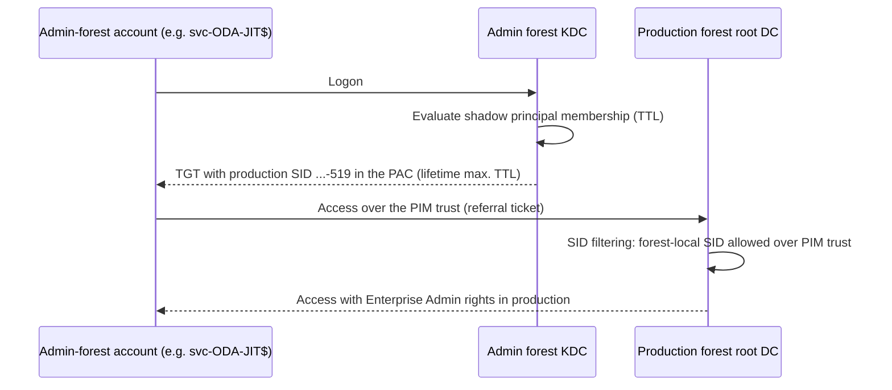

# PIM trust (PAM trust) and shadow principals – just-in-time rights across forest boundaries

**🌐 Language:** English · [Deutsch](PAM-Trust-Shadow-Principals.de.md)
<!-- docx-meta: Document=PIM trust and shadow principals (built-in Windows Server / AD DS); Version / Status=1.0 – for review; Date=2026-10-05 -->

This guide explains three features that are **built into Active Directory since Windows Server
2016** and how to set them up. No additional products are required:

1. **PAM feature** (Privileged Access Management optional feature) – time-bound group
   memberships (TTL)
2. **Shadow principals** – an object in the admin forest that represents a group of another forest
3. **PIM trust** (often called PAM trust) – a forest trust over which the production forest accepts
   its own privileged SIDs (e.g. Enterprise Admins) coming from the admin forest

It also describes what this means for the ODA-JIT automation (Enterprise Admin only during the
collection window).

> **Customer status:** all DCs run Windows Server 2022, so the technical prerequisites are met once
> the functional levels match (section 3). A PIM trust is **not** set up yet.

## 1. Summary

| Question | Answer |
| -------- | ------ |
| What does the PAM feature provide? | Group memberships with an expiry (`Add-ADGroupMember -MemberTimeToLive`). The KDC caps the Kerberos TGT lifetime at the shortest remaining TTL. Works **within one forest**. |
| What does a shadow principal provide? | An account in the **admin forest** gets the SID of a group of the **production forest** (e.g. Enterprise Admins) in its Kerberos ticket – optionally only for a TTL. |
| Why the PIM trust? | Over a normal forest trust the production forest filters out its own privileged SIDs. A PIM trust lets them through, so shadow principals only work with it. |
| Can it elevate the ODA assessment gMSA? | **No.** The gMSA lives in the production forest (the collector is a member there). Shadow principals only elevate admin-forest accounts. For the ODA gMSA the PAM feature (TTL) **in the production forest** remains the right tool. |
| So what is it good for in the ODA-JIT scenario? | For the **executor** `svc-ODA-JIT$`. It can live in the admin forest and get Enterprise Admin rights in production via a shadow principal, with no standing membership in a production group. |
| Biggest consequence | Whoever controls the admin forest controls every production forest that trusts it via a PIM trust. The admin forest must be protected at least as well as production Tier-0. |

## 2. How it works

### 2.1 Time-bound memberships (PAM feature)

- Enabled per forest and **cannot be disabled again**.
- Any membership can then carry a TTL. When it expires, AD removes the link by itself.
- The KDC issues TGTs only until the shortest TTL expires, so the rights also end in the ticket on
  time.

### 2.2 Shadow principals

- Object class `msDS-ShadowPrincipal` in the container
  `CN=Shadow Principal Configuration,CN=Services,CN=Configuration,<admin forest>`.
- Mandatory attribute `msDS-ShadowPrincipalSid`: the SID of the represented group in the production
  forest, e.g. `S-1-5-21-<production root domain>-519` (Enterprise Admins).
- Members are admin-forest accounts, with or without a TTL.
- When a member logs on, the admin forest's KDC adds the `msDS-ShadowPrincipalSid` to the ticket's
  PAC. If the membership is time-bound, the TGT ends no later than the TTL.

### 2.3 PIM trust and SID filtering

When a ticket crosses a forest trust, the trusting (production) forest filters its SIDs. According
to the protocol specification (MS-PAC 4.1.2.2):

| SID in the ticket | Normal forest trust | PIM trust |
| ----------------- | ------------------- | --------- |
| Production-forest groups with RID < 1000, e.g. Enterprise Admins `-519`, Domain Admins `-512` (category "ForestSpecific") | **removed** | **accepted** ("The trusting domain allows SIDs that are local to its forest to come over a PrivilegedIdentityManagement trust.") |
| `BUILTIN\Administrators` `S-1-5-32-544` and all other `S-1-5-32-*` | removed (AlwaysFilter) | removed (AlwaysFilter) |
| SIDs of the admin forest itself | allowed | allowed |

So shadow principals may point to **Enterprise Admins** or **Domain Admins** of a production domain,
but **not** to `BUILTIN\Administrators`.


<!-- docx-alt: Flow: | 1. The admin-forest account logs on. 2. The admin forest's KDC evaluates the shadow principal membership and writes the production SID (e.g. Enterprise Admins ...-519) into the PAC; the TGT is valid no longer than the TTL. 3. When accessing a production DC over the PIM trust, SID filtering lets this forest-local SID through. 4. The account acts with Enterprise Admin rights in production. -->

## 3. Prerequisites

| # | Prerequisite | Admin forest | Production forest | Check |
| - | ------------ | ------------ | ----------------- | ----- |
| 1 | All DCs Windows Server 2016 or later | required | required (PIM trust) | `Get-ADDomainController -Filter * \| Select HostName, OperatingSystem` |
| 2 | Forest and domain functional level Windows Server 2016 or higher | **required** (PAM feature, shadow principals) | recommended; required if TTL memberships are used there | `(Get-ADForest).ForestMode`, `(Get-ADDomain).DomainMode` |
| 3 | PAM feature enabled | **required** | only for TTL memberships in production (e.g. ODA gMSA) | `Get-ADOptionalFeature -Filter "Name -eq 'Privileged Access Management Feature'"` |
| 4 | Name resolution between the forests | required | required | `Resolve-DnsName <other forest>` |
| 5 | Firewall for trust traffic between the DCs | required | required | see Microsoft Learn "Configure firewall for AD domain and trusts" |
| 6 | Admin forest as a separate, hardened single-domain forest | required | – | security concept |

> **Note:** raising the functional level and enabling the PAM feature **cannot be undone**. Get
> both approved in change management first.

## 4. Setup step by step

Example names: admin forest `admin.example` (NetBIOS `ADMIN`), production forest
`forest-a.example` (NetBIOS `FORESTA`).

### Step 1 – Check and, if needed, raise the functional level (admin forest)

```powershell
# As Enterprise Admin of the admin forest
Get-ADForest admin.example | Select-Object Name, ForestMode
Get-ADDomain admin.example | Select-Object Name, DomainMode
# If lower than Windows2016Forest / Windows2016Domain:
Set-ADDomainMode -Identity admin.example -DomainMode Windows2016Domain
Set-ADForestMode -Identity admin.example -ForestMode Windows2016Forest
```

### Step 2 – Enable the PAM feature

```powershell
# Admin forest (required)
Enable-ADOptionalFeature 'Privileged Access Management Feature' -Scope ForestOrConfigurationSet -Target 'admin.example'

# Production forest (only if TTL memberships are used there, e.g. for the ODA gMSA)
Enable-ADOptionalFeature 'Privileged Access Management Feature' -Scope ForestOrConfigurationSet -Target 'forest-a.example'

Get-ADOptionalFeature -Filter "Name -eq 'Privileged Access Management Feature'" | Select-Object Name, EnabledScopes
```

### Step 3 – Configure name resolution

```powershell
# On a DNS server/DC of the production forest
Add-DnsServerConditionalForwarderZone -Name 'admin.example' -MasterServers <IP-DC1-Admin>, <IP-DC2-Admin> -ReplicationScope Forest
# On a DNS server/DC of the admin forest
Add-DnsServerConditionalForwarderZone -Name 'forest-a.example' -MasterServers <IP-DC1-Prod>, <IP-DC2-Prod> -ReplicationScope Forest
```

### Step 4 – Create a one-way forest trust and mark it as PIM trust

Direction: **the production forest trusts the admin forest**, not the other way round. Run all
`netdom` commands on a DC of the production root domain. The first name is always the trusting
domain (production), `/Domain:` the trusted one (admin).

```cmd
:: 1. Create the trust (production trusts admin)
netdom trust forest-a.example /Domain:admin.example /Add /UserD:ADMIN\<EA-admin> /PasswordD:* /UserO:FORESTA\<EA-admin> /PasswordO:*

:: 2. Mark it as forest-transitive - prerequisite for the PIM trust
netdom trust forest-a.example /Domain:admin.example /ForestTRANsitive:Yes

:: 3. Allow SID history over the trust
netdom trust forest-a.example /Domain:admin.example /EnableSIDHistory:Yes

:: 4. Enable PIM behaviour
netdom trust forest-a.example /Domain:admin.example /EnablePIMTrust:Yes

:: 5. Disable quarantine (domain-trust style SID filtering)
netdom trust forest-a.example /Domain:admin.example /Quarantine:No
```

On a DC of the **admin forest**, also mark the other side as a forest trust:

```cmd
netdom trust admin.example /Domain:forest-a.example /ForestTRANsitive:Yes
```

Optional but recommended: **selective authentication** on production's outgoing trust
(`netdom trust forest-a.example /Domain:admin.example /SelectiveAUTH:Yes`). Admin-forest accounts can
then only authenticate to computers on whose computer object they have the **"Allowed to
authenticate"** right, e.g. root DCs, site GCs and collector servers.

Verify:

```powershell
# Query status per attribute (without :Yes/:No netdom shows the current value)
netdom trust forest-a.example /Domain:admin.example /EnablePIMTrust
netdom trust forest-a.example /Domain:admin.example /EnableSIDHistory

# trustAttributes: 0x8 = forest-transitive, 0x40 = SID history (treat as external), 0x400 = PIM trust
Get-ADTrust -Identity admin.example -Server forest-a.example | Select-Object Name, Direction, ForestTransitive, TrustAttributes
```

### Step 5 – Create the shadow principal (admin forest)

```powershell
# SID of the production group (Enterprise Admins of the production root domain)
$prodRoot = Get-ADDomain -Server 'forest-a.example'
$eaSid    = (Get-ADGroup -Identity "$($prodRoot.DomainSID)-519" -Server 'forest-a.example').SID

# Create the shadow principal in the admin forest
$container = 'CN=Shadow Principal Configuration,CN=Services,' + (Get-ADRootDSE -Server 'admin.example').configurationNamingContext
New-ADObject -Server 'admin.example' -Type 'msDS-ShadowPrincipal' -Name 'FORESTA-Enterprise Admins' `
    -Path $container -OtherAttributes @{ 'msDS-ShadowPrincipalSid' = $eaSid }
```

Anyone who may create objects in this container or change their members can hand out Enterprise
Admin rights in production. Grant these rights (Write, Create/Delete child objects) only to Tier-0
administrators of the admin forest.

### Step 6 – Add a member (standing or with TTL)

A shadow principal is not a group, so `Add-ADGroupMember` does not work. Set the `member` attribute
directly; a TTL uses the form `<TTL=seconds,DN>`.

```powershell
$sp     = "CN=FORESTA-Enterprise Admins,$container"
$member = (Get-ADServiceAccount 'svc-ODA-JIT' -Server 'admin.example').DistinguishedName

# a) time-bound (e.g. 2 hours)
Set-ADObject -Server 'admin.example' -Identity $sp -Add @{ member = "<TTL=7200,$member>" }

# b) standing
Set-ADObject -Server 'admin.example' -Identity $sp -Add @{ member = $member }

# Remove
Set-ADObject -Server 'admin.example' -Identity $sp -Remove @{ member = $member }
```

### Step 7 – Test

```powershell
# As a member of the shadow principal, on a host in the admin forest
klist purge
whoami /groups | Select-String '-519'          # the production SID ...-519 must appear
klist                                          # TGT end time <= TTL expiry
Get-ADGroup -Identity "$($prodRoot.DomainSID)-519" -Server 'forest-a.example' -Properties member   # read access to production
```

A write test on a test group in production (e.g. add a member and remove it again) confirms the
rights. `Get-ADObject` shows members without their TTL; the remaining lifetime is visible from the
TGT expiry.

### Step 8 – Monitor

| Where | What |
| ----- | ---- |
| Admin forest | Changes to `CN=Shadow Principal Configuration` (audit "Directory Service Changes", event 5136) |
| Production forest | Logons/ticket requests of admin-forest accounts at root DCs (4624, 4769), changes to Enterprise Admins (4756/4757) |
| Both | Changes to the trust configuration (4706, 4707, 4716) |

## 5. What this means for the ODA-JIT scenario

| | Variant A – without admin forest (possible today) | Variant B – with admin forest and PIM trust |
| - | ------------------------------------------------- | -------------------------------------------- |
| ODA assessment gMSA | lives in the production forest; JIT via TTL membership of the group `ODA-Assessment-Accounts` in Enterprise Admins | **unchanged from A** – shadow principals cannot elevate a production account |
| Executor `svc-ODA-JIT$` | lives in the production forest, standing member of root Domain Admins | lives in the **admin forest**, gets Enterprise Admin rights in production via the shadow principal `FORESTA-Enterprise Admins` |
| Tier-0 host | in the production root domain | in the admin forest |
| Standing privileged memberships in production | 1 (executor in Domain Admins) | **0** – the right is controlled in the admin forest |
| Local admin on the collector server | executor gMSA directly | executor as foreign security principal (FSP) in the collector server's local Administrators; with selective authentication also "Allowed to authenticate" |
| Multiple production forests | own executor and Tier-0 host per forest | one admin forest can serve several production forests (one PIM trust and one shadow principal each) |
| Effort | low | high: admin forest, trusts, DNS, firewall, hardening, operations |

For variant B only `ExecutorAccount` (e.g. `ADMIN\svc-ODA-JIT$`) and the location of the Tier-0 host
change in the ODA-JIT configuration (`ODAJit.<forest>.psd1`). `ForestRootServer`,
`SiteGlobalCatalogs` and `Collector` keep pointing to the production forest. The scripts are **not
yet tested** for this case – verify in a pilot first.

The executor's shadow principal membership can be standing. A stricter option is to grant it with a
TTL before each window; that is then done by a Tier-0 process in the admin forest, so no standing
right remains there either.

## 6. Security considerations

- **Trust direction:** production → admin only. The admin forest does **not** trust production.
- **The admin forest is Tier-0 for every connected production forest.** Over the PIM trust,
  production accepts privileged forest-local SIDs from the admin forest. Anyone who is a domain
  admin there can obtain such SIDs. Hence: a separate, minimal forest, no internet use, separate
  admin accounts, PAWs, strict monitoring.
- **No PIM trust to less protected forests.** Never let a production forest trust a forest that is
  protected less than its own Tier-0.
- **Use TTLs:** time-bound memberships also cap the TGT lifetime, so stolen tickets expire with the
  TTL at the latest.
- **Treat rights on the shadow principal container** like rights on Enterprise Admins.

## 7. Removal

```cmd
netdom trust forest-a.example /Domain:admin.example /EnablePIMTrust:No
netdom trust forest-a.example /Domain:admin.example /EnableSIDHistory:No
netdom trust forest-a.example /Domain:admin.example /Remove /UserD:ADMIN\<EA-admin> /PasswordD:* /UserO:FORESTA\<EA-admin> /PasswordO:*
```

```powershell
Remove-ADObject -Server 'admin.example' -Identity "CN=FORESTA-Enterprise Admins,$container" -Confirm:$false
```

The PAM feature and the raised functional level remain – both are irreversible.

## 8. Sources

- Microsoft Open Specifications [MS-PAC] 4.1.2.2 – SID Filtering and Claims Transformation
  (categories ForestSpecific/AlwaysFilter, rule for PrivilegedIdentityManagement trusts)
- Microsoft Open Specifications [MS-ADTS] 3.1.1.13.5 – ExpandShadowPrincipal (evaluation of shadow
  principals, shortest expiry limits validity)
- Microsoft Open Specifications [MS-ADSC] – Class msDS-ShadowPrincipal; [MS-ADA2] – Attribute
  msDS-ShadowPrincipalSid
- Windows Server: `netdom trust /?` (switches `/ForestTRANsitive`, `/EnableSIDHistory`,
  `/EnablePIMTrust` – trust must first be marked forest-transitive, `/Quarantine`, `/SelectiveAUTH`)
- Microsoft Learn: Raise the bastion forest functional level (DCs ≥ Windows Server 2016, functional
  level 2016, PAM feature, rights on the shadow principal container)
- Microsoft Learn: Configure firewall for AD domain and trusts
- TEAL Technology Consulting: "Privileged Access Management und Shadow Principals Feature"
  (2018-08-14, German) – practical example of trust attributes and TTL syntax
